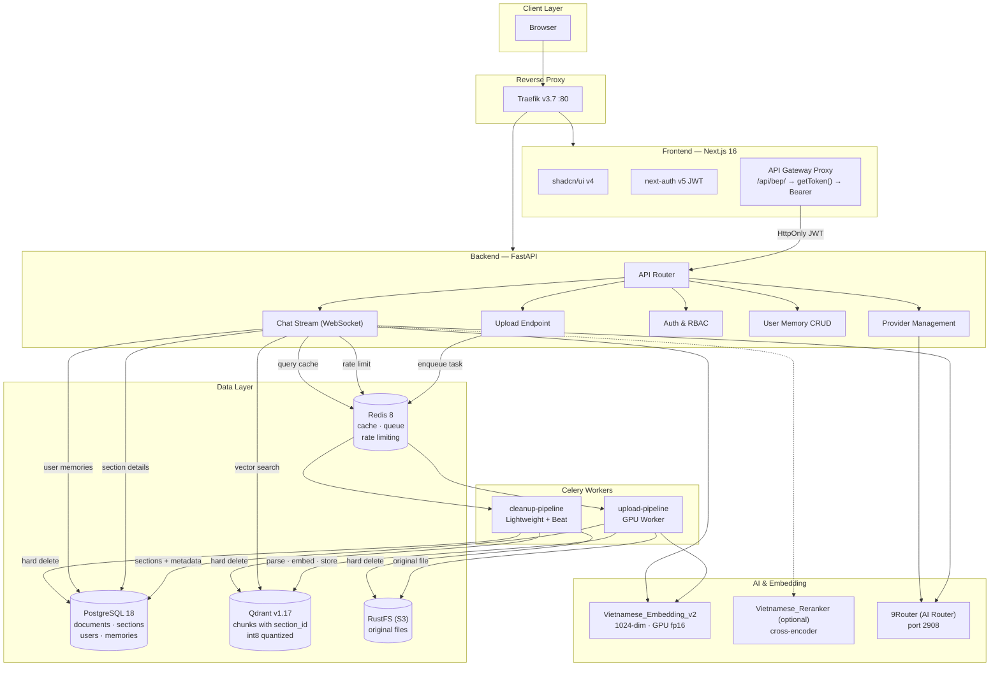
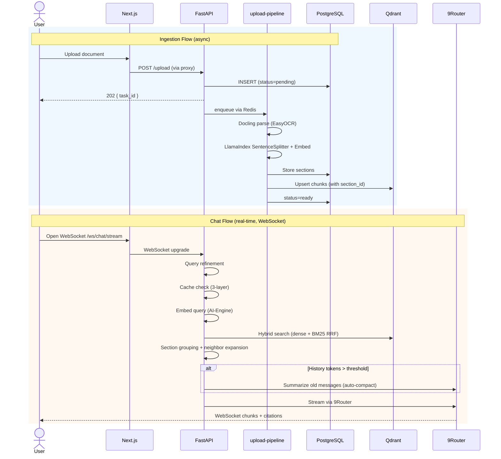
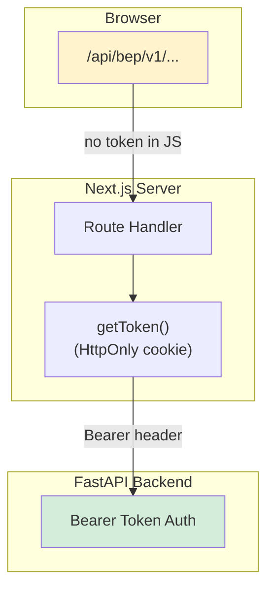

<div align="center">

# chatbot-rag

**On-premise hierarchical RAG chatbot for Vietnamese enterprise documents**

Self-hosted. No cloud lock-in. Complete control over your data.

[](https://docs.docker.com/compose/)
[](https://github.com/qtuanph/chatbot-rag/actions)
[](https://www.python.org/)
[](https://nextjs.org/)
[](https://fastapi.tiangolo.com/)
[](https://qdrant.tech/)
[](https://www.postgresql.org/)
[](LICENSE)
[](https://github.com/qtuanph/chatbot-rag/releases)
[](https://conventionalcommits.org)

</div>

---

## Quick Links

📦 **[Latest Release: v0.5.0](https://github.com/qtuanph/chatbot-rag/releases/tag/v0.5.0)** · 🚀 [Getting Started](#getting-started) · 📖 [Architecture](#architecture) · 📡 [API Reference](#api-reference) · 📂 [Full Changelog](https://github.com/qtuanph/chatbot-rag/releases)

---

## Table of Contents

- [Why This Project?](#why-this-project)
- [Features](#features)
- [Architecture](#architecture)
- [Tech Stack](#tech-stack)
- [Retrieval Pipeline](#retrieval-pipeline)
- [Security](#security)
- [Getting Started](#getting-started)
- [API Reference](#api-reference)
- [Configuration](#configuration)
- [Documentation](#documentation)
- [License](#license)

---

## Why This Project?

Vietnamese enterprises need AI-powered document Q&A that:

- **Stays on-premise** — sensitive documents never leave your infrastructure
- **Understands Vietnamese** — purpose-built embedding model fine-tuned on 1.1M Vietnamese triplets
- **Handles real documents** — hierarchical indexing preserves document structure (chapters, sections, pages)
- **Just works** — one `docker compose up`, zero cloud dependencies for inference or embedding

---

## Features

<table>
<tr><td width="180"><b>Hierarchical Indexing</b></td><td>Docs → Sections (H1–H6) → Chunks (~1536 tokens). Preserves document structure for accurate context retrieval.</td></tr>
<tr><td><b>5-Stage Retrieval</b></td><td>Hybrid dense + BM25 (RRF fusion) → in-memory section grouping (≥0.30) → dedup → <b>neighbor expansion</b> (±1 nodes) → full section context to LLM. Optional cross-encoder reranker.</td></tr>
<tr><td><b>Vietnamese-Optimized</b></td><td><code>AITeamVN/Vietnamese_Embedding_v2</code> — BGE-M3 fine-tuned on Vietnamese data, +16% Accuracy@1 vs base model.</td></tr>
<tr><td><b>AI-Engine Service</b></td><td>Dedicated GPU service for embedding + reranker inference. Hardware auto-detect: 3-tier VRAM scaling.</td></tr>
<tr><td><b>Smart OCR</b></td><td>Docling + EasyOCR on GPU/CUDA. DOCX → PDF conversion for accurate layout extraction.</td></tr>
<tr><td><b>Async Ingestion</b></td><td>Upload returns instantly with <code>task_id</code>. Parsing/indexing runs in background via Celery with live progress tracking.</td></tr>
<tr><td><b>Real-time Chat</b></td><td>WebSocket streaming with conversational Vietnamese AI. Citations grouped by document with merged page ranges.</td></tr>
<tr><td><b>Context Compaction</b></td><td>Auto-summarize old conversation history at 70% context window (~140K tokens). Keeps recent 5 turns verbatim, summarizes older messages via 9Router. Fallback: drop oldest if API fails.</td></tr>
<tr><td><b>Query Refinement</b></td><td>Automatic query rewriting for better retrieval — enabled by default. Handles follow-ups and Vietnamese phrasing.</td></tr>
<tr><td><b>User Memory</b></td><td>ChatGPT-like persistent memory per user — preferences, corrections, facts injected into AI context automatically.</td></tr>
<tr><td><b>Multi-Provider AI</b></td><td>9Router (Next.js AI router) connects any OpenAI-compatible provider: Kiro, OpenCode Free, Claude, Gemini, and more via dashboard UI.</td></tr>
<tr><td><b>3-Layer Cache</b></td><td>LLM Response Cache + Semantic Cache (Redis vector) + Query Embedding Cache — reduced from 5 layers, faster hit rate.</td></tr>
<tr><td><b>RAGAS Evaluation</b></td><td>Optional LLM-as-judge evaluation: faithfulness, answer relevancy, context precision, context recall.</td></tr>
<tr><td><b>Knowledge Graph</b></td><td>Optional entity extraction and relationship mapping from ingested documents.</td></tr>
<tr><td><b>Document Tree</b></td><td>Hierarchical navigation of document structure via tree explorer.</td></tr>
<tr><td><b>Security Hardened</b></td><td>API gateway proxy, JWT hidden from browser, server-side auth guards, atomic rate limiting, security headers.</td></tr>
</table>

---

## Architecture



### Data Flow



### Key Design Decisions

| Decision | Why |
|----------|-----|
| **Hybrid search (dense + BM25)** | Dense (embedding) + sparse (BM25) via RRF fusion — leverages both semantic similarity and keyword matching for Vietnamese |
| **LlamaIndex for ingestion** | SentenceSplitter + integrated embedding via IngestionPipeline — mature chunking with semantic boundaries |
| **9Router as AI router** | Next.js 16 AI router with RTK Token Saver, 3-tier fallback (Subscription→Cheap→Free), free providers (Kiro, OpenCode), format translation, usage dashboard |
| **Context Compaction** | Auto-triggered at 70% context window: old messages summarized via 9Router, recent 5 turns kept verbatim with fallback dropping oldest |
| **3-Layer Cache** | LLM Response + Semantic + Query Embedding — reduced from 5 layers (removed RagResultCache), simpler and faster |
| **Query Refinement** | Automatic query rewriting improves retrieval on follow-ups and ambiguous Vietnamese phrasing |
| **Separate AI-Engine** | Isolates GPU inference (embedding + reranker) from API server; enables independent scaling |
| **API gateway proxy** | Browser never sees Bearer token; auth via HttpOnly session cookie |

---

## Tech Stack

```mermaid
graph LR
    subgraph Frontend["Frontend"]
        direction TB
        F1["Next.js 16"]
        F2["shadcn/ui v4"]
        F3["next-auth v5"]
    end

    subgraph Backend["Backend"]
        direction TB
        B1["FastAPI"]
        B2["Celery"]
        B3["SQLAlchemy"]
    end

    subgraph Data["Data"]
        direction TB
        D1["PostgreSQL 18"]
        D2["Redis 8"]
        D3["Qdrant v1.17"]
        D4["RustFS (S3)"]
    end

    subgraph AI["AI & ML"]
        direction TB
        A1["Vietnamese_Embedding_v2"]
        A2["Vietnamese_Reranker (opt)"]
        A3["9Router (AI Router)"]
        A4["EasyOCR (Vietnamese)"]
        A5["Docling"]
    end

    Frontend ~~~ Backend ~~~ Data ~~~ AI
```



| Layer | Technology | Purpose |
|-------|-----------|---------|
| **Frontend** | Next.js 16 + shadcn/ui v4 + next-auth v5 | UI, SSR auth, API gateway proxy |
| **Backend** | FastAPI + Celery + SQLAlchemy | REST API, async tasks, ORM, WebSocket |
| **Database** | PostgreSQL 18 | Documents, sections, users, memories, audit |
| **Cache / Queue** | Redis 8 | Celery broker, semantic cache, query embedding cache, rate limiting |
| **Vector Search** | Qdrant v1.17 (int8 quantization, HNSW) | Chunk vectors with section_id metadata |
| **AI Proxy** | 9Router (Next.js 16, port 2908) | OpenAI-compatible AI router with free/paid provider support |
| **AI Service** | Dedicated AI-Engine container | GPU-accelerated embedding + reranker inference |
| **Embedding** | AITeamVN/Vietnamese_Embedding_v2 (1024-dim) | GPU fp16, hardware auto-detect (3-tier) |
| **Reranker** | AITeamVN/Vietnamese_Reranker | Optional cross-encoder (disabled by default) |
| **LLM Integration** | 9Router OpenAPI-compatible (direct HTTP) | Provider-agnostic chat with thinking mode, context compaction |
| **OCR** | EasyOCR on GPU | Vietnamese + English document text extraction |
| **Parsing** | Docling (Method D) | PDF/DOCX structured extraction with hierarchy |
| **Chunking** | LlamaIndex SentenceSplitter | Semantic-aware text splitting (~1536 tokens) |
| **Storage** | RustFS (S3-compatible) | Original file storage |
| **Reverse Proxy** | Traefik v3.7 | All traffic routing, WebSocket, security headers, auto-discovery |

---

## Retrieval Pipeline

```mermaid
flowchart LR
    A["User Query"] --> B["Query Refinement<br/>(Follow-up handling)"]
    B --> C{"3-Layer Cache<br/>Response · Semantic · Embedding"}
    C -->|HIT| D["Cached Response"]
    C -->|MISS| E["Embed Query<br/>(AI-Engine /embed)"]
    E --> F["Dense Search<br/>(Vietnamese_Embedding_v2)"]
    E --> G["BM25 Search<br/>(VietnameseBM25Encoder<br/>Underthesea tokenization)"]
    F --> H["RRF Fusion<br/>(k=60)"]
    G --> H
    H --> I["Stage 1: Section Grouping<br/>(score >= 0.30)"]
    I --> J["Dedup by section_id"]
    J --> K["Neighbor Expansion<br/>(+/- 1 nodes by order)"]
    K --> L{"Rerank?<br/>(RETRIEVAL_RERANK_ENABLED)"}
    L -->|ON| M["Cross-Encoder<br/>(Vietnamese_Reranker)"]
    L -->|OFF| N["Context Assembly<br/>+ User Memories<br/>+ KG Entities"]
    M --> N
    N --> O["AI Streaming<br/>(WebSocket + Citations)"]

    style C fill:#fff3cd,stroke:#856404
    style E fill:#d1ecf1,stroke:#0c5460
    style G fill:#f8d7da,stroke:#721c24
    style H fill:#d4edda,stroke:#155724
    style I fill:#d4edda,stroke:#155724
    style K fill:#d1ecf1,stroke:#0c5460
    style L fill:#e2e3fe,stroke:#383a40
```



| Stage | What Happens | Threshold / Notes |
|-------|-------------|-------------------|
| **Query Refinement** | Rewrite query for better retrieval (handles follow-ups, Vietnamese phrasing) | Enabled by default |
| **Cache check** | 3 layers: LLM response → semantic vector → query embedding | TTL configurable |
| **Dense search** | Single Qdrant query via AI-Engine | top_k = 50-80 |
| **BM25 search** | Underthesea tokenization, VietnameseBM25Encoder | top_k = 50-80 |
| **RRF fusion** | Reciprocal Rank Fusion combining dense + BM25 | k = 60 |
| **Stage 1** | Group results by `section_id`, pick top sections | score >= 0.30 |
| **Dedup** | Remove duplicate chunks from same section | — |
| **Neighbor expansion** | Fetch +/- 1 adjacent nodes by `order_index` per section | section context completeness |
| **Rerank** | Cross-encoder scores (optional, off by default) | `RETRIEVAL_RERANK_ENABLED=false` |
| **Context build** | Load section details, merge memories + KG entities, build prompt | DB-less assembly from cache |
| **Streaming** | AI response via WebSocket with grouped citations | Full-duplex |

---

## Security



| Layer | Mechanism |
|-------|-----------|
| **Network** | Traefik reverse proxy — all traffic on port 80, no direct service access |
| **Authentication** | JWT (HS256) stored in encrypted HttpOnly cookie — never exposed to client JS |
| **API Gateway** | Next.js Route Handler reads JWT server-side → attaches Bearer header to backend |
| **Authorization** | Server-side `auth()` guards in layout files — admin/member role enforcement |
| **Rate Limiting** | Atomic Lua scripts in Redis — 30 req/min (chat), 50 req/min (login), no race conditions |
| **Security Headers** | X-Frame-Options DENY, HSTS, nosniff, Referrer-Policy, Permissions-Policy |
| **Input Validation** | Filename/path traversal protections, file type whitelist, size limits |
| **Audit** | Correlation ID propagation, security event logging |

---

## Getting Started

### Prerequisites

- **Docker** & **Docker Compose** (v2+)
- **NVIDIA GPU** recommended (GTX 1650+ works) — CPU fallback available
- **8 GB RAM** minimum, 16 GB recommended
- `.env` file — copy from `.env.example`

### Quick Start

```bash
# 1. Configure environment
cp .env.example .env
# Edit .env: set JWT_SECRET, DATABASE_URL, S3_SECRET_KEY, MANAGEMENT_PASSWORD

# 2. Build & start all services
DOCKER_BUILDKIT=1 docker compose up --build

# 3. Wait for healthy (~5-10 min first build, models download at runtime)
#    - ai-engine: downloads embedding + reranker models (~2GB)
#    - workers: downloads EasyOCR models on first upload

# 4. Access the app
open http://localhost
```

### Default Credentials

```
Username: admin
Password: abc123
```

> Change these immediately in production via the admin panel.

### Access Services

| Service | URL | Notes |
|---------|-----|-------|
| **Web App** | http://localhost | Main application |
| **API Health** | http://localhost/api/v1/health | Service status |
| **Qdrant Dashboard** | http://localhost:6333/dashboard | Vector DB browser |
| **RustFS Console** | http://localhost:9001 | File storage admin |

### Reset Everything

```bash
docker compose down
docker volume rm chatbot-rag_pgdata chatbot-rag_qdrantdata chatbot-rag_redisdata chatbot-rag_hf-cache chatbot-rag_9router-data
docker compose up --build
```

---

## API Reference

All endpoints are prefixed with `/api/v1`. Authentication uses JWT Bearer token.

### Authentication

| Endpoint | Method | Auth | Description |
|----------|--------|------|-------------|
| `/auth/login` | POST | public | JWT authentication |
| `/auth/logout` | POST | JWT | Revoke token |
| `/auth/me` | GET | JWT | Current user info |
| `/auth/users` | POST | admin | Create user |
| `/auth/users` | GET | admin | List users |
| `/auth/users/{username}` | DELETE | admin | Delete user |
| `/auth/roles` | GET | admin | List roles |

### Documents

| Endpoint | Method | Auth | Description |
|----------|--------|------|-------------|
| `/documents/upload` | POST | admin | Upload document → returns `task_id` |
| `/documents/status/{task_id}` | GET | JWT | Poll ingestion progress |
| `/documents` | GET | member | List documents |
| `/documents/{document_id}` | GET | member | Document details |
| `/documents/{document_id}` | DELETE | admin | Hard-delete document |
| `/documents/{document_id}/retry` | POST | admin | Retry failed ingestion (re-upload to LlamaParse) |
| `/documents/{document_id}/rechunk` | POST | admin | Re-index from saved OCR (free) or fallback to retry if no OCR |

### Chat

| Endpoint | Method | Auth | Description |
|----------|--------|------|-------------|
| `/ws/chat/stream` | WebSocket | JWT | Chat with WebSocket streaming |
| `/chat/sessions` | POST | member | Create chat session |
| `/chat/sessions` | GET | member | List chat sessions |
| `/chat/messages` | GET | member | Get messages in session |
| `/chat/messages/{message_id}/feedback` | POST | member | Submit message feedback |

### Document Tree

| Endpoint | Method | Auth | Description |
|----------|--------|------|-------------|
| `/documents/{document_id}/tree` | GET | member | Hierarchical tree structure |
| `/documents/{document_id}/tree/nodes/{node_id}` | GET | member | Node details |
| `/documents/{document_id}/tree/search` | GET | member | Search within document |

### User Memory

| Endpoint | Method | Auth | Description |
|----------|--------|------|-------------|
| `/memories` | GET | member | List user memories |
| `/memories` | POST | member | Create memory |
| `/memories/{memory_id}` | PATCH | member | Update memory |
| `/memories/{memory_id}` | DELETE | member | Delete memory |

### Analytics

| Endpoint | Method | Auth | Description |
|----------|--------|------|-------------|
| `/analytics/stats` | GET | member | Usage statistics |

### Admin — Model Listing

| Endpoint | Method | Auth | Description |
|----------|--------|------|-------------|
| `/admin/models` | GET | admin | List available models from 9Router |

### System

| Endpoint | Method | Auth | Description |
|----------|--------|------|-------------|
| `/health` | GET | public | Service health check |
| `/health/data` | GET | public | Detailed health with storage info |

---

## Configuration

All settings are configured via environment variables (see `app/core/config.py`).

### AI & Embedding

```bash
AI_PROXY_URL=http://ai-proxy:2908                      # 9Router internal URL
AI_PROXY_DEFAULT_MODEL=                                 # Default model for chat
AI_PROXY_JWT_SECRET=your-secret                         # 9Router dashboard JWT secret
AI_PROXY_INITIAL_PASSWORD=123456                        # 9Router dashboard login password
EMBEDDING_HF_MODEL=AITeamVN/Vietnamese_Embedding_v2    # 1024-dim Vietnamese embedding
AI_ENGINE_URL=http://ai-engine:8000                     # AI-Engine internal URL
```

### Ingestion

```bash
INGESTION_EMBEDDING_CHUNK_SIZE=32       # Nodes per embedding batch
INGESTION_EMBED_PARALLELISM=4           # Max concurrent embed batches
INGESTION_PARSING_TIMEOUT=3600          # Max OCR/docling parse time (seconds)
INGESTION_OCR_LANGUAGES=vi,en           # EasyOCR languages
INGESTION_MIN_QUALITY_SCORE=0.3         # Minimum parse quality (0-1)
```

### Chat & Thinking

```bash
AI_TEMPERATURE=0.3                      # Generation temperature
AI_MAX_OUTPUT_TOKENS=8192               # Max output tokens
```

### Context Compaction (Auto-Compact)

```bash
AI_CONTEXT_WINDOW=200000                # Model context window (tokens)
AI_COMPACT_THRESHOLD_RATIO=0.70         # Trigger at 70% of window
AI_COMPACT_RESERVE_TOKENS=20000         # Reserve tokens for response
AI_COMPACT_KEEP_RECENT=5                # Recent turns kept verbatim
```

Thinking mode can be toggled per chat via the Brain button in the chat input area. When enabled, AIProxyBridge passes `reasoning_effort: "high"` to the LLM for deeper reasoning (supported by most OpenAI-compatible models).

### Retrieval Thresholds

```bash
RETRIEVAL_SECTION_MIN_SCORE=0.30    # Stage 1 — section grouping
RETRIEVAL_MIN_SCORE=0.35            # Stage 2 — chunk ranking
RETRIEVAL_SECTION_TOP_K=3           # Top sections to retrieve
RETRIEVAL_CHUNK_TOP_K=5             # Top chunks per section
RETRIEVAL_RERANK_ENABLED=false      # Enable cross-encoder reranker
RETRIEVAL_QUERY_REFINEMENT_ENABLED=true  # Enable query refinement
```

### Feature Flags

```bash
RAGAS_EVALUATION_ENABLED=false      # Enable RAGAS evaluation
KG_ENABLED=false                    # Enable Knowledge Graph
RETRIEVAL_QUERY_REFINEMENT_ENABLED=true  # Enable query refinement
```

### Cache

```bash
CACHE_SEMANTIC_ENABLED=true         # Redis vector semantic cache
CACHE_LLM_RESPONSE_ENABLED=true     # LLM response cache
```

### Production Safety (enforced when `APP_ENV=production`)

```bash
ALLOWED_HOSTS=your-host.com          # Must be explicit — no wildcard
CORS_ORIGINS=https://your-host.com   # Must be explicit — no localhost
S3_SECURE=true                       # Must be true
RATE_LIMIT_RELAXED_MODE=false        # Must be false
```

---

## Documentation

Read `AGENTS.md` first, then the JSON quick reference and topic docs.

| Topic | File | Time |
|-------|------|------|
| Rules & patterns | `docs/0_QUICK_REFERENCE.json` (v2026-05-19) | 5 min |
| Architecture & data model | `docs/1_ARCHITECTURE.md` | 10 min |
| Core workflows | `docs/2_WORKFLOWS.json` (children: 2.1-2.5) | 10 min |
| API contracts & security | `docs/3_API_CONTRACTS.md` (incl. rechunk) | 10 min |
| Deployment & observability | `docs/4_DEPLOYMENT.md` | 5 min |
| Ingestion & retrieval | `docs/2.1_WORKFLOWS_INGESTION.md` | 10 min |
| Chat workflow | `docs/2.2_WORKFLOWS_CHAT.md` (incl. compaction) | 5 min |
| Naming conventions | `docs/5_NAMING_CONVENTIONS.md` | 3 min |
| Known issues | `docs/6_KNOWN_ISSUES.json` | 2 min |

---

## Contributing

Contributions are welcome! Please read [AGENTS.md](AGENTS.md) for agent/dev guidelines, then:

1. Fork the repository
2. Create a feature branch (`git checkout -b feat/your-feature`)
3. Commit using [Conventional Commits](https://www.conventionalcommits.org/) format
4. Push and open a Pull Request

All changes must pass linting (`flake8`, `black --line-length=120`) and CI guardrails before merge.

---

## Database

- **Auto-initialized** via `ops/init.sql` on first run
- **No migrations needed** — schema is complete at startup
- **Idempotent** — safe to re-run `docker compose up`

---

## License

[Apache 2.0](LICENSE)
