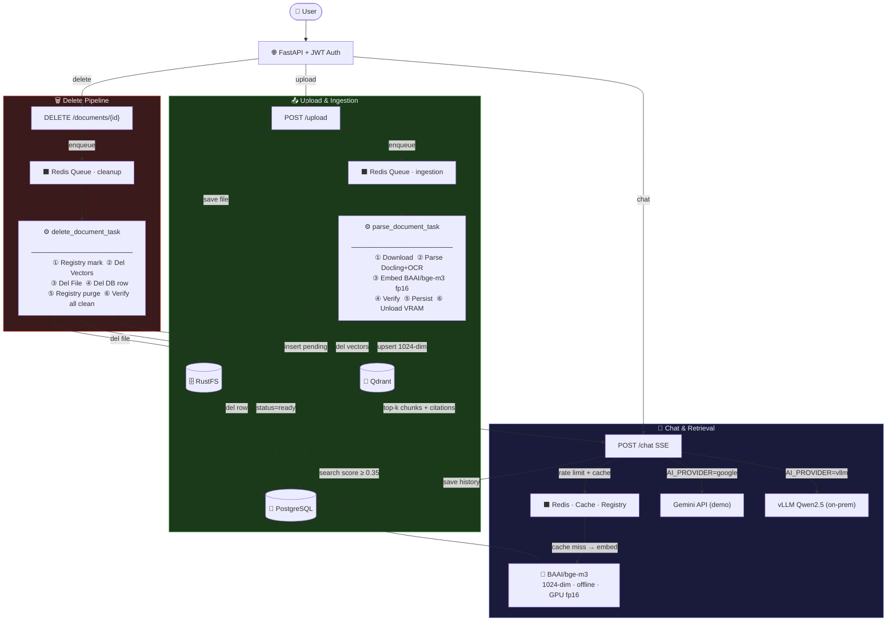

# chatbot-rag

**Docker-first, single-project hierarchical RAG chatbot** for Vietnamese enterprise documents.

> Deployment: Pure Docker. Self-hosted on your infrastructure. One project, shared document library, role-based access (admin / member).

## Tech Stack

### Core Framework
- **FastAPI 0.135** - Async API framework
- **Celery 5.6** - Distributed task queue
- **PostgreSQL 18** - Primary database
- **Redis 8.6** - Cache, queue, rate limiting

### AI & ML
- **BAAI/bge-m3** - Local embedding model (1024-dim, offline)
- **Rule-based refiner** - Fast text refinement (0GB VRAM)
- **Google Gemini 2.5-flash** - Chat LLM (temporary, external)
- **vLLM** - Local LLM inference (future, on-premise)

### Document Processing
- **Docling 2.85** - PDF/DOCX to Markdown conversion
- **EasyOCR** - Vietnamese + English OCR
- **LlamaIndex** - Hierarchical node parsing

### Storage & Retrieval
- **Qdrant 1.17** - Vector database
- **RustFS** - S3-compatible object storage
- **HuggingFace Transformers** - Model management

### Frontend
- **Streamlit 1.56** - Tree visualizer

## System Architecture

> Visual diagram: [`docs/architecture.drawio`](docs/architecture.drawio) — open with [draw.io](https://app.diagrams.net)



## What Exists

- FastAPI backend with async ingestion pipeline and live progress reporting
- **Streamlit Tree Visualizer** on port 8501 — Interactive hierarchical document explorer with zoom/pan, click-to-view, and search
- Celery worker with `acks_late`, `prefetch=1`, and 25-min soft time limit for reliability
- PostgreSQL + Redis + RustFS + Qdrant via docker-compose
- S3-compatible object storage (RustFS) for uploaded files
- Optional `vllm` service (onprem profile) for local LLM inference
- Multi-format ingestion: PDF, scanned PDF, images, DOCX, XLSX, Markdown, plain text
- **EasyOCR** (`vi+en`, GPU auto-detected) as mandatory OCR backend — no Tesseract
- Docling-first document extraction with ClassicParser fallback path
- Hierarchical document indexing: document → chapters → sections → subsections
- **BAAI/bge-m3 local embedding**: 1024-dim, 8192-token context, fully offline — no API calls, no rate limits
- **Rule-based AI refiner**: 0GB VRAM, ~1ms per node — fixes OCR errors, detects headers, validates hierarchy (NOT Qwen/Gemini)
- **Query embedding cache**: Redis-backed, MD5-keyed, TTL=1h — skip re-inference on repeated questions
- **Score threshold filter**: Drop retrieval results with cosine similarity < 0.35
- **Atomic rate limiting**: Lua script in Redis — no INCR+EXPIRE race condition
- **Hard-delete**: Full removal from vectors, file storage, and DB (with registry-first ordering)
- **Hardware auto-detection**: CPU/GPU count → embedding device selection (CUDA or CPU)

## Database Initialization

Database schema and seed data are initialized automatically at container startup:

- **Location**: [ops/init.sql](ops/init.sql) (comprehensive single-file initialization)
- **Mounted by docker-compose**: `./ops/init.sql:/docker-entrypoint-initdb.d/init.sql:ro`
- **Execution**: PostgreSQL automatically runs SQL files in `/docker-entrypoint-initdb.d/` on first startup
- **What it creates**:
  - UUID extension (`pgcrypto`, `uuid-ossp`)
   - 9 core tables: roles, users, documents, chat_sessions, chat_messages, data_sources, data_source_schema_cache, data_source_query_audit, security_audit
   - Indexes on document/session/audit lookups
  - Automatic `updated_at` triggers
   - Seed users: admin/member (password: `abc123`)

No Alembic migrations needed. Database is idempotent and initialized from a single `.sql` file.

## Project Structure

```
chatbot-rag/
├── app/
│   ├── adapters/           # External integrations (AI, parsers, embeddings)
│   ├── api/                # FastAPI routes & endpoints
│   │   └── routes/
│   │       ├── auth.py     # JWT authentication
│   │       ├── chat.py     # RAG chat endpoint
│   │       ├── documents.py # Document management
│   │       └── tree.py     # Hierarchical tree API
│   ├── core/               # Configuration, exceptions, hardware
│   ├── db/                 # PostgreSQL session management
│   ├── models/             # SQLAlchemy ORM models
│   ├── services/           # Business logic (RAG, ingestion, query cache)
│   ├── view/               # Streamlit visualizer
│   └── worker.py           # Celery task worker
├── tests/                  # Test suite (pytest)
│   ├── test_ingestion/     # Ingestion tests
│   ├── test_api/           # API endpoint tests
│   └── integration/        # End-to-end tests
├── docs/                   # Comprehensive documentation
│   ├── 01_SYSTEM_ARCHITECTURE.md
│   ├── 02_DATABASE_AND_PROJECT.md
│   ├── 03_CORE_WORKFLOWS.md
│   ├── 04_API_CONTRACT_AND_SECURITY.md
│   ├── 05_RESOURCE_OPTIMIZATION_AND_EDGE_CASES.md
│   ├── 06_DEPLOYMENT_AND_OBSERVABILITY.md
│   ├── 07_INGESTION_AND_RETRIEVAL_STRATEGY.md
│   └── STREAMLIT_VISUALIZER.md
├── ops/                    # Operations & infrastructure
│   └── init.sql            # Database schema initialization
├── docker-compose.yml      # Docker services
├── Dockerfile              # Application container
└── requirements.txt        # Python dependencies
```

## Storage Choice

- Uploaded files are stored in `RustFS`, not inside the git project and not as a local app folder source-of-truth.
- Reason: closer to production behavior, easier debugging of object-storage flows, cleaner future migration to S3-compatible deployments.
- RustFS API: `http://localhost:9000`
- RustFS console: `http://localhost:9001`

## LLM Configuration

### Current Setup (Production Demo)
- **AI Provider**: Google AI Studio (cloud-based)
- **Model**: Gemini 2.5 Flash
- **Configuration**: `AI_PROVIDER=google` in `.env`
- **Why**: Minimal resource requirements, immediate production-ready demonstration for stakeholders

### Future vLLM On-Premises Upgrade

When you have GPU hardware available, enable local inference:

#### Phase 1: Enable vLLM Service
1. Uncomment the `vllm` service in `docker-compose.yml` (lines ~125-160)
2. Optionally add HuggingFace model cache volume to persist downloaded models:
   ```yaml
   volumes:
     - hf_cache:/root/.cache/huggingface
   
   volumes:
     hf_cache:
   ```
3. Change `.env`: `AI_PROVIDER=vllm` (or keep `google` as fallback)
4. Start with profile: `docker compose --profile onprem up -d`

#### Phase 2: Scale Model Capacity (Optional)
Current default: `Qwen/Qwen2.5-7B-Instruct-AWQ` (7B parameters, lighter)

To upgrade to larger model in future, modify docker-compose.yml vLLM command:
```yaml
command: >
  --model Qwen/Qwen2.5-14B-Instruct-AWQ
  --quantization awq
  --host 0.0.0.0
  --port 8000
```

#### Hardware Requirements
- **Minimum**: NVIDIA GPU with 12GB VRAM
- **Recommended**: NVIDIA GPU with 16GB+ VRAM
- **Disk**: 8GB+ for model cache (persistent with volume)
- **Startup**: 5-15 minutes first run (model download), ~30 seconds with cached volume

#### Fallback Strategy
- Configure both providers in `.env`: `AI_PROVIDER=google` (fallback)
- App automatically routes to working provider if one fails
- Healthcheck includes vLLM when service is active

## Local Paths and Access

### Connection Details

| What | Value |
|------|-------|
| PostgreSQL host | `localhost:5432` |
| PostgreSQL DB | `ragbot` |
| PostgreSQL admin user | `db-admin` (for schema management) |
| PostgreSQL app user | `app_rw` (app runtime) |
| PostgreSQL password | set `POSTGRES_PASSWORD` / `APP_DB_PASSWORD` in `.env` |
| RedisHost | `localhost:6379` |
| RustFS API | `localhost:9000` |
| RustFS Console | `localhost:9001` |
| RustFS credentials | `rustfs` / set `S3_SECRET_KEY` in `.env` |

### Storage

- **Uploaded files**: Stored in RustFS bucket `rag-documents` (not local disk)
- **Object keys**: `s3://rag-documents/<document_id>/<filename>`
- **Local test files**: Use any temp path on your machine, upload via `POST /api/v1/upload`

## Quick Start

### Prerequisites

- Docker and Docker Compose
- `.env` file (copy from `.env.example`)

### Run the Stack

```bash
# 1. Initialize environment
cp .env.example .env
# Edit .env: set GOOGLE_API_KEY for demo mode

# 2. Build and start (BuildKit cache: pip + EasyOCR models cached across rebuilds)
DOCKER_BUILDKIT=1 docker compose up --build

# docker compose v2 (Compose V2) has BuildKit enabled by default
# On older versions: export DOCKER_BUILDKIT=1

# 3. Wait for services to be healthy (first build ~5-10min for EasyOCR model download)

# 4. Test API health
curl http://localhost:8000/api/v1/health
```

> **Build optimization**: Dockerfile uses BuildKit `--mount=type=cache` for both pip packages
> and EasyOCR models. Subsequent `docker build` runs reuse cached layers — no re-download.

### Service Endpoints

| Service | URL |
|---------|-----|
| **API** | `http://localhost:8000` |
| **OpenAPI Docs** | `http://localhost:8000/docs` |
| **Streamlit Visualizer** | `http://localhost:8501` |
| **RustFS S3 API** | `http://localhost:9000` |
| **RustFS Web Console** | `http://localhost:9001` |
| **Health Check** | `http://localhost:8000/api/v1/health` |

### Default Login Credentials (Development)

```
Username: admin
Password: abc123

Username: member
Password: abc123
```

### Optional: Run with Local LLM (vLLM)

To use a locally-hosted LLM instead of Google AI Studio:

```bash
docker compose --profile onprem up --build
```

This starts the `vllm` service with Qwen 2.5 7B (quantized). Set `AI_PROVIDER=vllm` in `.env`.

### Streamlit Tree Visualizer

The **Streamlit Tree Visualizer** is an interactive web-based tool for exploring hierarchical document structure:

- **URL**: `http://localhost:8501`
- **Purpose**: Browse document hierarchy, view node content, search across documents
- **Features**:
  - Hierarchical tree view (chapters → sections → subsections)
  - Color-coded levels (L1-L6) for visual depth
  - Click any node to view full text content
  - Search across all nodes by keyword
  - Vietnamese text support

**Usage**:
1. Open `http://localhost:8501` in your browser
2. Enter a Document ID (UUID from `/api/v1/documents`)
3. Click "🔄 Load Tree" to visualize the document structure
4. Click node titles to view content, use 📂 to expand/collapse

**Documentation**: See [`docs/STREAMLIT_VISUALIZER.md`](docs/STREAMLIT_VISUALIZER.md) for detailed usage guide.

## Database

The database is **automatically initialized** on first run via PostgreSQL's init hook:

- **Initialization file**: `ops/init.sql` (comprehens single-file schema)
- **Idempotent**: Safe to re-run; uses `CREATE IF NOT EXISTS` pattern
- **Seed data**: Default admin/member users and roles
- **No migrations needed**: Schema is complete at startup

### Troubleshooting Database Initialization

If the database doesn't initialize properly:

```bash
# 1. Stop all services
docker compose down

# 2. Remove PostgreSQL data volume
docker volume rm chatbot-rag_pgdata

# 3. Restart (will reinitialize from init.sql)
docker compose up --build
```

## Notes

- **Database**: Single `.sql` file initialization (`ops/init.sql`). No Alembic, no runtime DDL patches.
- **OCR**: EasyOCR (`vi+en`) is mandatory — pre-downloaded in Docker image, GPU auto-detected.
- **Ingestion**: Docling-first → EasyOCR → LlamaIndex hierarchy → chunked parallel embedding.
- **Embedding**: Parallel `ThreadPoolExecutor`, chunk size 32, configurable via `INGESTION_EMBEDDING_CHUNK_SIZE`.
- **Retrieval**: Query vector cached in Redis (1h TTL). Score threshold filters low-relevance chunks.
- **Rate limiting**: Atomic Lua script — safe under concurrent load, no key-expiry race condition.
- **Delete**: Full hard-delete (vectors + file + DB row). Registry marked deleted first so /status updates instantly.
- **vLLM model**: Configured via `VLLM_MODEL` env var — no longer hardcoded.
- **Hardware detection**: CPU/GPU auto-detected at startup via `app/core/hardware.py`.
- `/health` performs real dependency checks (PostgreSQL, Redis, RustFS, AI provider).
- `AI_PROVIDER=google` for demo; `AI_PROVIDER=vllm` for production on-premise.

## Implemented Endpoints (Scaffold → Production)

| Endpoint | Method | Status | Notes |
|----------|--------|--------|-------|
| `/api/v1/health` | GET | ✅ Working | Real dependency checks |
| `/api/v1/auth/login` | POST | ✅ Working | Returns bearer access token |
| `/api/v1/auth/logout` | POST | ✅ Working | Revokes active token |
| `/api/v1/auth/users` | POST | ✅ Working | Creates a user (admin only) |
| `/api/v1/upload` | POST | ✅ Working | Enqueues Celery job; returns task_id |
| `/api/v1/status/{task_id}` | GET | ✅ Working | Returns normalized task/document progress |
| `/api/v1/chat` | POST | ✅ Working | Provider-driven chat (`vllm` on-prem default, `google` demo mode) |
| `/api/v1/documents` | GET | ✅ Working | Lists documents and current pipeline status |
| `/api/v1/documents/{id}` | GET | ✅ Working | Returns full document metadata/status |
- `DELETE /api/v1/documents/{document_id}` soft-deletes a document and removes the source object from storage.
- Worker ingestion now extracts text from PDF, scanned PDF, images, DOCX, and XLSX.
- Parsing uses the Docling-first pipeline with classic parser fallback.
- Indexed output is stored as hierarchical nodes for later retrieval.
- `POST /api/v1/chat` uses adapter-based provider selection from `AI_PROVIDER`.
- Public API contract is served under `/api/v1/*`.

## Upload Processing Workflow

When an admin uploads a file via `POST /api/v1/upload`, the system runs this pipeline:

1. **Guardrails at API layer**
   - Enforce admin role and upload rate limit.
   - Validate filename and max size (`MAX_UPLOAD_SIZE_MB`).

2. **Deduplication and versioning**
   - Compute SHA-256 for uploaded bytes.
   - Reject active duplicates (`409 duplicate`) when hash matches an existing non-deleted document.
   - Compute next version for same filename.

3. **Persist source file + document row**
   - Save original file to RustFS as `s3://<bucket>/<document_id>/<filename>`.
   - Insert `documents` row with `status=pending`, `status_stage=uploaded`, `progress_percent=1`.
   - Write upload audit log.

4. **Queue asynchronous ingestion**
   - Register `document_id <-> task_id` in Redis.
   - Enqueue Celery task `app.worker.parse_document_task`.
   - Update `documents` progress to `status_stage=queued`, `progress_percent=5`.
   - Return `202 Accepted` immediately with `task_id`, `document_id`, `status=queued`.

5. **Worker parsing and indexing**
   - Download file from RustFS (`status_stage=download`, `progress_percent=10`).
   - Convert the file locally with Docling into Markdown (`status_stage=parse`, `progress_percent=40`).
   - Use LlamaIndex `MarkdownNodeParser` to turn the Markdown into hierarchical nodes.
   - Build hierarchical retrieval nodes for Qdrant (root + parent/child relationships).
   - If Docling or LlamaIndex fails, fall back to the classic parser so upload still completes when possible.
   - **Rule-based refiner** fixes OCR errors (e.g., "M Ụ C T I Ê U" → "MỤC TIÊU"), detects headers, validates hierarchy — 0GB VRAM, ~1ms per node.
   - Validate extraction quality thresholds (`INGESTION_MIN_NON_EMPTY_NODES`, `INGESTION_MIN_TOTAL_TEXT_CHARS`).
   - Save ingestion artifact into `documents.metadata.ingestion_artifact`.
   - Persist metadata (`status_stage=persist`, `progress_percent=75`).
   - Mark document `ready` on success (`progress_percent=100`) or `failed` + `parse_error` on failure.

6. **Client polling**
   - Use `GET /api/v1/status/{task_id}` until status is `ready` or `failed`.

### Document Status Lifecycle

- `status` (coarse): `pending | processing | ready | failed | deleted`
- `status_stage` (detailed): `uploaded | queued | enqueue_failed | download | parse | persist | ready | failed | deleted`
- `progress_percent`: `0..100`

7. **Retrieval behavior after ready**
   - Chat retrieval excludes soft-deleted documents.
   - Retrieval prefers latest document version per filename.

### Streamlit Tree Visualizer

**NEW**: Interactive hierarchical document explorer on port 8501.

#### Features
- **Hierarchical tree display**: View complete document structure as expandable tree
- **Click-to-view details**: Click any node to view full text content and metadata
- **Search functionality**: Search nodes by title or content across entire document
- **Color-coded levels**: Visual distinction by hierarchy depth (L1-L6)
- **Zoom/pan support**: Navigate large documents with 100+ nodes efficiently
- **Breadcrumb navigation**: See full path from root to current node
- **Metadata display**: View page numbers, node types, character counts, token counts

#### Usage
1. Start all services: `docker compose up --build`
2. Open browser: `http://localhost:8501`
3. Enter Document ID (UUID from admin dashboard or `/api/v1/documents`)
4. Click "Load Tree" to visualize document structure
5. Click any node title to view full content
6. Use Search tab to find specific text in document

#### API Integration
The visualizer uses new tree API endpoints:
- `GET /api/v1/documents/{document_id}/tree` — Get complete hierarchical structure
- `GET /api/v1/documents/{document_id}/nodes/{node_id}` — Get single node details
- `GET /api/v1/documents/{document_id}/search` — Search nodes by content

See [docs/STREAMLIT_VISUALIZER.md](docs/STREAMLIT_VISUALIZER.md) for detailed usage guide.

## Text Extraction And AI Usage

Short answer: **yes, extraction uses local AI/ML processing**, but **does not call the chat LLM provider during upload**.

1. **During upload ingestion**
   - Docling is the primary local parser for upload.
   - LlamaIndex turns the Docling Markdown output into hierarchical nodes.
   - The classic parser path is fallback only.
   - No call to `AI_PROVIDER` (`google`/`vllm`) in the upload pipeline.

2. **During chat answering**
   - `AI_PROVIDER` is used in `POST /api/v1/chat` to generate final answer from retrieved context.
   - Citations come from indexed hierarchical nodes stored in Qdrant.

## Chat Behavior Target

- Keep chat history minimal.
- Use one active chat session at a time for the project.
- Creating a new chat should clear the active session history.
- Retain messages for 24h only if you need temporary debugging/audit.

## Chat Storage Today

- Active chat state is stored in Redis with per-user key scoping.
- Session ownership is checked against `chat_sessions.user_id` to prevent cross-user access.
- Messages are kept with short TTL in Redis for runtime context and persisted to DB as assistant replies.
- This remains lightweight for local development and debugging.

## Database Model

The database keeps three main kinds of data:

- `roles`: stores account permissions in DB
- `documents`: one row per uploaded file, including file path, hash, size, and status
- Qdrant: the extracted document tree and retrieval payload used for hierarchical RAG

Simple flow:

```text
Upload file
   |
   v
RustFS object
   |
   v
documents row
   |
   v
worker parse
   |
   v
hierarchical nodes in Qdrant
   |
   v
ready for RAG
```

1. Upload file to RustFS
2. Create a `documents` row with `status=pending`
3. Worker parses the file
4. Worker writes hierarchical nodes to Qdrant
5. `documents.status` becomes `ready`

For deletes:

- **Hard-delete** removes ALL traces: vectors from Qdrant, file from RustFS, DB row.
- Deletion order: (1) `registry.delete()` → /status = 'deleted' immediately, (2) Qdrant vectors, (3) RustFS file, (4) DB row, (5) `registry.purge()`.
- Historical chat messages referencing the document are preserved in DB for audit.

The rest of the tables support auth, chat history, and future data connectors.

## Auth And Roles

- No public self-signup.
- Admin users manage account creation.
- Admin and member accounts are stored in the database.
- Roles:
  - `admin`: can create users and upload files
  - `member`: can only chat with AI

Protected routes:

- `POST /api/v1/upload` requires `admin`
- `POST /api/v1/auth/users` requires `admin`
- `POST /api/v1/chat` requires a valid JWT

Login uses the DB-backed project accounts plus username/password.
