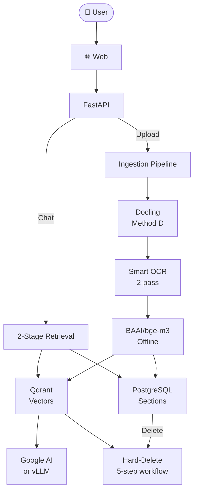

# chatbot-rag

**Docker-first, on-premise hierarchical RAG chatbot** for Vietnamese enterprise documents.

> Self-hosted. No cloud lock-in. Complete control. One shared document library. Role-based access (admin / member).

## ✨ Features

| Feature | Details |
|---------|---------|
| **Hierarchical Indexing** | Docs → Sections (H1-H6) → Chunks (~400 tokens) |
| **2-Stage Retrieval** | Coarse section search → Fine chunk search |
| **Smart OCR** | 2-pass (native PDFs: no OCR, scanned: auto-OCR) |
| **Async Ingestion** | Upload returns instantly, parsing async via Celery |
| **Real-time Chat** | SSE streaming with citations + admin dashboard |
| **Local Embeddings** | BAAI/bge-m3 (1024-dim, offline, no API calls) |
| **Production Ready** | 5-phase hardening: secrets, Docker, API, pipeline, tests |

## Tech Stack

| Layer | Tech |
|-------|------|
| **Frontend** | Next.js 16 + shadcn/ui + next-auth v5 (JWT) |
| **Backend** | FastAPI + Celery + PostgreSQL + Redis |
| **Search** | Qdrant (vectors) + PostgreSQL (sections) |
| **AI** | Google AI (gemma-4-26b-a4b-it) or vLLM (on-prem) |
| **OCR** | EasyOCR (vi+en), GPU auto-detected |
| **Storage** | RustFS (S3-compatible) |

## Documentation

**Start here**: Read `CLAUDE.md` for mandatory rules, then explore `docs/` folder.

| Topic | Read | Time |
|-------|------|------|
| **Rules & patterns** | `docs/00_QUICK_REFERENCE.md` | 5 min |
| **System architecture** | `docs/01_SYSTEM_ARCHITECTURE.md` | 10 min |
| **2-stage retrieval deep dive** | `docs/07_INGESTION_AND_RETRIEVAL_STRATEGY.md` | 15 min |
| **All topics by category** | See index in `docs/` folder | varies |

## Quick Start

### Prerequisites
- Docker & Docker Compose
- `.env` file (copy from `.env.example`)

### Run
```bash
# 1. Set up environment
cp .env.example .env
# Edit .env: set GOOGLE_API_KEY for demo

# 2. Build & start all services
DOCKER_BUILDKIT=1 docker compose up --build

# 3. Wait for services to be healthy (~5-10 min on first build)

# 4. Test
curl http://localhost:8000/api/v1/health
```

### Access Services
| Service | URL |
|---------|-----|
| **Web App** | http://localhost:3000 |
| **API** | http://localhost:8000 |
| **API Docs** | http://localhost:8000/docs |
| **Qdrant** | http://localhost:6333/dashboard |
| **RustFS Console** | http://localhost:9001 |

### Default Credentials
```
Username: admin / member
Password: abc123
```

## With Local LLM (vLLM)

Replace Google AI with local Qwen 2.5 on GPU:

```bash
docker compose --profile onprem up --build
```

Then set `.env`: `AI_PROVIDER=vllm`

## Architecture



## Documentation

Everything you need to know is in `docs/`:

- **[docs/00_QUICK_REFERENCE.md](docs/00_QUICK_REFERENCE.md)** — Rules & patterns cheat sheet
- **[docs/01_SYSTEM_ARCHITECTURE.md](docs/01_SYSTEM_ARCHITECTURE.md)** — System design
- **[docs/07_INGESTION_AND_RETRIEVAL_STRATEGY.md](docs/07_INGESTION_AND_RETRIEVAL_STRATEGY.md)** — How 2-stage retrieval works
- **[docs/02_DATABASE_AND_PROJECT.md](docs/02_DATABASE_AND_PROJECT.md)** — Database schema
- **[docs/03_CORE_WORKFLOWS.md](docs/03_CORE_WORKFLOWS.md)** — Ingestion, chat, retrieval workflows
- **[docs/04_API_CONTRACT_AND_SECURITY.md](docs/04_API_CONTRACT_AND_SECURITY.md)** — All endpoints & security patterns
- **[docs/06_DEPLOYMENT_AND_OBSERVABILITY.md](docs/06_DEPLOYMENT_AND_OBSERVABILITY.md)** — Production deployment guide

For any question, the answer is in `docs/`.

## Implemented Routes

| Endpoint | Method | Purpose |
|----------|--------|---------|
| `/api/v1/auth/login` | POST | JWT authentication |
| `/api/v1/auth/logout` | POST | Revoke token |
| `/api/v1/upload` | POST | Upload document (admin only) |
| `/api/v1/status/{task_id}` | GET | Poll ingestion progress |
| `/api/v1/chat` | POST | Chat with RAG (returns answer + citations) |
| `/api/v1/chat/stream` | POST | Chat with SSE streaming |
| `/api/v1/documents` | GET | List documents |
| `/api/v1/documents/{id}` | DELETE | Hard-delete document |
| `/api/v1/tree/{document_id}` | GET | Hierarchical tree structure |
| `/api/v1/health` | GET | Service health check |

See `docs/04_API_CONTRACT_AND_SECURITY.md` for full endpoint details.

## Database

- **Auto-initialized** via `ops/init.sql` on first run
- **No migrations needed** — schema is complete at startup
- **Idempotent** — safe to re-run `docker compose up`

To reset:
```bash
docker compose down
docker volume rm chatbot-rag_pgdata
docker compose up --build
```

## Ingestion Pipeline

1. Upload file → Save to RustFS → Enqueue Celery task
2. Worker: Download → Parse (Docling) → Smart OCR → Embed
3. Store: Sections → PostgreSQL, Vectors → Qdrant
4. Return: Status updates live via `/api/v1/status/{task_id}`

**Parsing**: Docling (primary, preserves metadata) + fallback classic parser
**OCR**: EasyOCR (fast path for native PDFs, fallback for scanned)
**Refinement**: Rule-based only (0GB VRAM, no AI needed)

## Key Invariants

| Rule | Why |
|------|-----|
| **Async ingestion** | Upload returns immediately with `task_id` |
| **2-stage retrieval** | Section search (coarse) → Chunk search (fine) |
| **Hard-delete ordering** | registry → vectors → file → DB → purge |
| **Local embeddings** | BAAI/bge-m3 offline, no API rate limits |
| **Atomic rate limiting** | Lua script in Redis, no race conditions |
| **Citations required** | Every answer must include sources |

## Configuration

All env vars are in `app/core/config.py`. Key ones:

```bash
# AI
AI_PROVIDER=google              # or: vllm
GOOGLE_API_KEY=...             # Required for Google AI
EMBEDDING_HF_MODEL=BAAI/bge-m3 # Must be bge-m3

# Retrieval thresholds
RETRIEVAL_SECTION_MIN_SCORE=0.30  # Stage 1
RETRIEVAL_MIN_SCORE=0.35          # Stage 2

# Production safety (enforced when APP_ENV=production)
ALLOWED_HOSTS=specific_host     # Not wildcard
CORS_ORIGINS=specific_origin    # Not localhost
S3_SECURE=true                  # Not false
```

See `docs/06_DEPLOYMENT_AND_OBSERVABILITY.md` for production deployment.

## Deployment

### Development
```bash
docker compose up --build
```

### Production
Same Docker Compose, but:
1. Set production-safe env vars (see Configuration)
2. Use proper `ALLOWED_HOSTS` and `CORS_ORIGINS`
3. Sit behind a reverse proxy (nginx/Caddy)
4. Use real TLS certificates

See `docs/06_DEPLOYMENT_AND_OBSERVABILITY.md` for details.

## Status

✅ **Production ready** — 5 phases of hardening complete
- Phase 0: Secret containment
- Phase 1: Docker hardening
- Phase 2: API hardening
- Phase 3: Pipeline recovery
- Phase 4: Route coverage tests
- Phase 5: Documentation

See `CHANGELOG.md` for all changes.

## License

[LICENSE](LICENSE)
