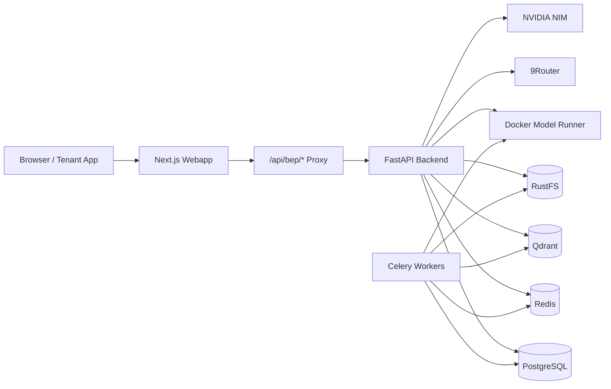

# chatbot-rag

[](./LICENSE) [](https://fastapi.tiangolo.com/) [](https://nextjs.org/) [](https://qdrant.tech/) [](https://www.postgresql.org/) [](https://redis.io/) [](https://docs.celeryq.dev/) [](https://www.docker.com/) [](https://ui.shadcn.com/) [](https://github.com/iZenDeveloper/auditai)

A self-hosted, multi-tenant RAG chatbot platform built for SaaS-style operations and real product integration.

`chatbot-rag` is designed as an AI gateway between tenant applications and enterprise knowledge retrieval. It combines tenant-scoped document ingestion, stateless chat, OpenAI-compatible APIs, hybrid retrieval, usage tracking, and an internal admin console in one deployable stack.

---

## Table of Contents

- [Overview](#overview)
- [Retrieval Accuracy](#retrieval-accuracy)
- [Key Capabilities](#key-capabilities)
- [System Architecture](#system-architecture)
- [Technology Stack](#technology-stack)
- [Product Model](#product-model)
- [Retrieval Pipeline](#retrieval-pipeline)
- [Public API Example](#public-api-example)
- [Quick Start](#quick-start)
- [Operational Notes](#operational-notes)
- [Repository Guide](#repository-guide)
- [Acknowledgments](#acknowledgments)
- [License](#license)

---

## Overview

Most internal chatbots stop at "upload files and ask questions." This project is intentionally built for a more demanding enterprise use case:

- Multiple tenants on shared infrastructure
- Strict tenant data isolation
- Stateless chat flows for scalability
- Seamless integration into tenant software through a familiar OpenAI-compatible API
- Provider-aware retrieval and generation
- Operational visibility for usage, quota, and model behavior

The result is a platform that serves as a robust foundation for embedding AI assistance inside real business software.

---

## Retrieval Accuracy

The platform is continuously audited and stress-tested using conversational, real-world Vietnamese queries mimicking non-technical end-users. 

In our latest live production evaluation (July 2026) using the **BGE-M3** semantic embedding model and **Qdrant** Hybrid Search, the system achieved a perfect score against complex technical manuals:

```text
Queries: 10 conversational, non-standard questions
MRR: 1.0000 (100%)
Hit@1: 1.0000 (100%)
nDCG@5: 1.0000 (100%)
```

**Conclusion:** The RAG engine reliably retrieves the exact document ID on the very first try, demonstrating high resilience against slang, formatting variations, and casual phrasing.

---

## Key Capabilities

### Multi-tenant by design
- Tenant-scoped documents, usage, and quota
- Tenant-scoped instructions and welcome messages
- Tenant-scoped API keys

### Stateless chat
- No product dependency on persisted chat sessions
- Frontend holds recent transcript in memory only
- Backend receives recent `messages`, injects tenant instruction and retrieved context, then answers
- Premium glassmorphism chat interface for smooth testing

### OpenAI-compatible public API
- Easy integration for tenant applications
- Compatible mental model for existing AI clients and internal tooling

### Hybrid retrieval pipeline
- Qdrant-backed dense and sparse hybrid search
- Section hydration from PostgreSQL (accelerated via Redis caching)
- Adaptive reranking with NVIDIA NIM (skips obvious queries to save tokens)

### Admin-first operations
- Platform-wide tenant management
- Tenant-scoped document operations
- API key management
- Usage and spend visibility
- Provider/runtime configuration through the webapp

### Self-hosted deployment
- Docker Compose topology
- Object storage, vector store, queue/cache, reverse proxy, and web UI included

---

## System Architecture



### Internal request flow
`Browser -> Next.js Webapp -> /api/bep/* -> Next.js Route Handler -> FastAPI`

### Public integration flow
`Tenant Software -> OpenAI-compatible API -> FastAPI -> Retrieval + LLM orchestration`

---

## Technology Stack

### Application Layer
- **Frontend:** Next.js 16
- **UI:** shadcn/ui + Base UI primitives
- **Backend:** FastAPI
- **Workers:** Celery

### Data and Infrastructure
- **Primary database:** PostgreSQL
- **Vector database:** Qdrant
- **Cache / queue:** Redis
- **Object storage:** RustFS (S3-compatible)
- **Reverse proxy:** Traefik

### AI Runtime
- **LLM gateway:** 9Router
- **Default embedding runtime:** Docker Model Runner (BAAI/bge-m3)
- **Default reranker:** NVIDIA NIM

---

## Product Model

### Roles

#### `platform_admin`
- Creates tenants and provisions admin accounts
- Manages platform-wide API keys
- Uploads and manages tenant documents
- Reviews cross-tenant usage and spend

#### `tenant_admin`
- Views tenant documents and tests chat in tenant scope
- Views tenant usage and quota
- Edits tenant-specific chatbot settings and instructions
- Cannot manage platform-wide resources

### Chat Model
The product uses **stateless chat**:
- No persisted `chat_sessions` / `chat_messages` product flow
- Transcript lives in frontend memory while the chat stays open
- Backend only needs recent `messages` plus tenant context

---

## Retrieval Pipeline

At a high level:
1. Accept the latest user query
2. Enforce tenant boundary
3. Run hybrid retrieval in Qdrant
4. Hydrate top sections from PostgreSQL (with Redis caching)
5. Rerank when useful
6. Build final generation context
7. Call the LLM through 9Router

**Notable implementation details:**
- Payload-indexed tenant/document/section metadata in Qdrant.
- Chat history used for LLM context, not as default RAG expansion.
- Adaptive rerank skipping for short, high-confidence queries.
- SSE-based streaming for chat and ingestion progress.

---

## Public API Example

```http
POST /v1/chat/completions
Authorization: Bearer <tenant_api_key>
Content-Type: application/json
```

```json
{
  "model": "chatbot-rag",
  "messages": [
    {
      "role": "user",
      "content": "How do I create a warehouse receipt?"
    }
  ],
  "stream": true,
  "temperature": 0.2
}
```

---

## Quick Start

### Backend (API)
```bash
cd chatbot-api
cp .env.example .env
docker compose build
docker compose up -d
```

### Frontend (Webapp)
```bash
cd chatbot-webapp
npm install
npm run dev
```

### Useful endpoints
- **Web app (Local):** `http://localhost:3000`
- **Backend API:** `https://api.qtuanph.dev/v1/health`
- **Qdrant dashboard:** `http://localhost:6333/dashboard`
- **9Router:** `http://localhost:2908`
- **Traefik dashboard:** `http://localhost:8080`

---

## Operational Notes

- Chat uses **SSE** for response streaming.
- Document ingestion progress also uses **SSE**.
- The current stack is better aligned with real deployment than single-machine demos.
- Throughput at scale still depends on LLM provider capacity, embedding/reranking throughput, worker concurrency, and database sizing.

---

## Repository Guide

If you are contributing or maintaining the project, start here:

| Topic | File |
|---|---|
| Project guardrails | `AGENTS.md` |
| Architecture | `docs/1_ARCHITECTURE.md` |
| Workflows | `docs/2_WORKFLOWS.json` |
| API contracts | `docs/3_API_CONTRACTS.md` |
| Deployment | `docs/4_DEPLOYMENT.md` |
| Runtime snapshot | `docs/7_CURRENT_SETTINGS.json` |

---

## Acknowledgments

Special thanks to our contributors:
- **[iZenDeveloper](https://github.com/iZenDeveloper)** for integrating the [AuditAI](https://github.com/iZenDeveloper/auditai) RAG quality smoke suite into the project, helping us measure and improve retrieval accuracy and safety.

---

## License

Licensed under **AGPL-3.0**.
