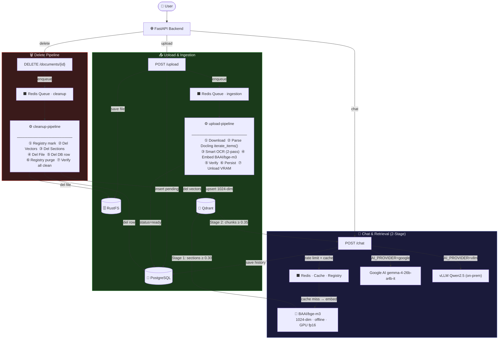

# chatbot-rag

**Docker-first, single-project hierarchical RAG chatbot** for Vietnamese enterprise documents with Next.js 16 frontend.

> Deployment: Pure Docker. Self-hosted on your infrastructure. One project, shared document library, role-based access (admin / member).

## Tech Stack

### Frontend
- **Next.js 16** - React framework with App Router
- **shadcn/ui v4** - UI component library
- **next-auth v5** - Authentication with JWT strategy
- **@xyflow/react** - Document tree visualization
- **Tailwind CSS v4** - Styling

### Core Framework
- **FastAPI 0.135** - Async API framework
- **Celery 5.6** - Distributed task queue
- **PostgreSQL 18** - Primary database
- **Redis 8.6** - Cache, queue, rate limiting

### AI & ML
- **Chat LLM**: Google AI `gemma-4-26b-a4b-it` (26B parameters, high quality)
- **Embedding**: `BAAI/bge-m3` (1024-dim, offline, multilingual)
- **AI Refiner**: Rule-based heuristics (0GB VRAM, ~1ms per node) — NO AI in ingestion
- **OCR**: EasyOCR (vi+en), GPU auto-detected
- **Future (vLLM)**: On-premise local LLM inference

### Document Processing
- **Docling 2.88** - PDF/DOCX to Markdown conversion
- **EasyOCR** - Vietnamese + English OCR
- **LlamaIndex** - Hierarchical node parsing

### Storage & Retrieval
- **Qdrant 1.17** - Vector database
- **RustFS** - S3-compatible object storage
- **HuggingFace Transformers** - Model management

## System Architecture

> Visual diagram: [`docs/architecture.drawio`](docs/architecture.drawio) — open with [draw.io](https://app.diagrams.net)



## What Exists

### Frontend (Next.js 16)
- Modern web interface with shadcn/ui v4 components
- JWT authentication via next-auth v5 with Credentials provider
- SSE streaming chat for real-time AI responses
- Admin dashboard with health monitoring
- Document management (upload, list, detail with react-flow tree)
- User management (CRUD operations for admins)
- Role-based routing (admin vs member access)

### Backend (FastAPI)
- Async ingestion pipeline with live progress reporting
- Celery worker with `acks_late`, `prefetch=1`, and 25-min soft time limit for reliability
- PostgreSQL + Redis + RustFS + Qdrant via docker-compose
- S3-compatible object storage (RustFS) for uploaded files
- Optional `vllm` service (onprem profile) for local LLM inference
- Multi-format ingestion: PDF, scanned PDF, images, DOCX, XLSX, Markdown, plain text
- **EasyOCR** (`vi+en`, GPU auto-detected) as mandatory OCR backend — no Tesseract
- Docling-first document extraction with `iterate_items()` (Method D) for 100% metadata preservation
- **Smart OCR Strategy**: 2-pass — fast no-OCR for native PDFs, OCR fallback only for scanned PDFs
- ClassicParser fallback path if Docling fails
- **2-stage retrieval**: Sections (coarse, ≥ 0.30) → Chunks (fine, ≥ 0.35)
- **`document_sections` table** in PostgreSQL for section-level storage
- **BAAI/bge-m3 local embedding**: 1024-dim, 8192-token context, fully offline — no API calls, no rate limits
- **Rule-based refiner**: 0GB VRAM, ~1ms per node — fixes OCR errors, detects headers, validates hierarchy (NO AI in ingestion)
- **Query embedding cache**: Redis-backed, MD5-keyed, TTL=1h — skip re-inference on repeated questions
- **Score threshold filter**: Drop retrieval results with cosine similarity < 0.35
- **Atomic rate limiting**: Lua script in Redis — no INCR+EXPIRE race condition
- **Hard-delete**: Full removal from vectors, sections, file storage, and DB (with registry-first ordering)
- **Hardware auto-detection**: CPU/GPU count → embedding device selection (CUDA or CPU)
- **Tree API**: Hierarchical document exploration endpoints

## Database Initialization

Database schema and seed data are initialized automatically at container startup:

- **Location**: [ops/init.sql](ops/init.sql) (comprehensive single-file initialization)
- **Mounted by docker-compose**: `./ops/init.sql:/docker-entrypoint-initdb.d/init.sql:ro`
- **Execution**: PostgreSQL automatically runs SQL files in `/docker-entrypoint-initdb.d/` on first startup
- **What it creates**:
  - UUID extension (`pgcrypto`, `uuid-ossp`)
  - Core tables: roles, users, documents, document_sections, chat_sessions, chat_messages, data_sources, data_source_schema_cache, data_source_query_audit, security_audit
  - Indexes on document/session/audit/section lookups
  - Automatic `updated_at` triggers
  - Seed users: admin/member (password: `abc123`)

No Alembic migrations needed. Database is idempotent and initialized from a single `.sql` file.

## Project Structure

```
chatbot-rag/
├── app/                    # FastAPI backend
│   ├── adapters/           # External integrations (AI, parsers, embeddings)
│   ├── api/                # FastAPI routes & endpoints
│   │   └── routes/
│   │       ├── auth.py     # JWT authentication
│   │       ├── chat.py     # RAG chat endpoint (SSE streaming)
│   │       ├── documents.py # Document management
│   │       ├── tree.py     # Hierarchical tree API
│   │       └── health.py   # Health monitoring endpoints
│   ├── core/               # Configuration, exceptions, hardware
│   ├── db/                 # PostgreSQL session management
│   ├── models/             # SQLAlchemy ORM models
│   ├── services/           # Business logic (RAG, ingestion, query cache)
│   ├── workers/            # Celery task workers
│   │   ├── upload_pipeline.py    # Ingestion tasks (GPU)
│   │   └── cleanup_pipeline.py   # Delete + chat session cleanup + beat
├── webapp/                 # Next.js 16 frontend
│   ├── app/                # Next.js App Router
│   │   ├── (auth)/         # Auth routes (login)
│   │   ├── (main)/         # Main app routes (chat, admin, settings)
│   │   │   ├── admin/      # Admin dashboard
│   │   │   │   ├── documents/ # Document management
│   │   │   │   └── users/     # User management
│   │   │   └── chat/       # Chat interface
│   │   └── layout.tsx      # Root layout
│   ├── components/         # React components
│   │   ├── admin/          # Admin components
│   │   └── ui/             # shadcn/ui components
│   └── lib/                # Utilities (auth, API client)
├── docs/                   # Comprehensive documentation
│   ├── 01_SYSTEM_ARCHITECTURE.md
│   ├── 02_DATABASE_AND_PROJECT.md
│   ├── 03_CORE_WORKFLOWS.md
│   ├── 04_API_CONTRACT_AND_SECURITY.md
│   ├── 05_RESOURCE_OPTIMIZATION_AND_EDGE_CASES.md
│   ├── 06_DEPLOYMENT_AND_OBSERVABILITY.md
│   └── 07_INGESTION_AND_RETRIEVAL_STRATEGY.md
├── ops/                    # Operations & infrastructure
│   └── init.sql            # Database schema initialization
├── docker-compose.yml      # Docker services
├── Dockerfile              # Application container
└── requirements.txt        # Python dependencies
```

## Storage Choice

- Uploaded files are stored in `RustFS`, not inside the git project and not as a local app folder source-of-truth.
- Reason: closer to production behavior, easier debugging of object-storage flows, cleaner future migration to S3-compatible deployments.
- RustFS API: `http://localhost:9000`
- RustFS console: `http://localhost:9001`

## LLM Configuration

### Current Setup (Production Demo)
- **AI Provider**: Google AI Studio (cloud-based)
- **Model**: `gemma-4-26b-a4b-it` (26B parameters, high quality)
- **Configuration**: `AI_PROVIDER=google` in `.env`
- **API Key**: Single `GOOGLE_API_KEY` (no rotation)
- **Why**: High-quality responses, production-ready demonstration

### Future vLLM On-Premises Upgrade

When you have GPU hardware available, enable local inference:

#### Phase 1: Enable vLLM Service
1. Uncomment the `vllm` service in `docker-compose.yml`
2. Optionally add HuggingFace model cache volume to persist downloaded models
3. Change `.env`: `AI_PROVIDER=vllm` (or keep `google` as fallback)
4. Start with profile: `docker compose --profile onprem up -d`

#### Phase 2: Scale Model Capacity (Optional)
Current default: `Qwen/Qwen2.5-7B-Instruct-AWQ` (7B parameters, lighter)

To upgrade to larger model in future, modify docker-compose.yml vLLM command:
```yaml
command: >
  --model Qwen/Qwen2.5-14B-Instruct-AWQ
  --quantization awq
  --host 0.0.0.0
  --port 8000
```

#### Hardware Requirements
- **Minimum**: NVIDIA GPU with 12GB VRAM
- **Recommended**: NVIDIA GPU with 16GB+ VRAM
- **Disk**: 8GB+ for model cache (persistent with volume)
- **Startup**: 5-15 minutes first run (model download), ~30 seconds with cached volume

## Local Paths and Access

### Connection Details

| What | Value |
|------|-------|
| PostgreSQL host | `localhost:5432` |
| PostgreSQL DB | `ragbot` |
| PostgreSQL admin user | `db-admin` (for schema management) |
| PostgreSQL app user | `app_rw` (app runtime) |
| PostgreSQL password | set `POSTGRES_PASSWORD` / `APP_DB_PASSWORD` in `.env` |
| Redis Host | `localhost:6379` |
| RustFS API | `localhost:9000` |
| RustFS Console | `localhost:9001` |
| RustFS credentials | `rustfs` / set `S3_SECRET_KEY` in `.env` |

### Service Endpoints

| Service | URL |
|---------|-----|
| **Webapp (Next.js)** | `http://localhost:3000` |
| **API (FastAPI)** | `http://localhost:8000` |
| **OpenAPI Docs** | `http://localhost:8000/docs` |
| **RustFS S3 API** | `http://localhost:9000` |
| **RustFS Web Console** | `http://localhost:9001` |
| **Qdrant Dashboard** | `http://localhost:6333/dashboard` |
| **Health Check** | `http://localhost:8000/api/v1/health` |

## Quick Start

### Prerequisites

- Docker and Docker Compose
- `.env` file (copy from `.env.example`)

### Run the Stack

```bash
# 1. Initialize environment
cp .env.example .env
# Edit .env: set GOOGLE_API_KEY for demo mode

# 2. Build and start (BuildKit cache: pip + EasyOCR models cached across rebuilds)
DOCKER_BUILDKIT=1 docker compose up --build

# 3. Wait for services to be healthy (first build ~5-10min for EasyOCR model download)

# 4. Test API health
curl http://localhost:8000/api/v1/health
```

> **Build optimization**: Dockerfile uses BuildKit `--mount=type=cache` for both pip packages
> and EasyOCR models. Subsequent `docker build` runs reuse cached layers — no re-download.

### Default Login Credentials (Development)

```
Username: admin
Password: abc123

Username: member
Password: abc123
```

### Optional: Run with Local LLM (vLLM)

To use a locally-hosted LLM instead of Google AI Studio:

```bash
docker compose --profile onprem up --build
```

This starts the `vllm` service with Qwen 2.5 7B (quantized). Set `AI_PROVIDER=vllm` in `.env`.

## Database

The database is **automatically initialized** on first run via PostgreSQL's init hook:

- **Initialization file**: `ops/init.sql` (comprehensive single-file schema)
- **Idempotent**: Safe to re-run; uses `CREATE IF NOT EXISTS` pattern
- **Seed data**: Default admin/member users and roles
- **No migrations needed**: Schema is complete at startup

### Troubleshooting Database Initialization

If the database doesn't initialize properly:

```bash
# 1. Stop all services
docker compose down

# 2. Remove PostgreSQL data volume
docker volume rm chatbot-rag_pgdata

# 3. Restart (will reinitialize from init.sql)
docker compose up --build
```

## Notes

- **Frontend**: Next.js 16 with shadcn/ui v4, next-auth v5 (JWT), SSE streaming for real-time chat.
- **Database**: Single `.sql` file initialization (`ops/init.sql`). No Alembic, no runtime DDL patches.
- **OCR**: EasyOCR (`vi+en`) is mandatory — pre-downloaded in Docker image, GPU auto-detected.
- **Ingestion**: Docling `iterate_items()` (Method D) → Smart OCR (2-pass) → Section extraction → Rule-based refiner → chunked parallel embedding.
- **Retrieval**: 2-stage pipeline — coarse section search (≥ 0.30) → fine chunk search (≥ 0.35).
- **Embedding**: Parallel `ThreadPoolExecutor`, chunk size 32, configurable via `INGESTION_EMBEDDING_CHUNK_SIZE`.
- **Refiner**: Rule-based only — 0GB VRAM, ~1ms per node. NO AI in ingestion pipeline.
- **Rate limiting**: Atomic Lua script — safe under concurrent load, no key-expiry race condition.
- **Delete**: Full hard-delete (sections + vectors + file + DB row). Registry marked deleted first so /status updates instantly. Deletion via `cleanup-pipeline` worker.
- **Chat session cleanup**: Auto-delete sessions older than 1 day via Celery beat (`cleanup-pipeline` worker).
- **Hardware detection**: CPU/GPU auto-detected at startup via `app/core/hardware.py`.
- `/health` performs real dependency checks (PostgreSQL, Redis, RustFS, AI provider).
- `AI_PROVIDER=google` for demo; `AI_PROVIDER=vllm` for production on-premise.

## Implemented Endpoints

| Endpoint | Method | Status | Notes |
|----------|--------|--------|-------|
| `/api/v1/health` | GET | ✅ Working | Real dependency checks |
| `/api/v1/health/data` | GET | ✅ Working | Detailed health data with checks |
| `/api/v1/health/nodes` | GET | ✅ Working | List Qdrant nodes |
| `/api/v1/health/node` | GET | ✅ Working | Get single Qdrant node |
| `/api/v1/auth/login` | POST | ✅ Working | Returns bearer access token |
| `/api/v1/auth/logout` | POST | ✅ Working | Revokes active token |
| `/api/v1/auth/me` | GET | ✅ Working | Get current user info |
| `/api/v1/auth/users` | POST | ✅ Working | Creates a user (admin only) |
| `/api/v1/auth/users` | GET | ✅ Working | List users (admin only) |
| `/api/v1/auth/users/{username}` | DELETE | ✅ Working | Delete user (admin only) |
| `/api/v1/upload` | POST | ✅ Working | Enqueues Celery job; returns task_id |
| `/api/v1/status/{task_id}` | GET | ✅ Working | Returns normalized task/document progress |
| `/api/v1/chat` | POST | ✅ Working | Provider-driven chat with 2-stage retrieval |
| `/api/v1/chat/stream` | POST | ✅ Working | SSE streaming chat |
| `/api/v1/chat/sessions` | GET | ✅ Working | List user's chat sessions |
| `/api/v1/documents` | GET | ✅ Working | Lists documents and current pipeline status |
| `/api/v1/documents/{id}` | GET | ✅ Working | Returns full document metadata/status |
| `/api/v1/documents/{id}` | DELETE | ✅ Working | Hard-deletes document + all related data |
| `/api/v1/tree/{document_id}` | GET | ✅ Working | Hierarchical tree structure |
| `/api/v1/tree/{document_id}/nodes/{node_id}` | GET | ✅ Working | Node details with full text |
| `/api/v1/tree/{document_id}/search` | GET | ✅ Working | Search nodes by content |

## Upload Processing Workflow

When an admin uploads a file via `POST /api/v1/upload`, the system runs this pipeline:

1. **Guardrails at API layer**
   - Enforce admin role and upload rate limit.
   - Validate filename and max size (`MAX_UPLOAD_SIZE_MB`).

2. **Deduplication and versioning**
   - Compute SHA-256 for uploaded bytes.
   - Reject active duplicates (`409 duplicate`) when hash matches an existing non-deleted document.
   - Compute next version for same filename.

3. **Persist source file + document row**
   - Save original file to RustFS as `s3://<bucket>/<document_id>/<filename>`.
   - Insert `documents` row with `status=pending`, `status_stage=uploaded`, `progress_percent=1`.
   - Write upload audit log.

4. **Queue asynchronous ingestion**
   - Register `document_id <-> task_id` in Redis.
   - Enqueue Celery task `app.workers.upload_pipeline.parse_document_task`.
   - Update `documents` progress to `status_stage=queued`, `progress_percent=5`.
   - Return `202 Accepted` immediately with `task_id`, `document_id`, `status=queued`.

5. **Worker parsing and indexing**
   - Download file from RustFS (`status_stage=download`, `progress_percent=10`).
   - **Smart OCR Strategy**: Try fast extraction first (no OCR for native PDFs), fallback to OCR only for scanned PDFs.
   - **Method D**: Extract directly from Docling `iterate_items()` — preserves page numbers, heading levels, table structures with 100% metadata fidelity.
   - Build sections with exact page numbers from provenance data → store in `document_sections` table.
   - Split sections into chunks (~400 tokens, ~75 overlap) → store vectors in Qdrant.
   - If Docling fails, fall back to the classic parser so upload still completes when possible.
   - **Rule-based refiner** fixes OCR errors, detects headers, validates hierarchy — 0GB VRAM, ~1ms per node (NO AI in ingestion).
   - Validate extraction quality thresholds.
   - Mark document `ready` on success or `failed` on failure.

6. **Client polling**
   - Use `GET /api/v1/status/{task_id}` until status is `ready` or `failed`.

### Document Status Lifecycle

- `status` (coarse): `pending | processing | ready | failed | deleted`
- `status_stage` (detailed): `uploaded | queued | enqueue_failed | download | parse | persist | ready | failed | deleted`
- `progress_percent`: `0..100`

## Text Extraction And AI Usage

Short answer: **extraction uses local ML processing (EasyOCR + embeddings)**, but **does NOT use any AI LLM for text refinement**.

1. **During upload ingestion**
   - Docling is the primary local parser using `iterate_items()` for direct item extraction (Method D).
   - **Smart OCR Strategy**: Fast pass (no OCR) for native PDFs → OCR fallback only for scanned PDFs. Images always use OCR.
   - Page numbers, heading levels, and table structures are preserved directly from Docling provenance data.
   - **Rule-based refiner** fixes OCR errors — 0GB VRAM, ~1ms per node.
   - BAAI/bge-m3 embedding model creates vectors locally (offline).
   - **No call to `AI_PROVIDER` (`google`/`vllm`) in the upload pipeline.**

2. **During chat answering**
   - `AI_PROVIDER` is used in `POST /api/v1/chat` or `POST /api/v1/chat/stream` to generate final answer from retrieved context.
   - Citations come from indexed hierarchical nodes stored in Qdrant.

## Chat Behavior Target

- Keep chat history minimal.
- Use one active chat session at a time for the project.
- Creating a new chat should clear the active session history.
- Chat sessions auto-delete after 1 day (`CHAT_SESSION_TTL_DAYS`).
- `cleanup-pipeline` worker runs daily Celery beat task to purge expired sessions.

## Auth And Roles

- No public self-signup.
- Admin users manage account creation.
- Admin and member accounts are stored in the database.
- Roles:
  - `admin`: can create users and upload files
  - `member`: can only chat with AI

Protected routes:

- `POST /api/v1/upload` requires `admin`
- `POST /api/v1/auth/users` requires `admin`
- `POST /api/v1/chat` requires a valid JWT

Login uses the DB-backed project accounts plus username/password.
