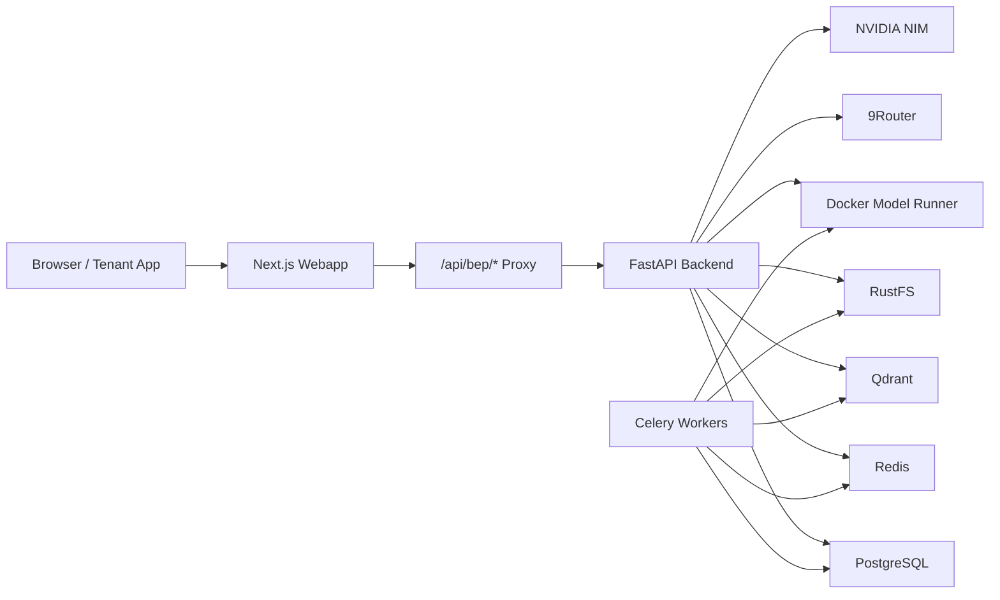

# chatbot-rag

[](./LICENSE)
[](https://fastapi.tiangolo.com/)
[](https://nextjs.org/)
[](https://qdrant.tech/)
[](https://ui.shadcn.com/)
[](https://github.com/iZenDeveloper/auditai)

A self-hosted, multi-tenant RAG chatbot platform built for SaaS-style operations and real product integration.

`chatbot-rag` is designed as an AI gateway between tenant applications and enterprise knowledge retrieval. It combines tenant-scoped document ingestion, stateless chat, OpenAI-compatible APIs, hybrid retrieval, usage tracking, and an internal admin console in one deployable stack.

---

## Table of Contents

- [Overview](#overview)
- [Key Capabilities](#key-capabilities)
- [Why This Architecture](#why-this-architecture)
- [System Architecture](#system-architecture)
- [Technology Stack](#technology-stack)
- [Product Model](#product-model)
- [Retrieval Pipeline](#retrieval-pipeline)
- [Public API Example](#public-api-example)
- [Quick Start](#quick-start)
- [Operational Notes](#operational-notes)
- [Repository Guide](#repository-guide)
- [Engineering Principles](#engineering-principles)
- [License](#license)

---

## Overview

Most internal chatbots stop at "upload files and ask questions." This project is intentionally built for a more demanding use case:

- multiple tenants on shared infrastructure
- strict tenant isolation
- stateless chat flows
- integration into tenant software through a familiar API
- provider-aware retrieval and generation
- operational visibility for usage, quota, and model behavior

The result is a platform that is useful not just as a demo chatbot, but as a foundation for embedding AI assistance inside real business software.

---

## Key Capabilities

### Multi-tenant by design
- tenant-scoped documents
- tenant-scoped usage and quota
- tenant-scoped instructions and welcome messages
- tenant-scoped API keys

### Stateless chat
- no product dependency on persisted chat sessions
- frontend holds recent transcript in memory only
- backend receives recent `messages`, injects tenant instruction and retrieved context, then answers
- premium glassmorphism chat interface for smooth testing

### OpenAI-compatible public API
- easy integration for tenant applications
- compatible mental model for existing AI clients and internal tooling

### Hybrid retrieval pipeline
- Qdrant-backed search
- Section hydration from PostgreSQL (accelerated via Redis caching)
- reranking with NVIDIA NIM by default
- adaptive rerank skipping for short, obvious queries to save latency and token cost

### Admin-first operations
- platform-wide tenant management
- tenant-scoped document operations
- API key management
- usage and spend visibility
- provider/runtime configuration through the webapp

### Self-hosted deployment
- Docker Compose topology
- object storage, vector store, queue/cache, reverse proxy, and web UI included

---

## Why This Architecture

This repository intentionally favors boundaries that scale operationally:

- **Browser -> `/api/bep/*` -> Next.js proxy -> FastAPI**
  - browser code never holds backend bearer tokens
- **Route -> Service -> Repository**
  - HTTP handling, business logic, and data access stay separated
- **Tenant ID as the primary boundary**
  - avoids reintroducing legacy user-owned document assumptions
- **Stateless chat**
  - simplifies product behavior and reduces persistence complexity
- **Provider-aware runtime**
  - 9Router for LLM access
  - Docker Model Runner for local embeddings
  - NVIDIA NIM as the reranker happy path

---

## System Architecture



### Internal request flow

```text
Browser -> Next.js Webapp (Cloudflare Pages) -> /api/bep/* -> Next.js Route Handler -> FastAPI
```

### Public integration flow

```text
Tenant Software -> OpenAI-compatible API -> FastAPI -> Retrieval + LLM orchestration
```

---

## Technology Stack

### Application Layer
- **Frontend:** Next.js 16
- **UI:** shadcn/ui + Base UI primitives
- **Backend:** FastAPI
- **Workers:** Celery

### Data and Infrastructure
- **Primary database:** PostgreSQL
- **Vector database:** Qdrant
- **Cache / queue:** Redis
- **Object storage:** RustFS (S3-compatible)
- **Reverse proxy:** Traefik

### AI Runtime
- **LLM gateway:** 9Router
- **Default embedding runtime:** Docker Model Runner
- **Default reranker:** NVIDIA NIM
- **Local reranker:** optional fallback path

### Retrieval / AI Libraries
- **LlamaIndex**
- **qdrant-client**
- **FastEmbed**
- **Docling** (Local Offline AI Parser for Complex PDF/Word Documents)

---

## Product Model

### Roles

#### `platform_admin`
- creates tenants
- provisions tenant admin accounts
- manages tenant API keys
- uploads and manages tenant documents
- tests chat inside tenant scope
- reviews cross-tenant usage and spend

#### `tenant_admin`
- views tenant documents
- tests chat in tenant scope
- views tenant usage and quota
- edits tenant-specific chatbot settings and instructions
- cannot manage platform-wide resources

### Chat Model

The product uses **stateless chat**:

- no persisted `chat_sessions` / `chat_messages` product flow
- no legacy session sidebar dependency
- transcript lives in frontend memory while the chat stays open
- backend only needs recent `messages` plus tenant context

### Tenant Integration Model

Tenant applications typically need only:

- `base_url`
- `api_key`
- `model`
- `messages`

---

## Retrieval Pipeline

At a high level:

1. accept the latest user query
2. enforce tenant boundary
3. run hybrid retrieval in Qdrant
4. hydrate top sections from PostgreSQL (with Redis caching)
5. rerank when useful
6. build final generation context
7. call the LLM through 9Router

### Notable implementation details

- payload-indexed tenant/document/section metadata in Qdrant
- latest-query retrieval by default
- chat history used for LLM context, not as default RAG expansion
- adaptive rerank skipping for short, high-confidence queries
- usage and cost tracking across LLM, embedding, and reranker calls
- SSE-based streaming for chat and ingestion progress

---

## Public API Example

```http
POST /v1/chat/completions
Authorization: Bearer <tenant_api_key>
Content-Type: application/json
```

```json
{
  "model": "chatbot-rag",
  "messages": [
    {
      "role": "user",
      "content": "How do I create a warehouse receipt?"
    }
  ],
  "stream": true,
  "temperature": 0.2,
  "max_tokens": 1024
}
```

---

### Quick Start

**Backend (API):**
```bash
cd chatbot-api
cp .env.example .env
docker compose build
docker compose up -d
```

**Frontend (Webapp):**
```bash
cd chatbot-webapp
npm install
npm run dev
```

### Useful endpoints

- **Web app (Local):** `http://localhost:3000`
- **Backend API:** `https://api.qtuanph.dev/v1/health`
- **Qdrant dashboard:** `http://localhost:6333/dashboard`
- **9Router:** `http://localhost:2908`
- **Traefik dashboard:** `http://localhost:8080`

---

## Operational Notes

- Chat uses **SSE** for response streaming
- Document ingestion progress also uses **SSE**
- The current stack is better aligned with real deployment than single-machine demos
- Throughput at scale still depends on:
  - LLM provider capacity
  - embedding throughput
  - reranking throughput
  - worker concurrency
  - Redis / PostgreSQL / Qdrant sizing

If your target is production traffic rather than local demo load, scale planning should focus on `api`, `workers`, `ai-proxy`, and retrieval/runtime capacity rather than frontend-only tuning.

---

## Repository Guide

If you are contributing or maintaining the project, start here:

| Topic | File |
|---|---|
| Project guardrails | `AGENTS.md` |
| Architecture | `docs/1_ARCHITECTURE.md` |
| Workflows | `docs/2_WORKFLOWS.json` |
| API contracts | `docs/3_API_CONTRACTS.md` |
| Deployment | `docs/4_DEPLOYMENT.md` |
| Runtime snapshot | `docs/7_CURRENT_SETTINGS.json` |

---

## Engineering Principles

- strict tenant isolation
- stateless chat by default
- route -> service -> repository separation
- no backend bearer token in browser code
- synchronized code and documentation changes
- no hardcoded "pass-the-bug" fixes

## Acknowledgments

Special thanks to our contributors:
- **[iZenDeveloper](https://github.com/iZenDeveloper)** for integrating the [AuditAI](https://github.com/iZenDeveloper/auditai) RAG quality smoke suite into the project, helping us measure and improve retrieval accuracy and safety.

---

## License

Licensed under **AGPL-3.0**.
