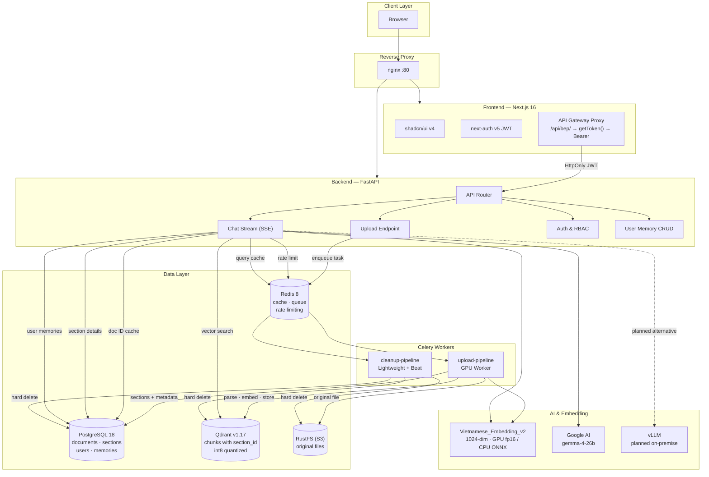
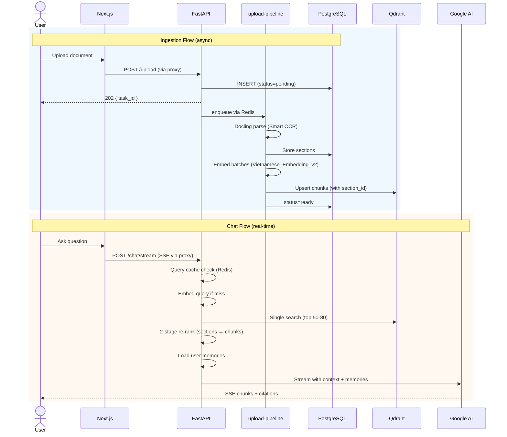
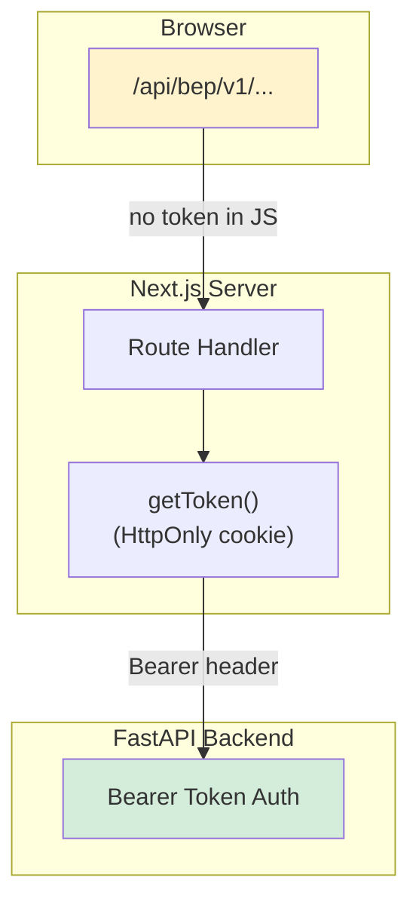

<div align="center">

# chatbot-rag

**On-premise hierarchical RAG chatbot for Vietnamese enterprise documents**

Self-hosted. No cloud lock-in. Complete control over your data.

[](https://docs.docker.com/compose/)
[](https://github.com/qtuanph/chatbot-rag/actions)
[](https://www.python.org/)
[](https://nextjs.org/)
[](https://fastapi.tiangolo.com/)
[](https://qdrant.tech/)
[](https://www.postgresql.org/)
[](LICENSE)
[](https://github.com/qtuanph/chatbot-rag/releases)
[](https://conventionalcommits.org)

</div>

---

## Quick Links

📦 **[Latest Release: v0.1.0](https://github.com/qtuanph/chatbot-rag/releases/tag/v0.1.0)** · 🚀 [Getting Started](#getting-started) · 📖 [Architecture](#architecture) · 📡 [API Reference](#api-reference) · 📂 [Full Changelog](https://github.com/qtuanph/chatbot-rag/releases)

---

## Table of Contents

- [Why This Project?](#why-this-project)
- [Features](#features)
- [Architecture](#architecture)
- [Tech Stack](#tech-stack)
- [Retrieval Pipeline](#retrieval-pipeline)
- [Security](#security)
- [Getting Started](#getting-started)
- [API Reference](#api-reference)
- [Configuration](#configuration)
- [Planned Local LLM (vLLM)](#planned-local-llm-vllm)
- [Documentation](#documentation)
- [License](#license)

---

## Why This Project?

Vietnamese enterprises need AI-powered document Q&A that:

- **Stays on-premise** — sensitive documents never leave your infrastructure
- **Understands Vietnamese** — purpose-built embedding model fine-tuned on 1.1M Vietnamese triplets
- **Handles real documents** — hierarchical indexing preserves document structure (chapters, sections, pages)
- **Just works** — one `docker compose up`, zero cloud dependencies for inference or embedding

---

## Features

<table>
<tr><td width="180"><b>Hierarchical Indexing</b></td><td>Docs → Sections (H1–H6) → Chunks (~400 tokens). Preserves document structure for accurate context retrieval.</td></tr>
<tr><td><b>5-Stage Retrieval</b></td><td>Hybrid dense + BM25 (RRF fusion) → in-memory section grouping → dedup → <b>neighbor expansion</b> (±3 nodes) → context assembly. Reranker optional (off by default).</td></tr>
<tr><td><b>Vietnamese-Optimized</b></td><td><code>AITeamVN/Vietnamese_Embedding_v2</code> — BGE-M3 fine-tuned on Vietnamese data, +16% Accuracy@1 vs base model.</td></tr>
<tr><td><b>Smart OCR</b></td><td>2-pass strategy: native PDFs skip OCR for speed, scanned docs auto-detected and OCR'd via EasyOCR (vi + en).</td></tr>
<tr><td><b>Async Ingestion</b></td><td>Upload returns instantly with <code>task_id</code>. Parsing/indexing runs in background via Celery with live progress tracking.</td></tr>
<tr><td><b>Real-time Chat</b></td><td>SSE streaming with conversational Vietnamese AI. Citations grouped by document with merged page ranges.</td></tr>
<tr><td><b>User Memory</b></td><td>ChatGPT-like persistent memory per user — preferences, corrections, facts injected into AI context automatically.</td></tr>
<tr><td><b>Document Tree</b></td><td>Hierarchical navigation of document structure via tree explorer.</td></tr>
<tr><td><b>Security Hardened</b></td><td>API gateway proxy, JWT hidden from browser, server-side auth guards, atomic rate limiting, security headers.</td></tr>
</table>

---

## Architecture



### Data Flow



### Key Design Decisions

| Decision | Why |
|----------|-----|
| **Hybrid search (dense + BM25)** | Dense (embedding) + sparse (BM25) via RRF fusion — leverages both semantic similarity and keyword matching for Vietnamese |
| **TTL-cached document IDs** (60s) | Avoids PostgreSQL subquery on every chat; invalidated on upload/delete |
| **Redis-cached query embeddings** (1h) | Repeated questions skip embedding entirely — 0ms, 0 model cost |
| **API gateway proxy** | Browser never sees Bearer token; auth via HttpOnly session cookie |
| **Rule-based refiner** | 0GB VRAM, ~1ms per node — no AI needed for OCR cleanup during ingestion |

---

## Tech Stack

```mermaid
graph LR
    subgraph Frontend["Frontend"]
        direction TB
        F1["Next.js 16"]
        F2["shadcn/ui v4"]
        F3["next-auth v5"]
    end

    subgraph Backend["Backend"]
        direction TB
        B1["FastAPI"]
        B2["Celery"]
        B3["SQLAlchemy"]
    end

    subgraph Data["Data"]
        direction TB
        D1["PostgreSQL 18"]
        D2["Redis 8"]
        D3["Qdrant v1.17"]
        D4["RustFS (S3)"]
    end

    subgraph AI["AI & ML"]
        direction TB
        A1["Vietnamese_Embedding_v2"]
        A2["Google Gemini"]
        A3["EasyOCR"]
        A4["Docling"]
    end

    Frontend ~~~ Backend ~~~ Data ~~~ AI
```



| Layer | Technology | Purpose |
|-------|-----------|---------|
| **Frontend** | Next.js 16 + shadcn/ui v4 + next-auth v5 | UI, SSR auth, API gateway proxy |
| **Backend** | FastAPI + Celery + SQLAlchemy | REST API, async tasks, ORM |
| **Database** | PostgreSQL 18 | Documents, sections, users, memories, audit |
| **Cache / Queue** | Redis 8 | Celery broker, query embedding cache, rate limiting |
| **Vector Search** | Qdrant v1.17 (int8 quantization, HNSW) | Chunk vectors with section_id metadata |
| **Embedding** | AITeamVN/Vietnamese_Embedding_v2 (1024-dim) | GPU fp16 / CPU ONNX fallback |
| **AI** | Google Gemini (gemma-4) | Conversational response generation; vLLM is planned, not enabled in current code |
| **OCR** | EasyOCR (vi + en) | Scanned document text extraction |
| **Parsing** | Docling (Method D) | PDF/DOCX structured extraction |
| **Storage** | RustFS (S3-compatible) | Original file storage |
| **Reverse Proxy** | nginx | All traffic routing, SSE, security headers |

---

## Retrieval Pipeline

```mermaid
flowchart LR
    A["User Query"] --> B["Rate Limit Check<br/>(Redis Lua)"]
    B --> C{"Query Cache<br/>(Redis MD5)"}
    C -->|HIT| E["Cached Vector<br/>(0ms)"]
    C -->|MISS| D["Embed Query<br/>(Vietnamese_Embedding_v2)"]
    D --> E
    E --> F["Doc ID Cache<br/>(TTL 60s)"]
    F --> G["Dense Search<br/>(Vietnamese_Embedding_v2)"]
    F --> H["BM25 Search<br/>(VietnameseBM25Encoder<br/>Underthesea tokenization)"]
    G --> I["RRF Fusion<br/>(k=60)"]
    H --> I
    I --> J["Stage 1: Section Grouping<br/>(score >= 0.30)"]
    J --> K["Dedup by section_id"]
    K --> L["Neighbor Expansion<br/>(+/- 3 nodes by order)"]
    L --> M{"Rerank?<br/>(RETRIEVAL_RERANK_ENABLED)"}
    M -->|ON| N["Cross-Encoder<br/>(Vietnamese_Reranker)"]
    M -->|OFF| O["Context Assembly<br/>+ User Memories"]
    N --> O
    O --> P["AI Streaming<br/>(SSE + Citations)"]

    style C fill:#fff3cd,stroke:#856404
    style G fill:#d1ecf1,stroke:#0c5460
    style H fill:#f8d7da,stroke:#721c24
    style I fill:#d4edda,stroke:#155724
    style J fill:#d4edda,stroke:#155724
    style L fill:#d1ecf1,stroke:#0c5460
    style M fill:#e2e3fe,stroke:#383a40
```



| Stage | What Happens | Threshold / Notes |
|-------|-------------|-------------------|
| **Cache check** | MD5-keyed Redis lookup for query vector | TTL = 1 hour |
| **Doc scope** | TTL-cached active document IDs from PostgreSQL | TTL = 60s |
| **Dense search** | Single Qdrant query with Vietnamese_Embedding_v2 | top_k = 50-80 |
| **BM25 search** | Underthesea tokenization, VietnameseBM25Encoder | top_k = 50-80 |
| **RRF fusion** | Reciprocal Rank Fusion combining dense + BM25 | k = 60 |
| **Stage 1** | Group results by `section_id`, pick top 3 sections | score >= 0.30 |
| **Dedup** | Remove duplicate chunks from same section | — |
| **Neighbor expansion** | Fetch +/- 3 adjacent nodes by `order_index` per section | section context completeness |
| **Rerank** | Cross-encoder scores (optional, off by default) | `RETRIEVAL_RERANK_ENABLED=false` |
| **Context build** | Load section details, merge user memories, build prompt | DB-less assembly from cache |
| **Streaming** | AI response via SSE with grouped citations | — |

---

## Security



| Layer | Mechanism |
|-------|-----------|
| **Network** | nginx reverse proxy — all traffic on port 80, no direct service access |
| **Authentication** | JWT (HS256) stored in encrypted HttpOnly cookie — never exposed to client JS |
| **API Gateway** | Next.js Route Handler reads JWT server-side → attaches Bearer header to backend |
| **Authorization** | Server-side `auth()` guards in layout files — admin/member role enforcement |
| **Rate Limiting** | Atomic Lua scripts in Redis — 30 req/min (chat), 50 req/min (login), no race conditions |
| **Security Headers** | X-Frame-Options DENY, HSTS, nosniff, Referrer-Policy, Permissions-Policy |
| **Input Validation** | Filename/path traversal protections, file type whitelist, size limits |
| **Audit** | Correlation ID propagation, security event logging |

---

## Getting Started

### Prerequisites

- **Docker** & **Docker Compose** (v2+)
- **NVIDIA GPU** recommended (GTX 1650+ works) — CPU fallback available
- **8 GB RAM** minimum, 16 GB recommended
- `.env` file — copy from `.env.example`

### Quick Start

```bash
# 1. Configure environment
cp .env.example .env
# Edit .env: set GOOGLE_API_KEY, JWT_SECRET, DATABASE_URL, S3_SECRET_KEY

# 2. Build & start all services
DOCKER_BUILDKIT=1 docker compose up --build

# 3. Wait for healthy (~5-10 min first build)

# 4. Access the app
open http://localhost
```

### Default Credentials

```
Username: admin
Password: abc123
```

> Change these immediately in production via the admin panel.

### Access Services

| Service | URL | Notes |
|---------|-----|-------|
| **Web App** | http://localhost | Main application |
| **API Health** | http://localhost/api/v1/health | Service status |
| **Qdrant Dashboard** | http://localhost:6333/dashboard | Vector DB browser |
| **RustFS Console** | http://localhost:9001 | File storage admin |

### Reset Everything

```bash
docker compose down
docker volume rm chatbot-rag_pgdata chatbot-rag_qdrantdata chatbot-rag_redisdata
docker compose up --build
```

---

## API Reference

All endpoints are prefixed with `/api/v1`. Authentication uses JWT Bearer token.

### Authentication

| Endpoint | Method | Auth | Description |
|----------|--------|------|-------------|
| `/auth/login` | POST | public | JWT authentication |
| `/auth/logout` | POST | JWT | Revoke token |
| `/auth/me` | GET | JWT | Current user info |
| `/auth/users` | POST | admin | Create user |
| `/auth/users` | GET | admin | List users |
| `/auth/users/{username}` | DELETE | admin | Delete user |
| `/auth/roles` | GET | admin | List roles |

### Documents

| Endpoint | Method | Auth | Description |
|----------|--------|------|-------------|
| `/documents/upload` | POST | admin | Upload document → returns `task_id` |
| `/documents/status/{task_id}` | GET | JWT | Poll ingestion progress |
| `/documents` | GET | member | List documents |
| `/documents/{document_id}` | GET | member | Document details |
| `/documents/{document_id}` | DELETE | admin | Hard-delete document |
| `/documents/{document_id}/retry` | POST | admin | Retry failed ingestion |

### Chat

| Endpoint | Method | Auth | Description |
|----------|--------|------|-------------|
| `/chat/stream` | POST | member | Chat with SSE streaming |
| `/chat/sessions` | POST | member | Create chat session |
| `/chat/sessions` | GET | member | List chat sessions |
| `/chat/messages` | GET | member | Get messages in session |
| `/chat/messages/{message_id}/feedback` | POST | member | Submit message feedback |

### Document Tree

| Endpoint | Method | Auth | Description |
|----------|--------|------|-------------|
| `/documents/{document_id}/tree` | GET | member | Hierarchical tree structure |
| `/documents/{document_id}/tree/nodes/{node_id}` | GET | member | Node details |
| `/documents/{document_id}/tree/search` | GET | member | Search within document |

### User Memory

| Endpoint | Method | Auth | Description |
|----------|--------|------|-------------|
| `/memories` | GET | member | List user memories |
| `/memories` | POST | member | Create memory |
| `/memories/{memory_id}` | PATCH | member | Update memory |
| `/memories/{memory_id}` | DELETE | member | Delete memory |

### Analytics

| Endpoint | Method | Auth | Description |
|----------|--------|------|-------------|
| `/analytics/stats` | GET | member | Usage statistics |

### System

| Endpoint | Method | Auth | Description |
|----------|--------|------|-------------|
| `/health` | GET | public | Service health check |
| `/health/data` | GET | public | Detailed health with storage info |

---

## Configuration

All settings are configured via environment variables (see `app/core/config.py`).

### AI & Embedding

```bash
AI_PROVIDER=google                                    # current code supports google only
GOOGLE_API_KEY=...                                    # Required for Google AI
GOOGLE_MODEL=gemma-4-26b-a4b-it                       # Gemini model
EMBEDDING_HF_MODEL=AITeamVN/Vietnamese_Embedding_v2   # 1024-dim Vietnamese embedding
```

### Retrieval Thresholds

```bash
RETRIEVAL_SECTION_MIN_SCORE=0.30    # Stage 1 — section grouping
RETRIEVAL_MIN_SCORE=0.35            # Stage 2 — chunk ranking
RETRIEVAL_SECTION_TOP_K=3           # Top sections to retrieve
RETRIEVAL_CHUNK_TOP_K=5             # Top chunks per section
```

### Production Safety (enforced when `APP_ENV=production`)

```bash
ALLOWED_HOSTS=your-host.com          # Must be explicit — no wildcard
CORS_ORIGINS=https://your-host.com   # Must be explicit — no localhost
S3_SECURE=true                       # Must be true
RATE_LIMIT_RELAXED_MODE=false        # Must be false
```

---

## Planned Local LLM (vLLM)

vLLM is a planned on-premise provider path. The current code only enables the Google adapter, so do not set `AI_PROVIDER=vllm` until a vLLM adapter is implemented.

```bash
# future target only
AI_PROVIDER=vllm
```

---

## Documentation

Read `AGENTS.md` first, then the JSON quick reference and topic docs.

| Topic | File | Time |
|-------|------|------|
| Rules & patterns | `docs/00_QUICK_REFERENCE.json` | 5 min |
| Architecture & data model | `docs/01_ARCHITECTURE.md` | 10 min |
| Core workflows | `docs/02_WORKFLOWS.md` | 10 min |
| API contracts & security | `docs/03_API_CONTRACTS.md` | 10 min |
| Deployment & observability | `docs/04_DEPLOYMENT.md` | 5 min |
| Ingestion & retrieval | `docs/05_INGESTION_RETRIEVAL.md` | 10 min |

---

## Contributing

Contributions are welcome! Please read [AGENTS.md](AGENTS.md) for agent/dev guidelines, then:

1. Fork the repository
2. Create a feature branch (`git checkout -b feat/your-feature`)
3. Commit using [Conventional Commits](https://www.conventionalcommits.org/) format
4. Push and open a Pull Request

All changes must pass linting (`flake8`, `black --line-length=120`) and CI guardrails before merge.

---

## Database

- **Auto-initialized** via `ops/init.sql` on first run
- **No migrations needed** — schema is complete at startup
- **Idempotent** — safe to re-run `docker compose up`

---

## License

[Apache 2.0](LICENSE)
