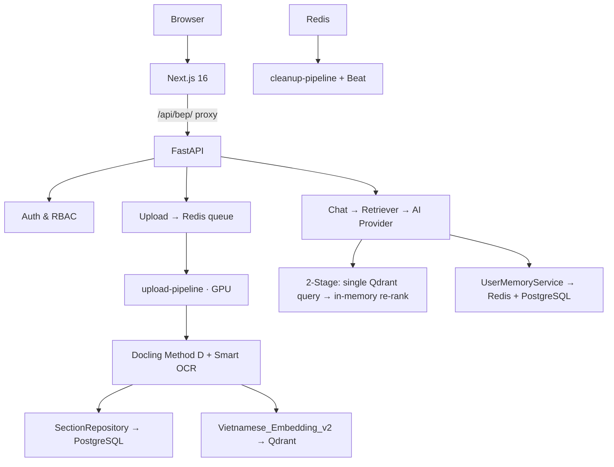

# 01 — Architecture and Data Model

Single source of truth for system design, data model, and invariants. Security details in `03_API_CONTRACTS.md`.

## Tech Stack

| Component | Technology |
|-----------|-----------|
| Frontend | Next.js 16 + shadcn/ui v4 + next-auth v5 (JWT) |
| Backend | FastAPI async |
| Workers | upload-pipeline (GPU, ingestion) + cleanup-pipeline (lightweight, deletion + beat) |
| Database | PostgreSQL 18 (metadata, auth, sessions, audit) |
| Vectors | Qdrant (chunk vectors + retrieval payload) |
| Object storage | RustFS (raw uploads + artifacts) |
| Queue/Cache | Redis (Celery broker, embedding cache, rate limiting, chat hot cache with pipeline atomic ops) |
| Embedding | AITeamVN/Vietnamese_Embedding_v2 (1024-dim, local, GPU fp16 / CPU ONNX) |
| AI Provider | Google AI gemma-4-26b-a4b-it (singleton via lru_cache, x-goog-api-key header, httpx connection pool) |
| Ingestion | Docling iterate_items() (Method D) + Smart OCR 2-pass + Rule-based refiner |
| Reverse proxy | nginx on port 80 (all traffic: SSE, NextAuth, API, static) |

## Storage Split

| Store | Responsibility |
|-------|---------------|
| PostgreSQL | Auth, roles, documents, **document_sections** (canonical tree order), chat sessions/messages, user_memories, audit |
| Qdrant | Chunk vectors + payload with `section_id` metadata |
| RustFS | Raw uploaded files + ingestion artifacts |
| Redis | Celery broker/backend, query embedding cache (MD5, 1h TTL), rate limiting, user memory cache (5min TTL), chat hot history |

## Core PostgreSQL Tables

| Table | Purpose |
|-------|---------|
| `roles` | Role definitions (admin, member) |
| `users` | Authenticated accounts with bcrypt hash |
| `documents` | File metadata, status lifecycle, version, ingestion state |
| `document_sections` | Hierarchical tree: parent_section_id, order_index, page_range, breadcrumb |
| `chat_sessions` | Per-user conversation sessions (CASCADE delete with messages) |
| `chat_messages` | Message history with citations, token counts (tokens_in, tokens_out), latency_ms |
| `user_memories` | Persistent per-user facts/preferences/corrections |
| `security_audit` | Audit trail for sensitive actions |
| `data_sources` | SQL connector registry (Phase 2) |
| `data_source_schema_cache` | Connector schema cache (Phase 2) |
| `data_source_query_audit` | SQL query audit log (Phase 2) |

### documents Table Columns

| Column | Type | Notes |
|--------|------|-------|
| id | UUID PK | pgcrypto generated |
| title / file_name | VARCHAR(500) | User-provided title / original filename |
| file_path | VARCHAR(1000) | RustFS object URI |
| sha256 | VARCHAR(64) | Duplicate detection |
| file_type | VARCHAR(50) | pdf, docx, xlsx, txt |
| file_size | BIGINT | Bytes |
| version | INTEGER ≥ 1 | Auto-incremented per filename |
| status | VARCHAR(50) | pending → processing → ready / failed |
| status_stage | VARCHAR(50) | Fine-grained processing stage |
| progress_percent | INTEGER 0-100 | Live progress for frontend |
| status_message | VARCHAR(500) | Human-readable status |
| status_updated_at | TIMESTAMPTZ | Last status change |
| parse_error | TEXT | Error detail when failed |
| extra_metadata | JSONB | Ingestion artifact, warnings, timing |
| deleted_at | TIMESTAMPTZ | Legacy; not used in hard-delete path |
| created_by | UUID FK → users | Uploader |
| created_at / updated_at | TIMESTAMPTZ | Auto-managed via trigger |

## Component Diagram

## Runtime Data Flow

| Stage | Path | Output |
|-------|------|--------|
| Upload | Browser → /api/bep/ → proxy → API → RustFS | File persisted, document row pending |
| Queue | API → Redis → Worker | Async task, task_id returned (202) |
| Parse | Worker → Docling Method D + Smart OCR → sections + chunks | Items with page spans, heading levels |
| Validate | Hierarchy Validator + Rule-Based Refiner (0GB VRAM, ~1ms) | Cleaned, validated text |
| Store | SectionRepository → PostgreSQL → Embed → Qdrant | document_sections rows + vectors |
| Retrieve | QueryCache → single Qdrant query → section grouping → chunk re-rank | Top sections + chunks with citations |
| Memory | UserMemoryService → Redis cache → inject systemInstruction | Personalized prompt |
| Stream | AI Provider → strip_reasoning() → SSE → proxy → Browser | Grounded answer with citations, token stats, cost estimate |
| Extract | Post-response → async Gemini → user_memories | Learned facts for future turns |

## Non-Negotiable Invariants

| Rule | Behavior |
|------|----------|
| API contracts | Keep upload/status/chat/document endpoints stable |
| Async ingestion | Upload must never block on parsing |
| Provider boundary | Route handlers never call provider SDKs directly |
| Hierarchical retrieval | Never replace with flat chunk-only retrieval |
| Citation policy | Every grounded answer includes citations |
| Delete policy | Hard-delete 6-step order (see below) |
| Version policy | Latest active version preferred during retrieval |
| Rate limiting | Atomic Lua script — no INCR+EXPIRE race |

## Delete Policy (Authoritative)

Hard-delete removes all traces. **Order must not change:**

1. `registry.delete()` → marks deleted in Redis → `/status` returns 'deleted' immediately
2. `vector_store.delete()` → removes all Qdrant vectors → retrieval stops
3. `SectionRepository.delete()` → removes document_sections rows
4. `storage.delete_object()` → removes file from RustFS
5. `session.delete()` → removes documents row from PostgreSQL
6. `registry.purge()` → removes all Redis registry keys

**Sections deleted before DB row** — referential integrity.

## Versioning Policy

| Policy | Behavior |
|--------|----------|
| Same filename + new content | New row with `version = max(version) + 1` |
| Retrieval default | Highest version per filename (subquery in rag.py) |
| Delete by version | Hard-delete only specified version |

## Access Model

| Role | Rights |
|------|--------|
| admin | Upload, delete, manage users, all member rights |
| member | Chat, retrieval, view documents, manage own memories |

JWT auth (PyJWT) + role checks. Role cached in JWT payload to eliminate DB queries per request. TokenBlacklist singleton with shared Redis connection. One shared project dataset, no tenant partitioning.

## User Memory System

ChatGPT-like persistent memory. Types: `preference`, `correction`, `instruction`, `fact`.

Flow: Load from Redis/PostgreSQL (5min cache TTL) → inject into `systemInstruction` → AI generates response → async extract new memories via heuristic triggers + provider.chat() (uses cached singleton) → store in `user_memories`.

Frontend: Settings page `/settings` with full CRUD. Content limit: 1000 chars per memory.

## AI Thinking Control

Gemma 4 outputs chain-of-thought by default. 4 suppression layers:

| Layer | Mechanism | Location |
|-------|-----------|----------|
| API-level | `thinkingConfig: {thinkingLevel: "MINIMAL"}` | google.py generationConfig |
| Part filter | Skip `"thought": true` parts | google.py `_extract_text()` |
| Stream filter | `_ThoughtFilter` strips `<\|channel\|>thought...` tags | google.py |
| Post-process | `strip_reasoning()` + `strip_thought_blocks()` | google.py → chat.py |

**Only `MINIMAL` and `HIGH` accepted.** `thinkingBudget:0` causes 400. `includeThoughts:false` silently ignored.

## Multi-Turn Conversation

- Last 20 messages as Gemini `contents` array (assistant→model role mapping)
- RAG context embedded into current user message
- Messages persisted to PostgreSQL; Redis hot cache with 24h TTL
- `ChatStore.hydrate_from_db()` reloads from DB on TTL expiry (checks Redis first via `history_exists()`)
- Redis `append_message()` uses pipeline for atomic RPUSH + EXPIRE
- Auto-title from first user message (80 chars)
- `strip_thought_blocks()` cleans previous assistant messages before multi-turn send

## Chat Session Lifecycle

| Policy | Detail |
|--------|--------|
| Default view | Empty "Chat mới" on page load (no auto-restore) |
| History | Sidebar ordered by `updated_at DESC` |
| New session | `POST /chat/sessions` creates empty session |
| Switch | Click in sidebar → ChatPanel loads messages via `sessionId` prop |
| Auto-title | First user query truncated to 80 chars |
| Cleanup | Hard-delete after 30 days by Celery Beat (`CHAT_SESSION_TTL_DAYS`) |
| Cascade | Messages deleted with session automatically |
| `updated_at` | Auto-touched on message activity for sidebar ordering |

## Explicitly Removed / Changed

| Changed | Reason |
|---------|--------|
| Tesseract OCR | EasyOCR — better Vietnamese |
| Sequential embedding | ThreadPoolExecutor parallel — ~16x faster |
| AI-based refiner | Rule-based — 0GB VRAM, ~1ms |
| 2-query retrieval | Single Qdrant query + in-memory re-ranking |
| Direct PostgreSQL subquery per chat | TTL-cached document IDs (60s) |
| Direct port access | nginx reverse proxy on port 80 |
| Browser Bearer token | API gateway proxy — /api/bep/ only |
| Client-side accessToken | Removed from Session type — server-side only |
| Redis-only chat history | PostgreSQL persistence + Redis hot cache (pipeline atomic) |
| python-jose | PyJWT 2.10.1 — maintained, no CVEs |
| Manual XSS check | nh3 HTML sanitization (2026 standard) |
| Per-request httpx client | Singleton httpx.AsyncClient with connection pooling |
| Per-request TokenBlacklist | Module-level singleton |
| Per-request AI provider | lru_cache singleton via build_ai_provider() |
| export_to_markdown() | Method D (iterate_items()) — preserves page numbers |
| Single worker | upload_pipeline + cleanup_pipeline |
| do_ocr=True on all PDFs | Smart OCR 2-pass — OCR only for scanned PDFs |

## Planned (Phase 2)

SQL connector: tables `data_sources`, `data_source_schema_cache`, `data_source_query_audit` ready in `ops/init.sql`. Only SELECT allowed. LLM generates SQL from natural language. Policy-checked against approved table whitelist. Falls back to document RAG if unavailable.
