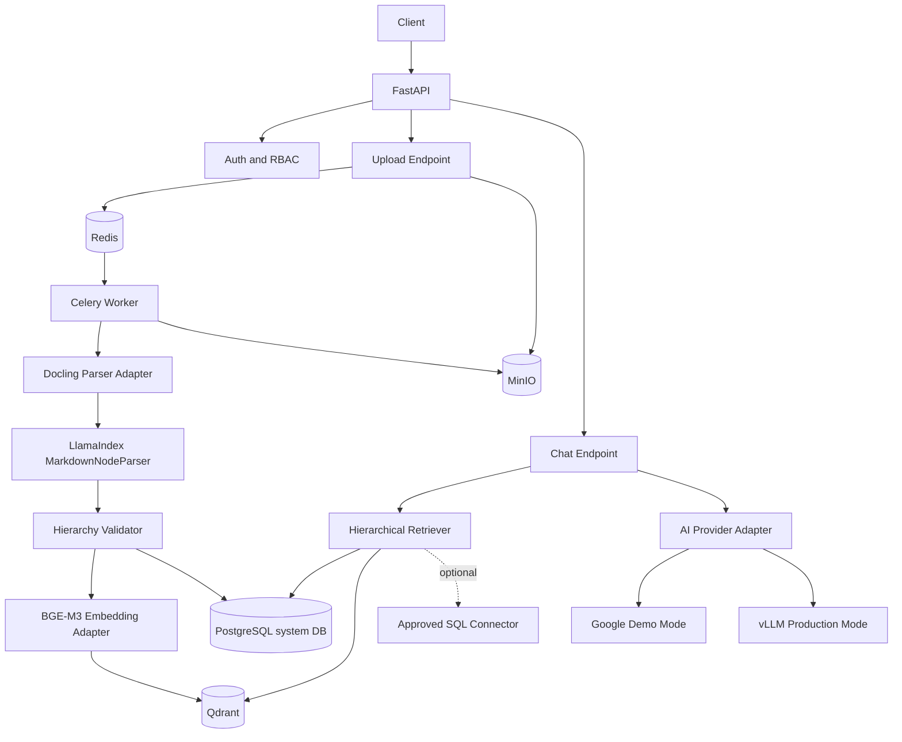

# 01 — System Architecture

Status: authoritative architecture baseline for implementation.

## Core Direction

| Principle | Decision |
|-----------|----------|
| Deployment | Docker-first, self-hosted, single-project deployment |
| Ingestion | Docling-first conversion to Markdown, then LlamaIndex hierarchy parsing |
| Embedding | Local BGE-M3 via sentence-transformers |
| Vector Store | Qdrant for vectors and retrieval payload |
| Metadata Store | PostgreSQL for users, documents, sessions, audit, connector metadata |
| Queue/Cache | Redis only for Celery broker/result and cache-like concerns |
| Retrieval | Hierarchical RAG by default; preserve section-parent context |
| Query routing | Document RAG default; SQL route only when explicitly required and approved |

PostgreSQL is the system database for metadata, status, auth, audit, and connector state. Qdrant is the retrieval store for node vectors and payload.

## High-Level Component Diagram

## Runtime Data Flow

| Stage | Path | Output |
|-------|------|--------|
| 1. Upload | Client -> API -> MinIO | File persisted, document row pending |
| 2. Queue | API -> Redis -> Worker | Async task created, task_id returned |
| 3. Parse | Worker -> Docling -> LlamaIndex | Hierarchical nodes |
| 4. Validate | Worker -> Hierarchy Validator | Parent-child consistency report |
| 5. Embed | Worker -> BGE-M3 | Dense vectors per node |
| 6. Persist | Worker -> PostgreSQL + Qdrant | System metadata stored in PostgreSQL; node vectors stored in Qdrant |
| 7. Retrieve | Chat -> Retriever | Section candidates with parent context |
| 8. Generate | Chat -> AI Provider -> JSON response | Grounded answer with citations |

## Non-Negotiable Invariants

| Rule | Required behavior |
|------|-------------------|
| API contracts | Keep upload/status/chat/document endpoints stable |
| Async ingestion | Upload endpoint must never block on parsing |
| Provider boundary | Route handlers must never call provider SDKs directly |
| Hierarchical retrieval | Do not replace with naive chunk-only retrieval |
| Citation policy | Every grounded answer must include citations |
| Soft-delete policy | Deleted documents excluded from new retrieval |
| Version policy | Latest active version preferred during retrieval |

## Explicitly Removed Legacy Patterns

| Removed | Reason |
|---------|--------|
| OCR-first parsing strategy | Replaced by Docling-first pipeline |
| Monolithic ingestion service file | Replaced by modular ingestion package |
| Dead service stubs and unused registries | Simplified to production-safe surface |

## Clarification: Tree Means Document Hierarchy

| Concept | Correct meaning |
|---------|-----------------|
| Tree retrieval | N-ary document hierarchy with parent-child nodes |
| Parent context | Retrieve section + parent context for grounding |
| Forbidden interpretation | Binary tree search algorithms are not used |
