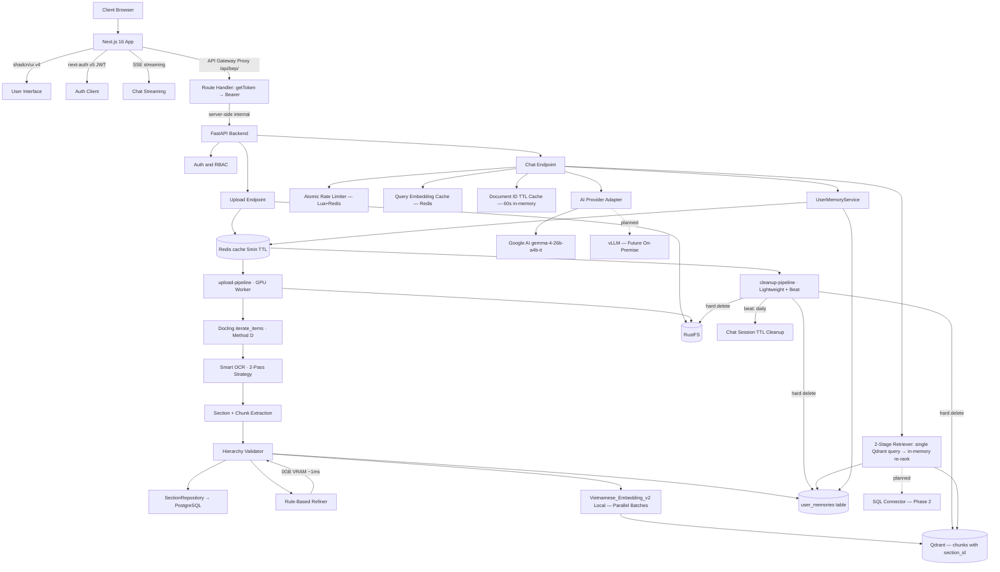

# 01 — System Architecture

Status: authoritative architecture baseline — updated to reflect Method D, Smart OCR Strategy, and worker architecture refactor.

## Core Direction

| Principle | Decision |
|-----------|----------|
| Deployment | Docker-first, self-hosted, single-project deployment |
| Frontend | **Next.js 16** with shadcn/ui v4, next-auth v5 (JWT), SSE streaming |
| Backend | FastAPI with async endpoints |
| Ingestion | Docling `iterate_items()` (Method D) for direct item extraction — preserves page numbers, heading levels, table structures |
| OCR | **Smart OCR Strategy**: fast no-OCR first, OCR fallback only for scanned PDFs. EasyOCR (vi + en) backend. |
| Embedding | **AITeamVN/Vietnamese_Embedding_v2 LOCAL** via sentence-transformers (1024-dim, GPU fp16 / CPU ONNX, fully offline) |
| AI Refiner | **Rule-based heuristics** (0GB VRAM, ~1ms per node) — NO AI in ingestion |
| Vector Store | Qdrant for vectors and retrieval payload |
| Metadata Store | PostgreSQL for users, documents, **sections**, sessions, audit, connector metadata |
| Queue/Cache | Redis for Celery broker/result, query embedding cache, rate limiting |
| Retrieval | **2-stage retrieval**: Sections (PostgreSQL canonical order) → Chunks (Qdrant with section_id) |
| Query routing | Document RAG default; SQL route only when explicitly required and approved |
| AI Provider | Google AI gemma-4-26b-a4b-it. vLLM on-premise is planned, not enabled in current code. |
| Workers | `upload-pipeline` (GPU, ingestion) + `cleanup-pipeline` (lightweight, deletion + beat) |
| Chat sessions | Auto-delete after 30 days (`CHAT_SESSION_TTL_DAYS`) via Celery beat. Messages persisted to PostgreSQL; Redis hot cache with 24h TTL and `hydrate_from_db()` on TTL expiry. Active session is reused until client/session state changes. |
| User memory | ChatGPT-like persistent memory: facts, preferences, corrections injected into system prompt |
| AI thinking | `thinkingConfig: {thinkingLevel: "MINIMAL"}` disables Gemma 4 thought tokens; `thought:true` part filter + `_ThoughtFilter` stream + `strip_reasoning()` safety net |
| AI output | Streaming uses `maxOutputTokens: 8192`, `max_context_chars: 500000`, provider timeout 300s (5min) |

PostgreSQL is the system database for metadata, status, auth, audit, and connector state. Qdrant is the retrieval store for node vectors and payload. Redis is used for task queue, cache, and atomic rate limiting.

## High-Level Component Diagram



## Runtime Data Flow

| Stage | Path | Output |
|-------|------|--------|
| 1. Upload | Browser → `/api/bep/` → Next.js proxy → API → RustFS | File persisted, document row pending |
| 2. Queue | API → Redis → Worker | Async task created, task_id returned |
| 3. Parse | Worker → Docling `iterate_items()` (Method D) + Smart OCR → Section extraction → Chunk splitting | Sections + chunks with page spans, heading levels |
| 4. Validate | Worker → Hierarchy Validator | Parent-child consistency report |
| 5. Refine | Worker → Rule-Based Refiner (0GB VRAM, ~1ms) | Cleaned text, fixed OCR errors |
| 6. Store Sections | Worker → SectionRepository → PostgreSQL | document_sections rows |
| 7. Embed | Worker → Vietnamese_Embedding_v2 (parallel batches of 32) | Dense vectors per chunk |
| 8. Persist | Worker → Qdrant | Chunks with section_id metadata |
| 9. Retrieve | Chat → QueryCache → Embedder → single Qdrant query → in-memory section grouping → chunk re-ranking | Top sections + chunks |
| 10. Memory | Chat → UserMemoryService → Redis cache (5min TTL) → PostgreSQL fallback → inject into systemInstruction | Personalized prompt context |
| 11. Stream | Chat → AI Provider (`maxOutputTokens: 8192`, timeout 5min) → strip_reasoning() safety net → SSE stream via proxy → Browser | Grounded answer with citations, no chain-of-thought |
| 12. Extract | Post-response → UserMemoryService.extract_memories_from_turn() → async Gemini call → store in user_memories | Learned facts for future turns |

## Non-Negotiable Invariants

| Rule | Required behavior |
|------|-------------------|
| API contracts | Keep upload/status/chat/document endpoints stable |
| Async ingestion | Upload endpoint must never block on parsing |
| Provider boundary | Route handlers must never call provider SDKs directly |
| Hierarchical retrieval | Do not replace with naive chunk-only retrieval |
| Citation policy | Every grounded answer must include citations |
| Delete policy | Hard-delete: vectors → file → DB row (registry.delete first, purge last) |
| Version policy | Latest active version preferred during retrieval |
| Rate limiting | Atomic Lua script in Redis — no INCR+EXPIRE race condition |

## Planned Features (Phase 2)

### SQL Connector (Text-to-SQL)

DB schema is already prepared in `ops/init.sql`:

| Table | Purpose |
|-------|---------|
| `data_sources` | Registered SQL Server / PostgreSQL connections |
| `data_source_schema_cache` | Cached table/column metadata with join hints |
| `data_source_query_audit` | Audit log for every SQL query executed |

When implemented, the connector will:
- Route only when question clearly requires live business data
- Use LLM to generate **read-only SELECT** statements from natural language
- Policy-check against approved table whitelist before execution
- Log every query to `data_source_query_audit`
- Fall back to document RAG if connector is unavailable

See: Pinterest Text-to-SQL, Swiggy Hermes, Uber QueryGPT for reference patterns.

## Explicitly Removed / Changed

| Changed | Reason |
|---------|--------|
| Tesseract OCR | Replaced by EasyOCR (mandatory) — better Vietnamese support |
| Sequential embedding loop | Replaced by `ThreadPoolExecutor` parallel batches — ~16x faster |
| DDL patches in `main.py` startup | Removed — schema fully managed by `ops/init.sql` |
| Non-atomic INCR+EXPIRE rate limit | Replaced by atomic Lua script |
| vLLM runtime adapter | Not present in current code; on-prem provider remains planned |
| AI-based text refiner (Qwen/Gemini) | Replaced by rule-based refiner — 0GB VRAM, ~1ms per node |
| Nuxt.js frontend | Replaced by Next.js 16 with shadcn/ui v4 |
| Streamlit frontend | Removed — replaced by Next.js app |
| Google API key rotation | Removed — single key only |
| `export_to_markdown()` path | Replaced by Method D (`iterate_items()`) — preserves page numbers, heading levels, table structures |
| `_build_page_map()` / `_find_page_for_section()` | Removed — page numbers now extracted directly from Docling provenance data |
| `app/worker.py` (single worker) | Refactored to `app/workers/upload_pipeline.py` + `app/workers/cleanup_pipeline.py` |
| `app/workflows/` directory | Removed — was empty, tasks moved to `app/workers/` |
| `do_ocr=True` on all PDFs | Replaced by Smart OCR Strategy — fast no-OCR first, OCR fallback only for scanned PDFs |
| 2-query retrieval (Stage 1 → Stage 2) | Replaced by single Qdrant query + in-memory section grouping and re-ranking — eliminates one round-trip |
| Direct PostgreSQL subquery per chat request | Replaced by TTL-cached document IDs (60s), explicitly invalidated on upload/delete |
| Duplicate system instruction in `chat()` and `chat_stream()` | Refactored to shared `_SYSTEM_INSTRUCTION` constant; `chat()` now reuses `chat_stream()` |
| Direct port access (localhost:3000, localhost:8000) | Replaced by nginx reverse proxy on port 80 — SSE streaming, NextAuth routing, rate limiting, security headers |
| Browser Bearer token exposure | Replaced by API gateway proxy — browser calls `/api/bep/` only, token read server-side via `getToken()` |
| Client-side session.accessToken | Removed from Session type — `accessToken` stays in JWT callback, never exposed to client components |
| Admin pages without server auth | Added server-side `auth()` guards in admin/chat/settings layouts |
| Redis-only chat history | Replaced by PostgreSQL persistence + Redis hot cache — `ChatStore.hydrate_from_db()` reloads on TTL expiry |
| N+1 session listing | Replaced by JOIN+GROUP BY query — `GET /chat/sessions` now returns `updated_at` field |
| No message restore | Added `GET /chat/messages?session_id=...` endpoint — frontend restores messages on page load |
| Proxy socket crash | Added retry-once in Route Handler — returns 502 JSON instead of crashing on socket close |
| Uvicron default keep-alive | Added `--timeout-keep-alive 75` to uvicorn entrypoint for worker stability |
| Single-file upload only | Frontend now supports multi-file parallel upload (`multiple` attribute, `Promise.allSettled()`) |

## User Memory Architecture

ChatGPT-like persistent memory system that allows the AI to learn user preferences, corrections, and instructions over time.

### Storage

| Layer | Store | TTL |
|-------|-------|-----|
| Primary | PostgreSQL `user_memories` table | Persistent |
| Cache | Redis `user_memories:{user_id}` | 5 minutes |
| API endpoint | `GET/POST/PATCH/DELETE /api/v1/memories` | Per-request |

### Memory Types

| Type | Description | Example |
|------|-------------|---------|
| `preference` | User preferences | "Trả lời ngắn gọn" |
| `correction` | User corrections | "Đừng dùng bullet points" |
| `instruction` | Explicit instructions | "Luôn trích dẫn nguồn" |
| `fact` | Facts about user | "Làm việc ở phòng marketing" |

### Flow

1. **Load**: Before streaming, `UserMemoryService.format_memories_for_prompt()` loads active memories (Redis → PostgreSQL fallback)
2. **Inject**: Memories appended to `systemInstruction` in Gemini API payload
3. **Generate**: AI generates personalized response using memory context
4. **Extract**: After response, async `extract_memories_from_turn()` uses heuristic triggers + Gemini to extract new facts
5. **Store**: New memories saved to PostgreSQL + Redis cache invalidated

### Frontend

Settings page (`/settings`) provides full CRUD:
- View all memories with type badges (color-coded)
- Add new memory (type selector + content input)
- Toggle active/inactive
- Delete memory

## AI Thinking Control

Gemma 4 26B A4B is a thinking model that outputs chain-of-thought reasoning by default. Three layers suppress this:

| Layer | Mechanism | Location |
|-------|-----------|----------|
| **API-level** | `thinkingConfig: {thinkingLevel: "MINIMAL"}` — Gemma 4 only accepts `MINIMAL` and `HIGH` | `app/adapters/ai/google.py` generationConfig |
| **Part filter** | Skip parts with `"thought": true` in `_extract_text()` | `app/adapters/ai/google.py` |
| **Stream filter** | `_ThoughtFilter` state machine strips `<\|channel\|>thought...<channel\|>` tags real-time | `app/adapters/ai/google.py` |
| **Post-process** | `strip_reasoning()` + `strip_thought_blocks()` on saved text | `app/adapters/ai/google.py` → `chat.py` |

**Note:** `thinkingBudget: 0` causes 400 error with Gemma 4. `includeThoughts: false` is silently ignored (bug). Only `thinkingLevel: "MINIMAL"` works. Source: google-gemini/cookbook#1198.

The `strip_reasoning()` function detects markers like "Question:", "Source Material:", "Structure:", "Drafting", "Self-Correction", "Final Polish:" and strips everything before the actual answer. Applied to saved text in both streaming and non-streaming routes.

## Multi-Turn Conversation

Chat supports multi-turn context via Gemini `contents` array format:
- History mapped: `assistant` → `model`, `user` → `user` roles
- Last 20 messages included for performance
- RAG context embedded into current user message (not separate field)
- Session managed by `ChatStore` with Redis-backed history
- **Message persistence**: Both user and assistant messages saved to PostgreSQL every turn
- **Hydration**: `ChatStore.hydrate_from_db()` reloads messages from DB when Redis TTL expires
- **Session design**: Active session is reused by the client/store, auto-title from first user message (80 chars), no multi-session sidebar

## Security Architecture

### API Gateway Proxy (JWT Hiding)

Browser **never** sends or receives Bearer tokens. All browser API calls go through the Next.js API gateway proxy:

```
Browser → /api/bep/... → Next.js Route Handler → getToken() (HttpOnly cookie) → Bearer header → FastAPI backend
```

| Layer | Mechanism |
|-------|-----------|
| **Client** | Calls `/api/bep/v1/...` — no token in JS, no token in Network tab |
| **Route Handler** | `webapp/app/api/bep/[...path]/route.ts` — reads JWT via `getToken()` from encrypted HttpOnly cookie |
| **Backend** | Receives standard Bearer token — no changes to auth logic |
| **Session type** | Client `Session` has `role` + `userId` only — `accessToken` stays server-side |

### Server-Side Auth Guards

All page layouts enforce authentication at the server component level:

| Layout | Auth Level | Redirect |
|--------|-----------|----------|
| `webapp/app/(main)/admin/layout.tsx` | `session.role === "admin"` | → `/login` or `/chat` |
| `webapp/app/(main)/chat/layout.tsx` | `session exists` | → `/login` |
| `webapp/app/(main)/settings/layout.tsx` | `session exists` | → `/login` |

### Security Headers

Applied via `next.config.ts` `headers()` config on all routes:

| Header | Value |
|--------|-------|
| X-Frame-Options | DENY |
| X-Content-Type-Options | nosniff |
| Referrer-Policy | strict-origin-when-cross-origin |
| Permissions-Policy | geolocation=(), microphone=(), camera=(), payment=() |
| X-DNS-Prefetch-Control | on |
| Strict-Transport-Security | max-age=31536000; includeSubDomains |

### Rate Limiting Summary

| Endpoint | Limit | Key |
|----------|-------|-----|
| `POST /memories` | 20/min per user | `throttle:memory:create:{user_id}` |
| `PATCH /memories/{id}` | 20/min per user | `throttle:memory:update:{user_id}` |
| `DELETE /memories/{id}` | 20/min per user | `throttle:memory:delete:{user_id}` |
| `POST /auth/users` | 5/min per admin | `throttle:user:create:{user_id}` |
| `DELETE /auth/users/{username}` | 5/min per admin | `throttle:user:delete:{user_id}` |
| `POST /chat/stream` | 30/min per user | existing chat throttle |
| `POST /auth/login` | 50/min per IP+user | existing login throttle |
