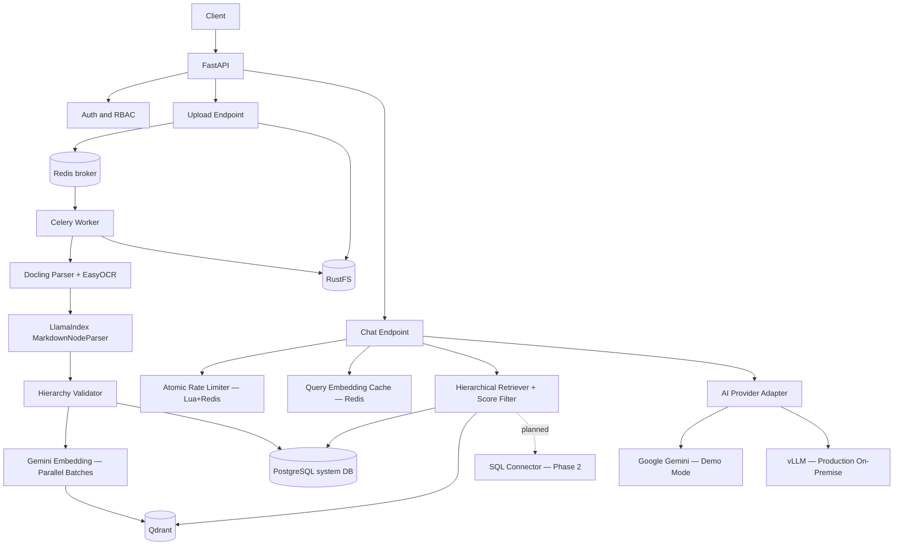

# 01 — System Architecture

Status: authoritative architecture baseline — updated to reflect production implementation.

## Core Direction

| Principle | Decision |
|-----------|----------|
| Deployment | Docker-first, self-hosted, single-project deployment |
| Ingestion | Docling-first conversion to Markdown, then LlamaIndex hierarchy parsing |
| OCR | EasyOCR (vi + en) — mandatory, deep-learning, GPU auto-detected |
| Embedding | Google Gemini Embedding API (gemini-embedding-001); vLLM local embedding future |
| Vector Store | Qdrant for vectors and retrieval payload |
| Metadata Store | PostgreSQL for users, documents, sessions, audit, connector metadata |
| Queue/Cache | Redis for Celery broker/result, query embedding cache, rate limiting |
| Retrieval | Hierarchical RAG by default; preserve section-parent context |
| Query routing | Document RAG default; SQL route only when explicitly required and approved |
| AI Provider | Google Gemini (demo); vLLM on-premise (production target) |

PostgreSQL is the system database for metadata, status, auth, audit, and connector state. Qdrant is the retrieval store for node vectors and payload. Redis is used for task queue, cache, and atomic rate limiting.

## High-Level Component Diagram

## Runtime Data Flow

| Stage | Path | Output |
|-------|------|--------|
| 1. Upload | Client → API → RustFS | File persisted, document row pending |
| 2. Queue | API → Redis → Worker | Async task created, task_id returned |
| 3. Parse | Worker → Docling + EasyOCR → LlamaIndex | Hierarchical nodes |
| 4. Validate | Worker → Hierarchy Validator | Parent-child consistency report |
| 5. Embed | Worker → Gemini (parallel batches of 32) | Dense vectors per node |
| 6. Persist | Worker → PostgreSQL + Qdrant | Metadata in PG; vectors in Qdrant |
| 7. Retrieve | Chat → QueryCache → Embedder → Qdrant → Score Filter | Top-k nodes, score ≥ 0.35 |
| 8. Generate | Chat → AI Provider → JSON response | Grounded answer with citations |

## Non-Negotiable Invariants

| Rule | Required behavior |
|------|-------------------|
| API contracts | Keep upload/status/chat/document endpoints stable |
| Async ingestion | Upload endpoint must never block on parsing |
| Provider boundary | Route handlers must never call provider SDKs directly |
| Hierarchical retrieval | Do not replace with naive chunk-only retrieval |
| Citation policy | Every grounded answer must include citations |
| Delete policy | Hard-delete: vectors → file → DB row (registry.delete first, purge last) |
| Version policy | Latest active version preferred during retrieval |
| Rate limiting | Atomic Lua script in Redis — no INCR+EXPIRE race condition |

## Planned Features (Phase 2)

### SQL Connector (Text-to-SQL)

DB schema is already prepared in `ops/init.sql`:

| Table | Purpose |
|-------|---------|
| `data_sources` | Registered SQL Server / PostgreSQL connections |
| `data_source_schema_cache` | Cached table/column metadata with join hints |
| `data_source_query_audit` | Audit log for every SQL query executed |

When implemented, the connector will:
- Route only when question clearly requires live business data
- Use LLM to generate **read-only SELECT** statements from natural language
- Policy-check against approved table whitelist before execution
- Log every query to `data_source_query_audit`
- Fall back to document RAG if connector is unavailable

See: Pinterest Text-to-SQL, Swiggy Hermes, Uber QueryGPT for reference patterns.

## Explicitly Removed / Changed

| Changed | Reason |
|---------|--------|
| Tesseract OCR | Replaced by EasyOCR (mandatory) — better Vietnamese support |
| Sequential embedding loop | Replaced by `ThreadPoolExecutor` parallel batches — ~16x faster |
| DDL patches in `main.py` startup | Removed — schema fully managed by `ops/init.sql` |
| Non-atomic INCR+EXPIRE rate limit | Replaced by atomic Lua script |
| Hardcoded `local-model` in vLLM adapter | Now reads `settings.vllm_model` from env |
