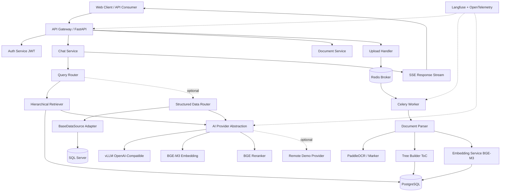

# 01 — System Architecture

> Status: target production architecture and implementation spec. The current repository only implements a partial backend scaffold.

## Project Intent For AI Implementers

| Intent | Meaning |
|--------|---------|
| Delivery style | Build a working system, not a prototype toy. Prefer minimal correct code over clever abstractions. |
| Runtime model | MUST be Docker-first so the project can run without manual local dependency installation beyond Docker. |
| AI rollout plan | Phase 1 uses Google AI Studio by API key for fast delivery. Phase 2 switches to on-prem `vLLM` on GPU. The codebase MUST support both through configuration. |
| Retrieval model | Use `hierarchical RAG` over a document hierarchy. Do NOT implement a binary tree data structure for retrieval. |
| Storage model | Use PostgreSQL as the primary database of record; use Redis only for queue/cache duties. |
| Query routing model | Default to uploaded-document answering. Only route to database access when the user question clearly requires live business data and an approved SQL connector is configured. |
| Implementation priority | Keep contracts stable and migration simple. Do not optimize prematurely with extra infrastructure or alternate databases. |

## High-Level Component Diagram



## Data Flow

| Stage | Component | Description |
|-------|-----------|-------------|
| 1. Ingest | Client → Gateway → Upload | File upload, validate, SHA-256 compute |
| 2. Queue | Upload → Redis → Celery | Async task enqueue, return `task_id` |
| 3. Parse | Worker → Parser → OCR fallback | Native text extraction first, OCR only for image-only pages, extract text + structure |
| 4. Index | TreeBuilder → Embedder → DB | Build document tree: document → page → section, store full sections |
| 5. Query | Client → ChatSvc → Router | Extract tenant_id, navigate tree, retrieve sections |
| 6. Generate | Retriever → AIProvider → SSE | Rerank, generate with citations, stream response |

## Service Separation

| Service | Responsibility | Tech |
|---------|---------------|------|
| **API** | HTTP endpoints, auth, validation, SSE streaming | FastAPI + Pydantic |
| **Worker** | Async document processing pipeline | Celery + Redis |
| **Storage** | Document metadata, tree nodes, embeddings, chat history | PostgreSQL + pgvector |
| **Data Connectors** | Optional external sources behind controlled adapters | `BaseDataSource` + future SQL Server adapter |
| **AI Serving** | LLM inference, embedding, reranking | Phase 1 demo: Google AI Studio via adapter. Phase 2 production: vLLM + Qwen2.5-AWQ + BGE-M3 + bge-reranker-base |
| **Observability** | Tracing, metrics, prompt logging | Langfuse + OpenTelemetry |

## AI Provider Abstraction Architecture

```
┌─────────────────────────────────┐
│       AIProvider Protocol       │
│  - chat(messages, **kwargs)     │
│  - embed(texts)                 │
│  - rerank(query, docs)          │
└──────────────┬──────────────────┘
               │
    ┌──────────┴──────────┐
    │                     │
┌───▼──────────────┐  ┌──────▼────────┐
│ RemoteProvider   │  │  vLLMProvider │
│ (Optional Demo)  │  │  (Production) │
└──────────────────┘  └───────────────┘
```

Target production default is `AI_PROVIDER=vllm`. During the current demo phase, `AI_PROVIDER=google` can be enabled by configuration only. No core retrieval, API, or tenancy changes are required.

## Phase Strategy

| Phase | Purpose | Provider | Invariants |
|-------|---------|----------|------------|
| Phase 1 | Demo / rapid delivery | Google AI Studio adapter | Same hierarchical RAG pipeline, same `tenant_id`, same REST/SSE APIs |
| Phase 2 | On-prem production | `vLLM` + quantized Qwen2.5 | Same application contracts; only provider and infrastructure change |

## Implementation Invariants

| Rule | Requirement |
|------|-------------|
| Retrieval model | MUST use `hierarchical RAG`; MUST NOT fall back to naive fixed-size chunking as the primary strategy |
| Ingestion model | MUST try native text extraction first, then OCR fallback for scanned PDFs/images |
| Provider boundary | MUST isolate LLM calls behind `AIProvider`; application code MUST NOT call Google or `vLLM` SDKs directly outside adapters |
| API stability | MUST keep `/upload`, `/status/{task_id}`, `/chat`, `/documents/{document_id}` stable across demo and production phases |
| Tenancy | MUST propagate `tenant_id` from auth layer to DB session before any tenant-scoped query |
| Citation model | MUST generate answers from retrieved full sections and return citations tied to stored nodes |
| Async ingestion | MUST keep upload/parse/indexing asynchronous via `Celery`; upload endpoint MUST NOT block on parsing |
| External data access | MUST be connector-based and policy-controlled; direct ad hoc DB access from chat code is forbidden |

## Query Routing Policy

| Question type | Default route |
|---------------|---------------|
| Internal handbook, policy, technical docs | Uploaded document hierarchical RAG |
| Explicit request for ERP or operational data | Controlled SQL connector path if configured and authorized |
| Ambiguous question that could be answered by docs | Prefer document route first |
| No configured SQL connector | Return document-only answer or explicit limitation |

## Explicit Non-Goals

| Anti-pattern | Why forbidden |
|-------------|---------------|
| Flat vector-only chunk search | Breaks document structure and weakens citations |
| Provider-specific business logic in routes | Makes Google -> `vLLM` migration expensive |
| Per-request ad hoc schema changes | Causes AI-generated code drift and inconsistent contracts |

## Why Hierarchical RAG > Naive Vector Chunking

| Aspect | Naive Chunking | Hierarchical RAG |
|--------|---------------|------------------|
| Context loss | Chunks lose document structure | Full sections preserved with parent context |
| Navigation | Flat similarity search | Tree navigation → precise section targeting |
| Citation | Hard to trace chunk → source | Node → section → page range → document |
| Long docs | Chunks scattered, incomplete answers | LLM navigates ToC → retrieves complete sections |
| Cross-section reasoning | Impossible without massive context | Parent node injection enables cross-section understanding |

For technical documentation, policies, and structured docs (`.md`), hierarchical retrieval is **significantly more accurate** because it respects the author's intended structure.

## Clarification: Document Tree, Not Binary Tree

| Concept | Required interpretation |
|---------|-------------------------|
| "Tree-based retrieval" | A document hierarchy / ToC tree where one parent can have many children |
| `parent_id` model | N-ary tree, not binary tree |
| Retrieval speed | Comes from metadata filtering, HNSW heading search, and full-section expansion |
| Forbidden misunderstanding | Do not implement binary-search-tree style retrieval logic for documents |
