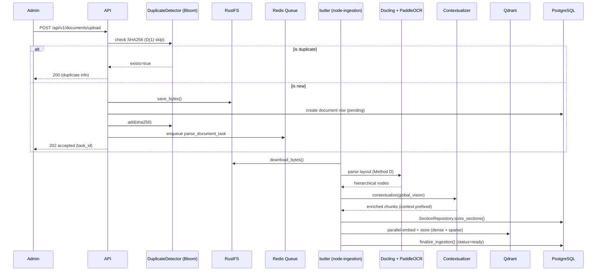
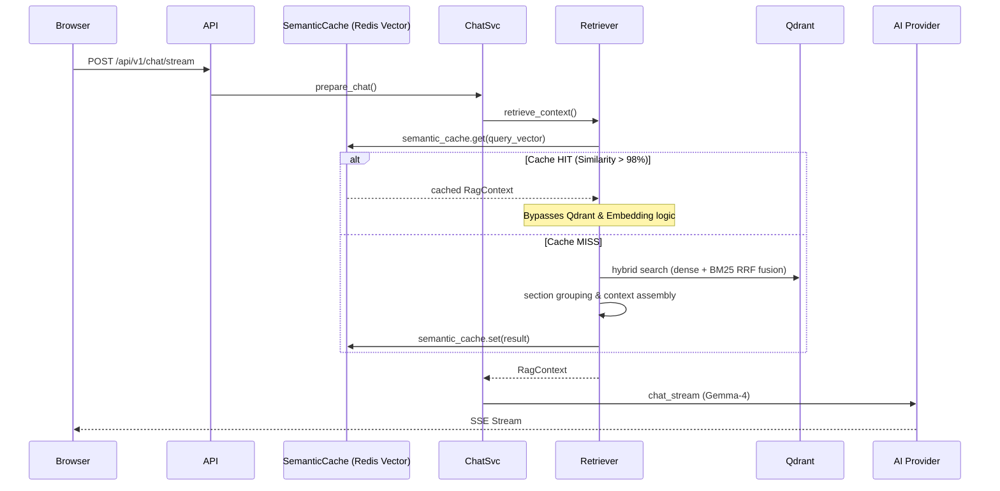
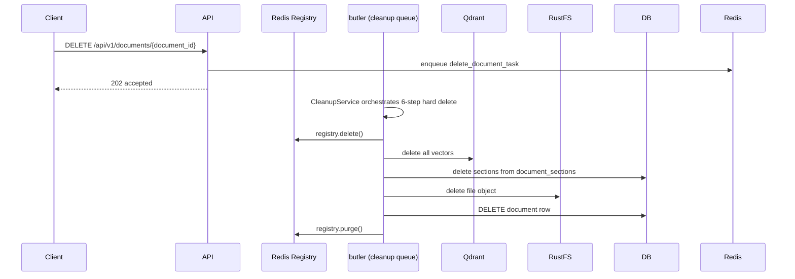
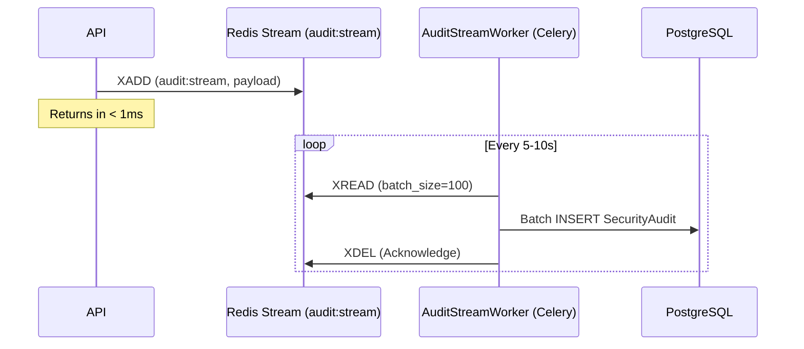

# 02 — Workflows

Detailed step-by-step logic for the primary system workflows.

## 1. Document Ingestion Workflow (Admin Only)

The 14-step pipeline for turning raw files into searchable vectors. Runs in `node-ingestion` (solo pool).

### Ingestion Invariants

| Rule | Requirement |
|------|-------------|
| **Duplicate Detection** | **Redis Bloom Filter (DuplicateDetector)** for O(1) checks before DB query |
| Async processing | Upload returns 202 immediately after storage save |
| Solo pool | Ingestion tasks run sequentially on `node-ingestion` to manage VRAM |
| **Global Vision** | **Contextualizer** prepends document-level summary to every chunk for higher RAG accuracy |
| Hierarchical | Docling structure preserved in `document_sections` |
| DB-less RAG | Qdrant payload contains `section_content` to minimize DB lookups during chat |
| Hybrid indexing | Both dense (1024-dim) and sparse (BM25) vectors stored |
| Timeout | SoftTimeLimitExceeded at 25 min → status=failed |

## 2. Chat → Retrieve → Generate → Response

### Chat Invariants

| Rule | Requirement |
|------|-------------|
| **Speed Layer** | **SemanticCache** (Redis Vector Search) checks for similarity > 98% (dist < 0.02) |
| **Exact Cache** | Redis exact match check on raw query text for sub-millisecond response |
| **Binary Serialization** | Chat history stored using **MessagePack** for extreme speed and low RAM |
| Doc ID cache | TTL-cached 60s, invalidated on upload/delete |
| 4-stage retrieval | Hybrid search → section grouping (≥0.30) → context assembly → citations |
| Thinking suppressed | 4 layers: thinkingConfig MINIMAL + thought:true filter + ThoughtFilter + strip_reasoning() |
| Rate limiting | **Sliding Window (Redis Lua)** — 30 req/min per user |

## 3. Hard Delete Workflow

## 4. Decoupled Audit Logging (New in V4)

High-concurrency logging that never blocks the user.

### Audit Invariants

| Rule | Detail |
|------|--------|
| **Zero Blocking** | API never writes to SecurityAudit table directly |
| **Batch Write** | AuditStreamWorker groups events to minimize DB transaction overhead |
| **Persistence** | Redis Stream acts as a reliable buffer until DB is ready |

## 5. Analytics Data Flow

Tokens stored per ChatMessage → aggregated by SQL query → endpoint. Admin sees system-wide, members see own stats. Pricing configurable via `AI_INPUT_COST_PER_1M`.

## Error Handling & Resilience

| Strategy | Handling |
|----------|----------|
| **Circuit Breaker** | Trips to OPEN if Qdrant/GPU fails repeatedly, prevents loop hanging |
| **Distributed Lock** | Redis Mutex prevents race conditions during session hydration |
| **Rate Limiter** | Sliding window protects AI resources from abuse |
| Parse failure | status=failed, parse_error set, SoftTimeLimitExceeded handled |
