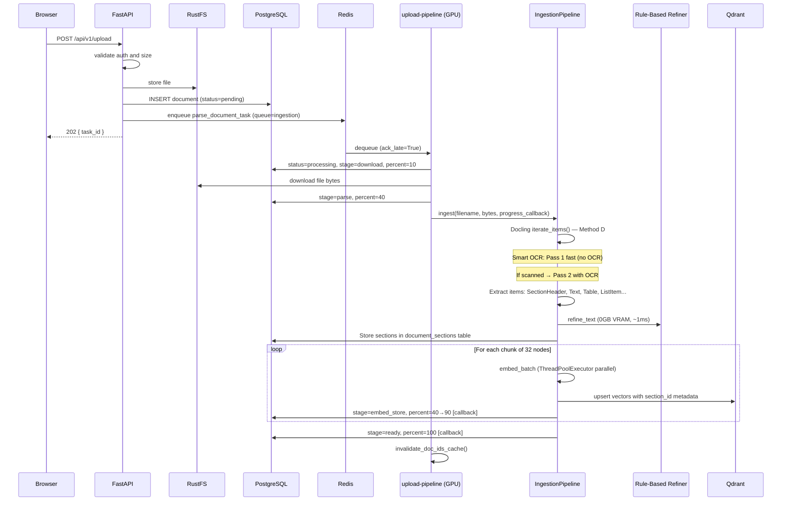
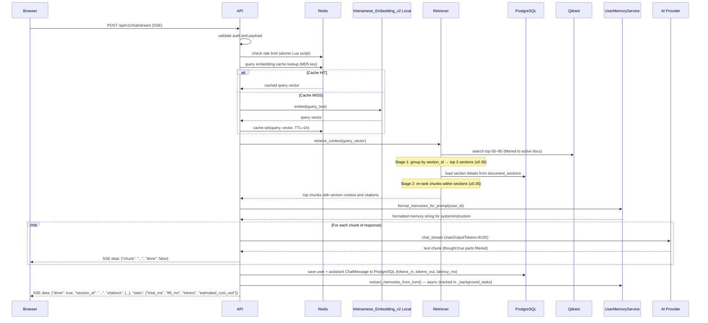
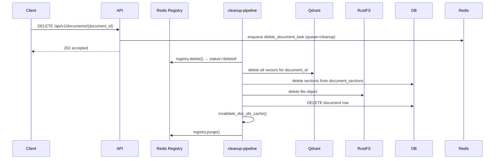
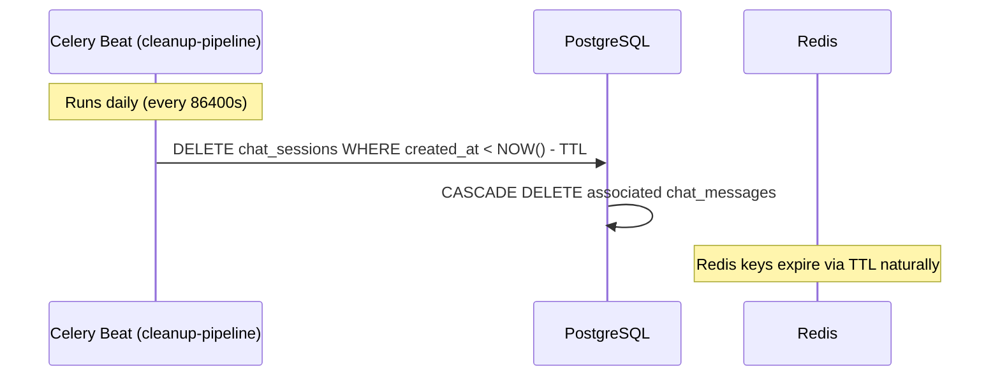

# 02 — Core Workflows

All system workflows with diagrams and invariants. Architecture and data model in `01_ARCHITECTURE.md`.

## Workflow 1: Upload → Parse → Index → Ready

### Upload Invariants

| Rule | Requirement |
|------|-------------|
| Non-blocking | Upload returns task_id immediately (202) |
| Chunked embed | Embed + store in batches of 32, not all at once |
| Pipelined store | Embedding of chunk N overlaps with Qdrant store of chunk N-1 |
| Progress live | progress_percent updates after each chunk via callback |
| Reliability | `task_acks_late=True` — task requeued if worker crashes |
| Timeout | SoftTimeLimitExceeded at 25 min → status=failed |

## Workflow 2: Chat → Retrieve → Generate → Response

### Chat Invariants

| Rule | Requirement |
|------|-------------|
| Cache first | Check Redis for query embedding before calling model |
| Doc ID cache | TTL-cached 60s, invalidated on upload/delete |
| 2-stage retrieval | Single Qdrant query → section grouping (≥0.30) → chunk re-ranking (≥0.35) |
| Citation required | Return citation payload for every grounded answer |
| Rate limiting | Atomic Lua script — 30 req/min per user |
| Provider swap safety | Chat route stays provider-agnostic via adapter |
| Multi-turn | Last 20 messages via Gemini contents array (assistant→model) |
| Memory injection | User memories loaded from Redis/PostgreSQL, injected into systemInstruction |
| Memory extraction | Async post-response: heuristic triggers + Gemini → user_memories |
| Thinking suppressed | 4 layers: thinkingConfig MINIMAL + thought:true filter + ThoughtFilter + strip_reasoning() |
| Output bounds | maxOutputTokens: 8192, max_context_chars: 500000, streaming timeout 300s |
| Clean saved text | strip_reasoning() applied to answer before saving to DB |
| Token tracking | Gemini usageMetadata captured: prompt_tokens, completion_tokens persisted to ChatMessage |
| Cost estimation | Input $0.075/1M + Output $0.30/1M tokens (Gemini 2.5 Flash pricing) |
| Async task tracking | Background memory extraction tracked in _background_tasks set, prevent GC |
| Frontend SSE abort | AbortController cancels stream on unmount or new message |
| Session default | Empty "Chat mới" on page load, sidebar for history |

## Workflow 3: Hard Delete

### Delete Invariants

| Rule | Requirement |
|------|-------------|
| Hard delete | 6-step order (see 01_ARCHITECTURE.md for full detail) |
| Registry first | `/status` returns 'deleted' immediately |
| Sections before DB | Referential integrity |
| No recovery | Irreversible — no trash/recycle |

## Workflow 4: Chat Session Auto-Delete

### Session TTL Invariants

| Rule | Detail |
|------|--------|
| TTL | `CHAT_SESSION_TTL_DAYS` (default: 30 days) |
| Cleanup | Celery beat in cleanup-pipeline — hard delete |
| Cascade | Messages deleted automatically with session |
| Persistence | Messages saved to PostgreSQL every turn; Redis is hot cache |
| Ordering | GET /chat/sessions returns updated_at DESC for sidebar |
| Config | `app/core/config.py` → `chat_session_ttl_days` |

## Error Handling Baseline

| Error | Handling |
|-------|----------|
| Parse failure | status=failed, parse_error set, SoftTimeLimitExceeded handled |
| Chunk embed failure | Log error, continue remaining chunks (partial index) |
| Retrieval timeout (5s) | Empty context, answer from LLM without grounding |
| Provider timeout | Graceful error response |
| Proxy socket close | Route Handler retries once; returns 502 JSON |
| Worker crash mid-task | Auto-requeue via task_acks_late=True |
