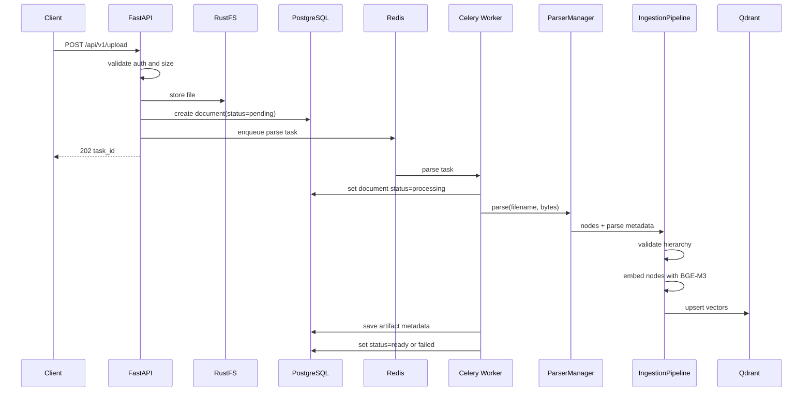
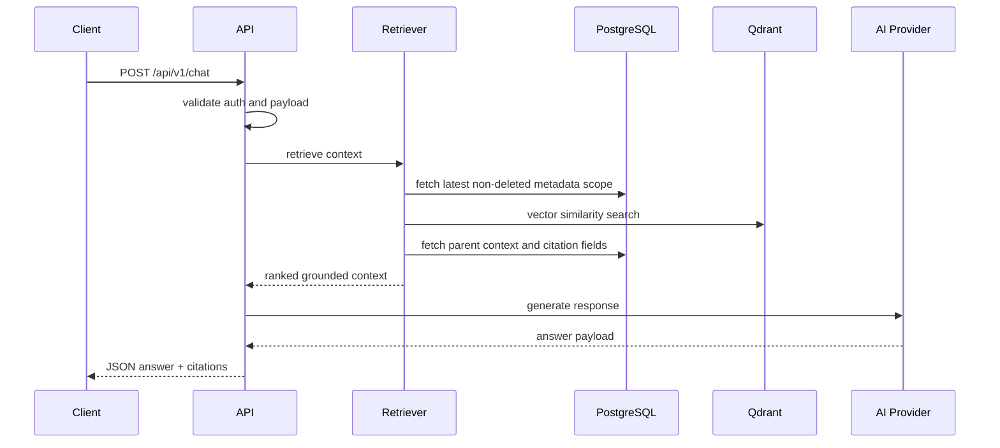
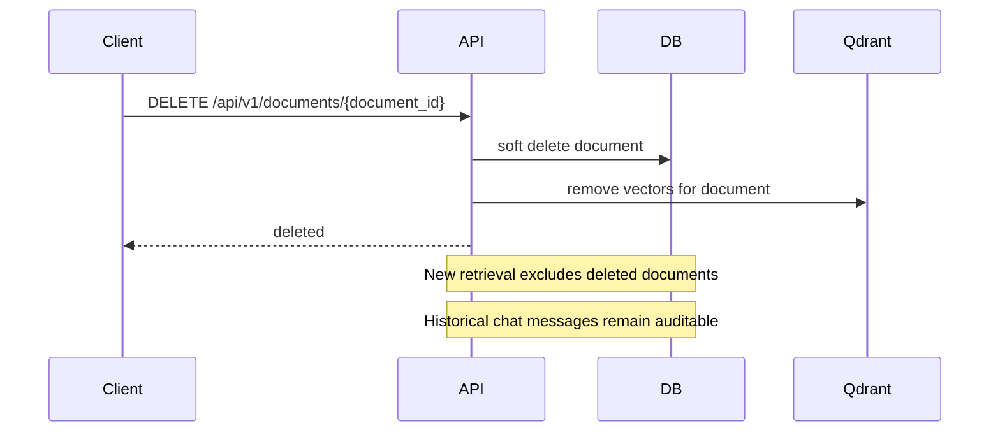

# 03 — Core Workflows

Status: implementation workflow baseline aligned with the new architecture.

## Workflow 1: Upload -> Queue -> Parse -> Index -> Ready

### Upload Invariants

| Rule | Requirement |
|------|-------------|
| Non-blocking upload | Upload endpoint returns task_id quickly |
| Single ingestion path | Worker uses parser manager + ingestion pipeline only |
| Persistence | Save structured nodes and ingestion artifact |
| Recovery | Mark failed status with parse_error on exception |

## Workflow 2: Chat -> Retrieve -> Generate -> JSON Response

### Chat Invariants

| Rule | Requirement |
|------|-------------|
| Grounding first | Build answer from retrieved context |
| Citation required | Return citation payload for grounded answers |
| Retrieval filters | Exclude soft-deleted docs, prefer latest version |
| Provider swap safety | Chat route stays provider-agnostic |

## Workflow 3: Delete -> Exclude -> Retain History

### Delete Invariants

| Rule | Requirement |
|------|-------------|
| Soft-delete first | Never hard-delete immediately in user path |
| Retrieval exclusion | Deleted docs excluded from new retrieval |
| History integrity | Existing chat history remains available |

## Workflow 4: Optional SQL Connector Route

| Condition | Behavior |
|-----------|----------|
| Question answered by docs | Stay on document RAG route |
| Explicit live business-data request + approved connector | Allow SQL connector route |
| SQL connector unavailable | Return explicit limitation, no ad hoc SQL |

## Error Handling Baseline

| Error | Handling |
|-------|----------|
| parse failure | document status=failed with parse_error |
| hierarchy inconsistency | log warning, safe fallback attachment policy |
| embedding/vector store failure | fail task deterministically, persist reason |
| provider timeout | retry with reduced context then graceful error |
