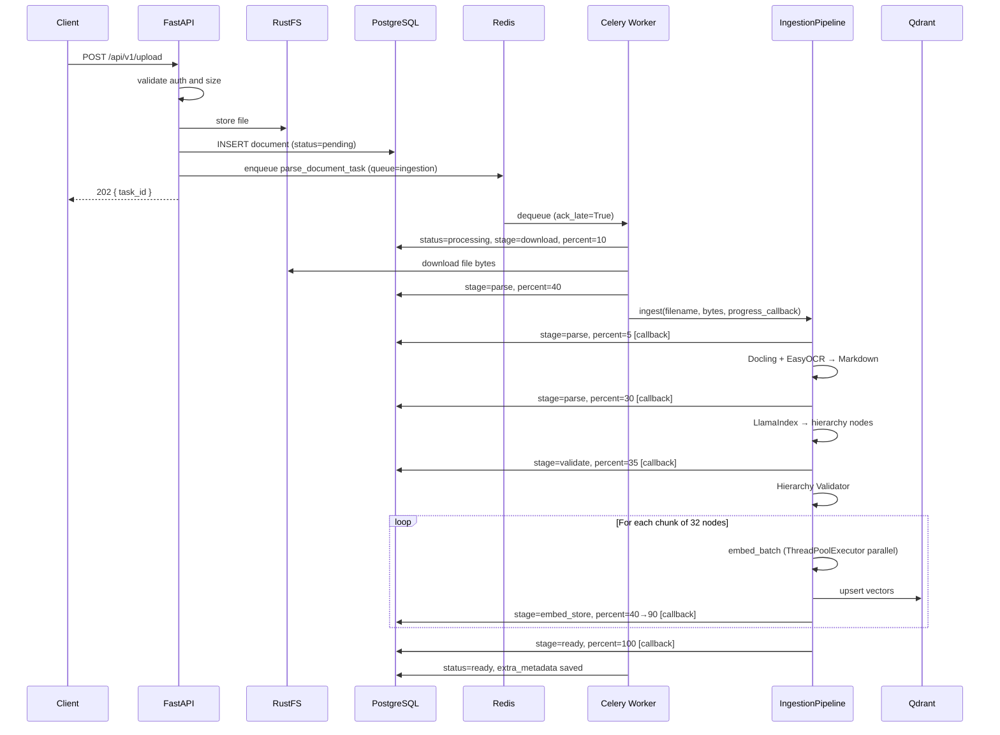
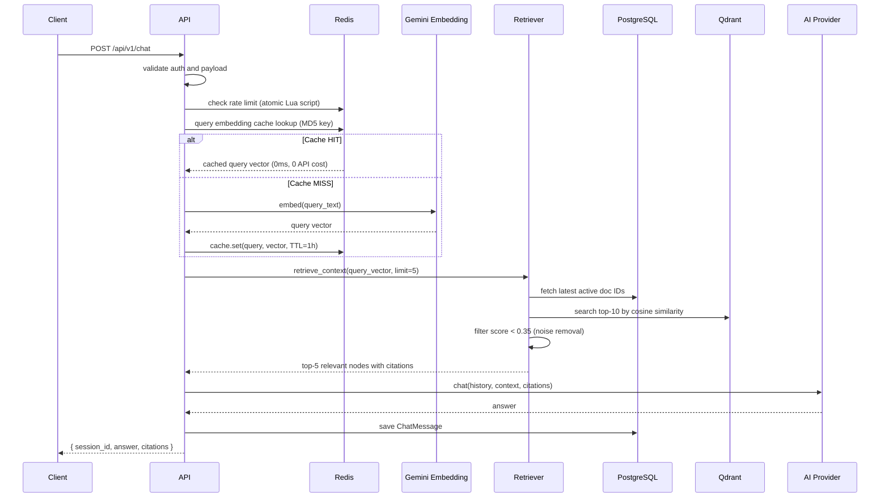
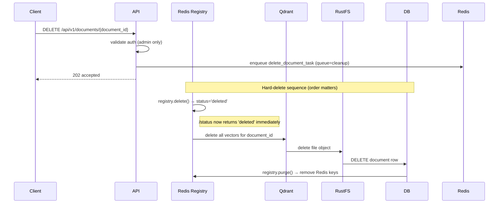

# 03 — Core Workflows

Status: implementation workflow baseline — updated to reflect chunked pipeline, progress reporting, and hard-delete.

## Workflow 1: Upload → Queue → Parse → Index → Ready

### Upload Invariants

| Rule | Requirement |
|------|-------------|
| Non-blocking | Upload endpoint returns `task_id` immediately |
| Chunked embed | Embed + store in batches of 32 nodes, not all at once |
| Progress live | `progress_percent` updates after each chunk via callback |
| Reliability | `task_acks_late=True` — task requeued if worker crashes |
| Timeout | `SoftTimeLimitExceeded` at 25 min → status=failed, not silent hang |

## Workflow 2: Chat → Retrieve → Generate → JSON Response

### Chat Invariants

| Rule | Requirement |
|------|-------------|
| Cache first | Check Redis for query embedding before calling API |
| Score threshold | Drop retrieval results with cosine similarity < 0.35 |
| Citation required | Return citation payload for every grounded answer |
| Retrieval filters | Exclude deleted docs, prefer latest version |
| Rate limiting | Atomic Lua script — 30 requests/min per user |
| Provider swap safety | Chat route stays provider-agnostic via adapter |

## Workflow 3: Delete → Hard Delete

### Delete Invariants

| Rule | Requirement |
|------|-------------|
| Hard delete | All traces removed: vectors, file, DB row, registry |
| Registry first | `registry.delete()` called before anything else — /status updates instantly |
| Purge last | `registry.purge()` only after DB row is gone |
| No recovery | Hard delete is irreversible — no trash/recycle |

## Workflow 4: Optional SQL Connector Route (Phase 2 — Not Yet Implemented)

| Condition | Behavior |
|-----------|----------|
| Question answerable by documents | Stay on document RAG route |
| Explicit live business-data request + approved connector | Route to SQL connector |
| SQL connector unavailable or not configured | Return explicit limitation message |

Implementation notes when building:
- Use `data_sources` table to look up connector config
- Load schema from `data_source_schema_cache`
- LLM generates **SELECT only** SQL — no DDL/DML
- Policy-check against approved table whitelist
- Log every query to `data_source_query_audit`

## Error Handling Baseline

| Error | Handling |
|-------|----------|
| Parse failure | `status=failed`, `parse_error` set, `SoftTimeLimitExceeded` handled |
| Chunk embed failure | Log error, continue remaining chunks (partial index) |
| Retrieval timeout (5s) | Return empty context, answer from LLM without grounding |
| Provider timeout | Graceful error response |
| Worker crash mid-task | Auto-requeue via `task_acks_late=True` |
