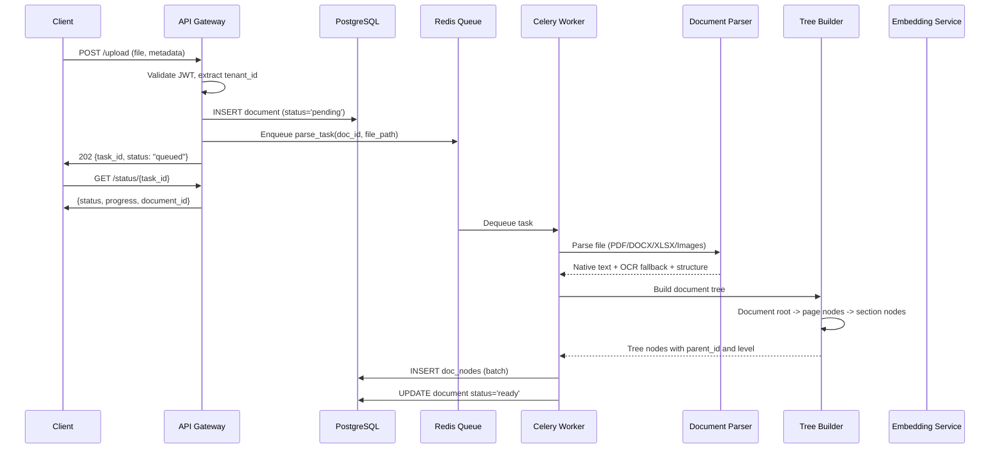
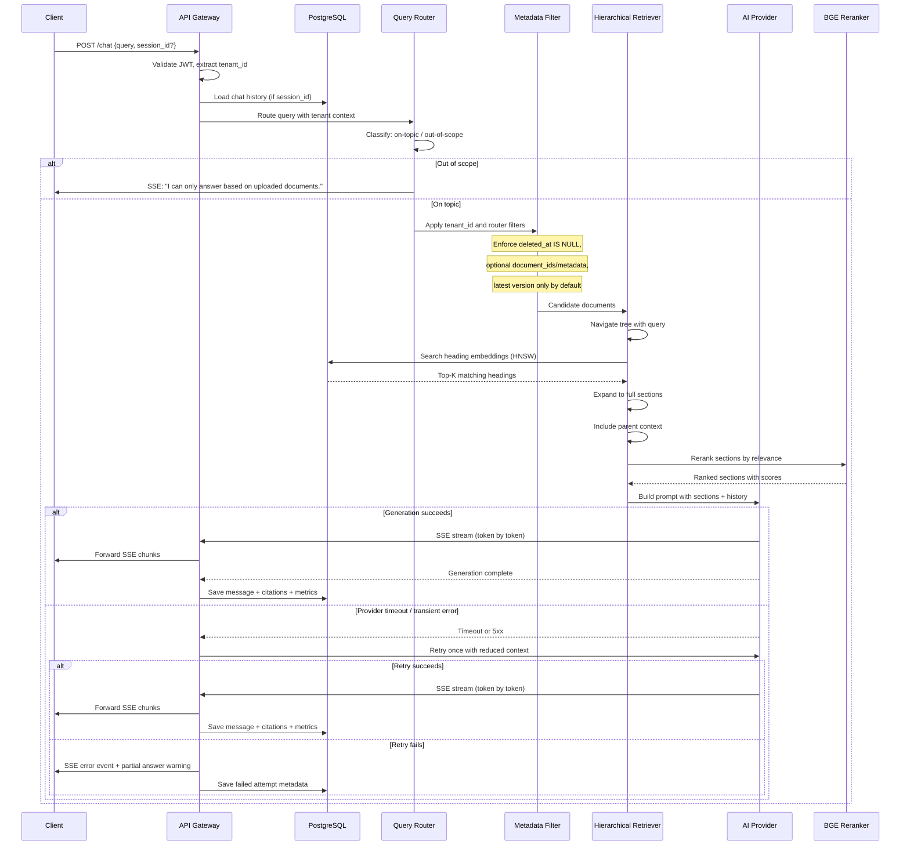
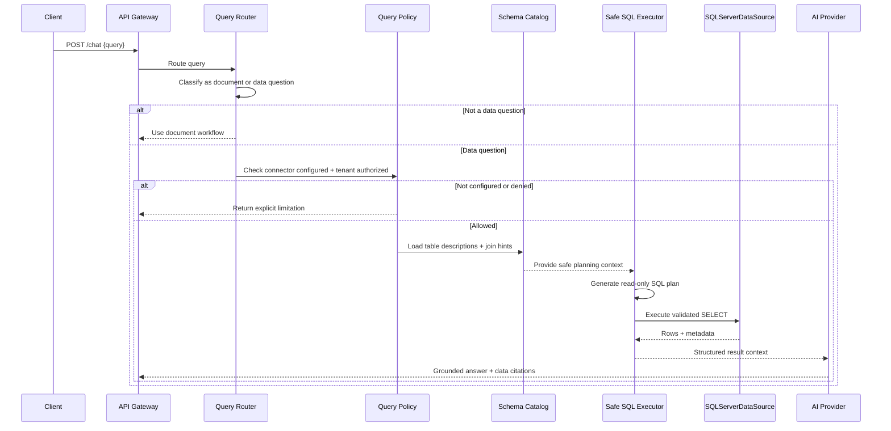
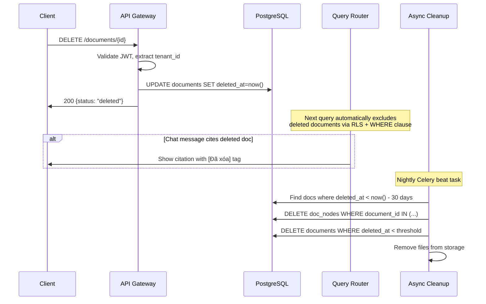

# 03 — Core Workflows

> Status: target production workflows. Upload, storage, async task tracking, and delete are implemented; chat is still a placeholder.

## Workflow 1: Upload → Parse → Hierarchical Tree Index → Ready

### Checkpointing & Retry

| Checkpoint | What's Saved | Recovery |
|------------|-------------|----------|
| Upload complete | Document row + file stored | Resume from parse |
| Parse complete | Raw text extracted | Resume from tree building |
| Tree built | Hierarchical nodes in memory | Resume from embedding |
| Embedding done | Vectors computed | Resume from DB insert |
| Final | Document status='ready' | Complete |

**Retry Strategy:** Max 3 attempts, exponential backoff (30s → 2m → 8m). After 3 failures → status='failed', notify user.

## Workflow 2: Query → Router → Retrieve → Generate → SSE

### Context Budgeting Rule

| Component | Budget | Rationale |
|-----------|--------|-----------|
| System prompt | ~10% | Instructions, guardrails |
| Chat history | ~20% | Recent turns (last 5-10) |
| Retrieved sections | ≤60% | Full sections, not chunks |
| Safety margin | ~10% | Buffer for response generation |

**Never exceed 60% of context window for retrieved content.** If sections are too large, truncate from the end, never cut mid-sentence.

## Workflow 2B: Query -> SQL Connector (Future, Conditional)

### SQL Routing Invariants

| Rule | Requirement |
|------|-------------|
| Default route | Document RAG remains the default answer path |
| SQL trigger | SQL path is used only for clearly data-centric questions |
| Access mode | SQL execution MUST be read-only and policy-checked |
| Planning context | SQL generation MUST use schema metadata, table descriptions, and join hints |
| Audit | Every executed SQL statement MUST be logged |

## Workflow 3: Delete → Soft Flag → Exclusion → Cleanup

### Error States & Handling

| Error | Trigger | Response |
|-------|---------|----------|
| `tenant_id mismatch` | JWT tenant ≠ document tenant | 403 Forbidden |
| `document not found` | ID doesn't exist or deleted | 404 Not Found |
| `parse timeout` | Large file, OCR taking too long | Retry with warning |
| `embedding OOM` | Too many nodes at once | Batch reduce size |
| `LLM timeout` | AI provider slow | Fallback to BM25 + warning |
| `SSE disconnect` | Client drops connection | Graceful stop, save partial |

## Workflow Invariants

| Workflow | Requirement |
|----------|-------------|
| Upload | MUST return quickly with `task_id`; MUST NOT parse inline in the request thread |
| Parse | MUST checkpoint by stage so retries do not restart from zero unnecessarily |
| Query | MUST apply tenant filter, soft-delete exclusion, and version preference before retrieval |
| Generation | MUST stream via SSE and persist final citations/metrics |
| Delete | MUST soft delete first and MUST exclude deleted docs from new retrieval immediately |

## AI Coding Guardrails

| If implementing | Required behavior |
|----------------|-------------------|
| Upload route | Return `202` for accepted async processing |
| Task polling | Read status from persisted task/document state, not in-memory globals |
| Chat route | Preserve SSE event names and payload shapes exactly as documented |
| Cleanup worker | Delete files only after hard-delete retention threshold is met |
