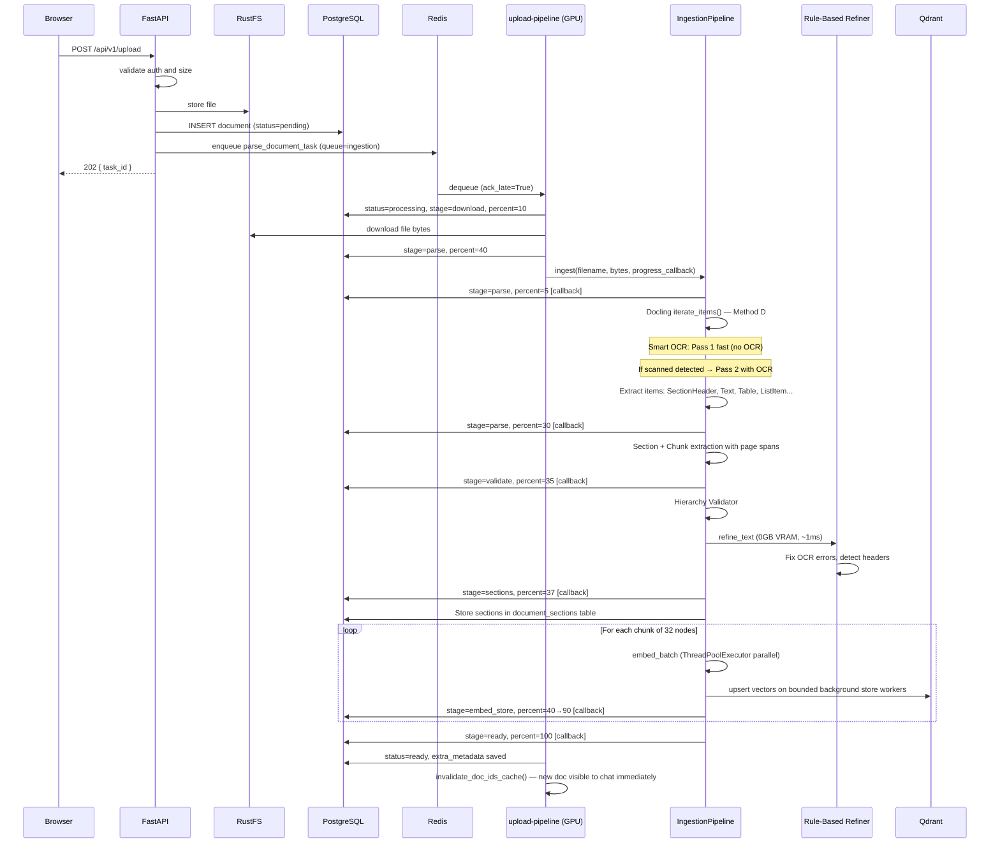
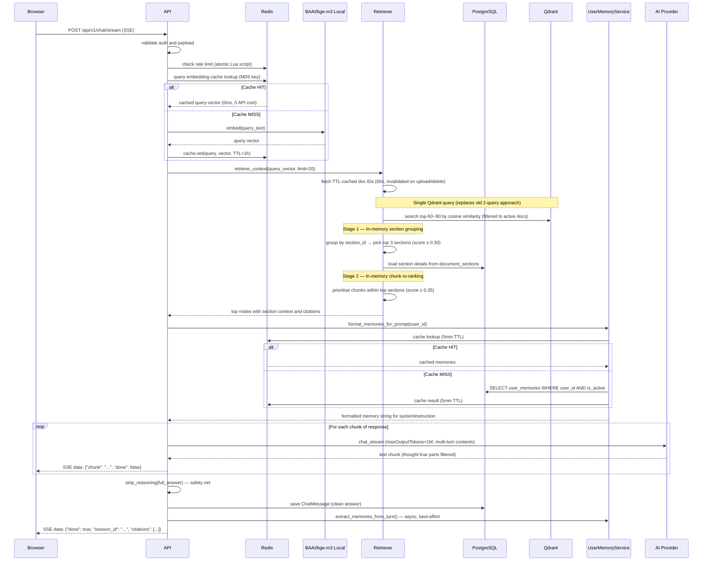
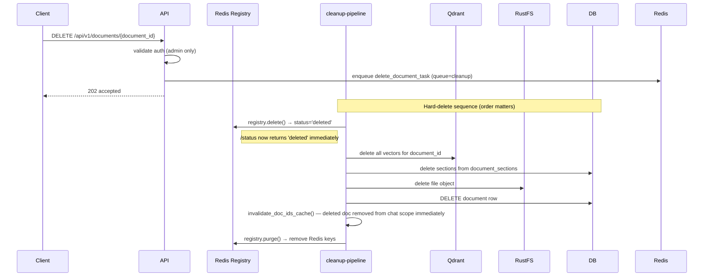
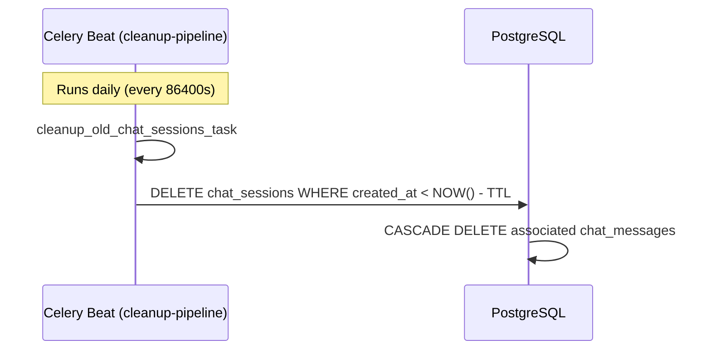

# 03 — Core Workflows

Status: implementation workflow baseline — updated to reflect Method D, Smart OCR Strategy, and worker architecture refactor.

## Workflow 1: Upload → Queue → Parse → Index → Ready

### Upload Invariants

| Rule | Requirement |
|------|-------------|
| Non-blocking | Upload endpoint returns `task_id` immediately |
| Chunked embed | Embed + store in batches of 32 nodes, not all at once |
| Pipelined store | Embedding of chunk N overlaps with Qdrant store of chunk N-1 |
| Store window | In-flight Qdrant writes are bounded by `ingestion_embed_parallelism` or hardware profile |
| Progress live | `progress_percent` updates after each chunk via callback |
| Reliability | `task_acks_late=True` — task requeued if worker crashes |
| Timeout | `SoftTimeLimitExceeded` at 25 min → status=failed, not silent hang |

### Ordering Invariants

| Rule | Requirement |
|------|-------------|
| Canonical order | `document_sections.order_index` defines document order |
| Page grouping | Sections may span multiple pages; store page span, not only the first page |
| Tree/list display | Admin document detail should render the ordered PostgreSQL slice as a table/list, not Qdrant scroll order |
| Full text | Section content is preserved during extraction; tree summaries may show truncated previews, but chunk payloads keep the full indexed text |

## Workflow 2: Chat → Retrieve → Generate → JSON Response

### Chat Invariants

| Rule | Requirement |
|------|-------------|
| Cache first | Check Redis for query embedding before calling API |
| Doc ID cache | TTL-cached 60s, invalidated on upload/delete — avoids PostgreSQL subquery per request |
| 2-stage retrieval | Single Qdrant query → in-memory section grouping (≥ 0.30) → chunk re-ranking within sections (≥ 0.35) |
| Citation required | Return citation payload for every grounded answer |
| Retrieval filters | Exclude deleted docs, prefer latest version |
| Rate limiting | Atomic Lua script — 30 requests/min per user |
| Provider swap safety | Chat route stays provider-agnostic via adapter |
| Multi-turn context | Last 20 messages via Gemini `contents` array with role mapping (assistant→model) |
| Memory injection | User memories loaded from Redis/PostgreSQL, injected into systemInstruction |
| Memory extraction | Async post-response: heuristic trigger detection + Gemini extraction → store in user_memories |
| Thinking suppressed | `thinkingConfig: {thinkingLevel: "MINIMAL"}` + `thought:true` filter + `_ThoughtFilter` stream + `strip_reasoning()` — 4 layers |
| History clean | `strip_thought_blocks()` removes `<\|channel\|>thought...<channel\|>` from previous assistant messages before sending as multi-turn context |
| No output limits | `maxOutputTokens: 1048576`, `max_context_chars: 500000`, streaming timeout 300s (5min) |
| Clean saved text | `strip_reasoning()` applied to answer before saving to DB |

## Workflow 3: Delete → Hard Delete

### Delete Invariants

| Rule | Requirement |
|------|-------------|
| Hard delete | All traces removed: vectors, file, DB row, registry |
| Registry first | `registry.delete()` called before anything else — /status updates instantly |
| Purge last | `registry.purge()` only after DB row is gone |
| No recovery | Hard delete is irreversible — no trash/recycle |

## Workflow 4: Optional SQL Connector Route (Phase 2 — Not Yet Implemented)

| Condition | Behavior |
|-----------|----------|
| Question answerable by documents | Stay on document RAG route |
| Explicit live business-data request + approved connector | Route to SQL connector |
| SQL connector unavailable or not configured | Return explicit limitation message |

Implementation notes when building:
- Use `data_sources` table to look up connector config
- Load schema from `data_source_schema_cache`
- LLM generates **SELECT only** SQL — no DDL/DML
- Policy-check against approved table whitelist
- Log every query to `data_source_query_audit`

## Workflow 5: Chat Session Auto-Delete

### Chat Session TTL Invariants

| Rule | Requirement |
|------|-------------|
| TTL | `CHAT_SESSION_TTL_DAYS` (default: 1 day) |
| Cleanup | Celery beat task in `cleanup-pipeline` worker |
| Delete behavior | CASCADE — messages deleted automatically with session |
| Config | `app/core/config.py` → `chat_session_ttl_days` |

## Error Handling Baseline

| Error | Handling |
|-------|----------|
| Parse failure | `status=failed`, `parse_error` set, `SoftTimeLimitExceeded` handled |
| Chunk embed failure | Log error, continue remaining chunks (partial index) |
| Retrieval timeout (5s) | Return empty context, answer from LLM without grounding |
| Provider timeout | Graceful error response |
| Worker crash mid-task | Auto-requeue via `task_acks_late=True` |
