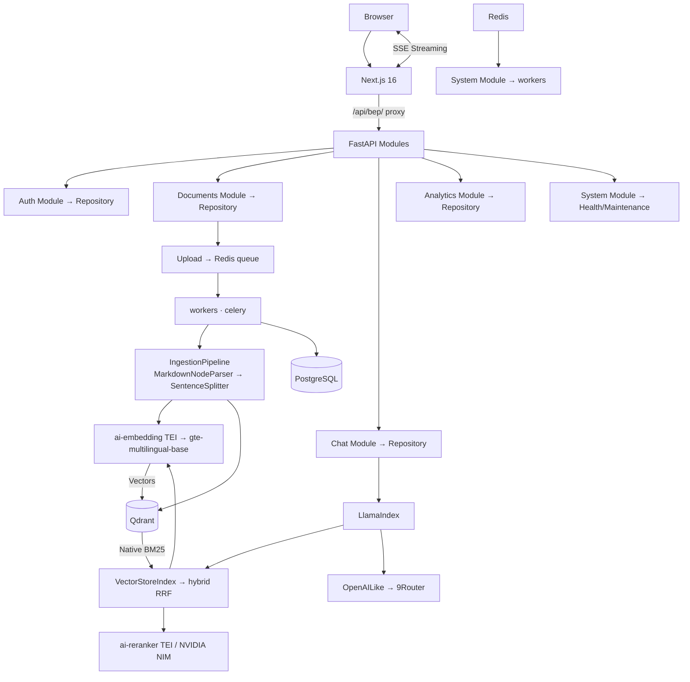

# 1 — Architecture and Data Model

Single source of truth for system design, data model, and invariants. Security details in `3_API_CONTRACTS.md`.

## Purpose

Customer-facing document guidance chatbot. Users upload documents (guides, manuals, policies) and ask questions — the system retrieves relevant content and generates accurate, complete answers. Key principle: **preserve factual content** — definitions, steps, examples, and lists must be presented fully, not summarized away.

## Tech Stack

| Component | Technology |
|-----------|-----------|
| Frontend | Next.js 16 + shadcn/ui v4 + next-auth v5 (JWT) |
| Backend | FastAPI 100% async (Strict await enforcement) |
| Workers | Celery (node-ingestion: solo + node-default: prefork, Beat) |
| AI Embedding | TEI container — `Alibaba-NLP/gte-multilingual-base` (768-dim, 32k ctx, GPU) |
| AI Reranker | TEI container — `Alibaba-NLP/gte-multilingual-reranker-base` (GPU), or NVIDIA NIM API |
| Database | PostgreSQL 18.4 (AsyncSessionLocal, Metadata/Auth/Audit) |
| Vectors | Qdrant (AsyncQdrantClient, Dense + Native BM25 Hybrid) |
| Object storage | RustFS (S3-compatible, isolated via asyncio.to_thread) |
| Queue/Cache | Redis 8.x (Celery, Streams, Semantic Cache, Rate Limiting) |
| AI Provider | 9Router (`decolua/9router:latest`, OpenAI-compatible, port 2908) |
| Ingestion | LlamaParse (cloud OCR) + LibreOffice (DOCX→PDF) + LlamaIndex SentenceSplitter + DuplicateDetector (Bloom) |
| RAG Framework | **LlamaIndex** — `VectorStoreIndex`, `IngestionPipeline`, `QdrantVectorStore`, `TextEmbeddingsInference`, `OpenAILike` |
| Reverse proxy | Traefik v3.7 on port 80 (auto-discovery via Docker labels, SSE, NextAuth, API, Rate Limited) |

## Storage Split

| Store | Responsibility |
|-------|---------------|
| PostgreSQL | Auth, roles, documents, **document_sections** (canonical tree order), chat sessions/messages, user_memories, audit |
| Qdrant | Chunk vectors + payload with `section_id` metadata (dense + native BM25 sparse) |
| RustFS | Raw uploaded files + ingestion artifacts |
| Redis 8.x | Celery broker (DB 2), result backend (DB 1), app cache + RediSearch semantic cache (DB 0), query embedding cache, rate limiting, chat history (MessagePack), audit stream (XADD). allkeys-lru |

## Core PostgreSQL Tables

| Table | Purpose |
|-------|---------|
| `roles` | Role definitions (admin, member) |
| `users` | Authenticated accounts with bcrypt hash |
| `documents` | File metadata, status lifecycle, version, ingestion state |
| `document_sections` | Hierarchical tree: parent_section_id, order_index, page_range, breadcrumb |
| `chat_sessions` | Per-user conversation sessions (CASCADE delete with messages) |
| `chat_messages` | Message history with citations, per-message token counts (tokens_in, tokens_out, latency_ms, model_used) |
| `ai_model_usage` | Every AI model call (chat + auxiliary) logged with prompt_tokens, completion_tokens, total_tokens, cost_usd, endpoint, user_id |
| `user_memories` | Persistent per-user facts/preferences/corrections |
| `security_audit` | Audit trail for sensitive actions |
| `data_sources` | SQL connector registry (Phase 2) |
| `data_source_schema_cache` | Connector schema cache (Phase 2) |
| `data_source_query_audit` | SQL query audit log (Phase 2) |

### documents Table Columns

| Column | Type | Notes |
|--------|------|-------|
| id | UUID PK | pgcrypto generated |
| title / file_name | VARCHAR(500) | User-provided title / original filename |
| file_path | VARCHAR(1000) | RustFS object URI |
| sha256 | VARCHAR(64) | Duplicate detection |
| file_type | VARCHAR(50) | pdf, docx, xlsx, txt |
| file_size | BIGINT | Bytes |
| version | INTEGER ≥ 1 | Auto-incremented per filename |
| status | VARCHAR(50) | pending → processing → ready / failed |
| status_stage | VARCHAR(50) | Fine-grained processing stage |
| progress_percent | INTEGER 0-100 | Live progress for frontend |
| status_message | VARCHAR(500) | Human-readable status |
| status_updated_at | TIMESTAMPTZ | Last status change |
| parse_error | TEXT | Error detail when failed |
| metadata | JSONB | Ingestion artifact, warnings, timing |
| deleted_at | TIMESTAMPTZ | Legacy; not used in hard-delete path |
| created_by | UUID FK → users | Uploader |
| created_at / updated_at | TIMESTAMPTZ | Auto-managed via trigger |

## Component Diagram



## Controller-Service-Repository Architecture

Strict 3-layer separation enforced across all route files:

```
Route (Controller)              Service (Business Logic)        Repository (Data Access)
┌─────────────────────┐        ┌──────────────────────┐        ┌────────────────────┐
│ HTTP request parsing │──→     │ Validation           │──→     │ SELECT/INSERT/     │
│ Auth deps            │        │ Orchestration        │        │ UPDATE/DELETE      │
│ Response formatting  │←──     │ Calculations         │←──     │ Session management │
│ Status codes         │        │ Cross-service calls  │        │ Model → Dict       │
└─────────────────────┘        └──────────────────────┘        └────────────────────┘
```

| Layer | Location | Convention |
|-------|----------|-----------|
| Controller | `app/modules/{domain}/router.py` | HTTP only — MUST use `async def`. NO `SessionLocal`, NO business logic. Catches domain exceptions (`ValueError`/`RuntimeError`) from services and translates to `http_errors.*` |
| Service | `app/modules/{domain}/service.py` | MUST use `async def`. Takes Repository via constructor. Contains all business logic. Raises `ValueError`/`RuntimeError` only — NEVER `http_errors.*`. |
| Repository | `app/modules/{domain}/repository.py` | MUST use `async def`. Takes `AsyncSession` via constructor. Performs SQL queries and returns dicts (never leaky ORM models). |
| DI Wiring | `app/api/deps.py` | FastAPI `Depends()` factories for all module services and repos. |

### Current Module Map

| Module | Purpose | Content |
|--------|---------|---------|
| `auth` | Identity & Access | Auth/User logic, JWT, Roles |
| `documents` | Ingestion & Storage | LlamaParse (cloud OCR), Sections, Chunks, Tree management |
| `chat` | Conversation & RAG | History, Retrieval logic, Memories |
| `analytics` | Monitoring & Audit | Token tracking, Audit stream processing |
| `system` | Orchestration | Health checks, Maintenance tasks, Global state |
| `admin` | Provider Management | 9Router model listing |

## Runtime Data Flow

| Stage | Path | Output |
|-------|------|--------|
| Upload | Browser → /api/bep/ → proxy → API → RustFS | File persisted, document row pending |
| Queue | API → Redis → Worker | Async task, task_id returned (202) |
| Parse | Worker → LlamaParseParser (cloud OCR for PDF/DOCX, local MarkdownNodeParser for .md/.txt) → sections + chunks | Items with page spans, heading levels |
| Chunk | LlamaIndex IngestionPipeline: MarkdownNodeParser → SentenceSplitter → LlamaIndex nodes | Split nodes with metadata |
| Embed & Store | QdrantVectorStore.add() — auto-embeds via Settings.embed_model (TEI), stores dense + native BM25 sparse | Vectors in Qdrant |
| Store sections | SectionRepository → PostgreSQL | document_sections rows |
| Retrieve | SemanticCache (similarity match) → exact cache → VectorStoreIndex hybrid search (dense + BM25 RRF) → reranker (TEI or NVIDIA) → full section context assembly | RagContext with scored nodes |
| Memory | UserMemoryService (redis_client shared pool) → Redis cache → inject systemInstruction | Personalized prompt |
| Stream | ChatService → OpenAILike.astream_chat() → SSE → Browser | Grounded answer with citations |
| Persist | Post-stream → `ChatService.save_assistant_message()` → PostgreSQL + MessagePack in Redis | Fast persistence |
| Audit | safe_record_audit → Redis Stream (XADD) → AuditStreamWorker → PostgreSQL | Decoupled logging |
| Extract | Post-response → Celery extract_memories_task → user_memories | Durable memory extraction |

## Non-Negotiable Invariants

| Rule | Behavior |
|------|----------|
| API contracts | Keep upload/status/chat/document endpoints stable |
| Async ingestion | Upload must never block on parsing |
| Provider boundary | Route handlers never call provider factories, provider adapters, or provider SDKs directly. Chat routes delegate generation orchestration to `ChatService`; `ChatService` uses `Settings.llm` (OpenAILike) for AI calls. |
| ID-first boundaries | Cross-layer/service/worker payloads pass stable IDs and URIs. Rich objects are rehydrated inside the owning layer. |
| Hierarchical retrieval | Retrieve at chunk level, present at section level (full section context to LLM) |
| Citation policy | Every grounded answer includes citations |
| Delete policy | Hard-delete 6-step order (see below) |
| Version policy | Latest active version preferred during retrieval |
| Rate limiting | Atomic Lua script — no INCR+EXPIRE race |
| Single chunking | SentenceSplitter applied exactly once in IngestionPipeline. No double-splitting. |
| LlamaIndex | All RAG operations use LlamaIndex primitives (VectorStoreIndex, IngestionPipeline, QdrantVectorStore). No custom retriever or embedder. |

## Delete Policy (Authoritative)

Hard-delete removes all traces. **Order must not change:**

1. `registry.delete()` → marks deleted in Redis → `/status` returns 'deleted' immediately
2. `vector_store.delete()` → removes all Qdrant vectors → retrieval stops
3. `SectionRepository.delete()` → removes document_sections rows
4. `storage.delete_object()` → removes file from RustFS
5. `DocumentRepository.hard_delete()` → removes documents row from PostgreSQL
6. `registry.purge()` → removes all Redis registry keys

**Sections deleted before DB row** — referential integrity.

## Versioning Policy

| Policy | Behavior |
|--------|----------|
| Same filename + new content | New row with `version = max(version) + 1` |
| Retrieval default | Highest version per filename (subquery in document repository) |
| Delete by version | Hard-delete only specified version |

## Access Model

| Role | Rights |
|------|--------|
| admin | Upload, delete, manage users, all member rights |
| member | Chat, retrieval, view documents, manage own memories |

JWT auth (PyJWT) + role checks. Role cached in JWT payload to eliminate DB queries per request. TokenBlacklist singleton with shared Redis connection. One shared project dataset, no tenant partitioning.

## User Memory System

ChatGPT-like persistent memory. Types: `preference`, `correction`, `instruction`, `fact`.

Flow: UserMemoryService receives `redis.Redis` + `MemoryRepository` through DI in request paths. Celery tasks create the same service with short-lived repositories in worker context. Active memories are loaded from Redis/PostgreSQL (cache TTL configurable via `MEMORY_CACHE_TTL`, default 5min) → injected into `systemInstruction` → AI generates response → `extract_memories_task` runs heuristic triggers + provider.chat() (cached singleton) → stores into `user_memories`. `MemoryService` handles user-facing CRUD with injected `MemoryRepository` and invalidates UserMemoryService cache. New reusable request services must not hide database access internally.

Frontend: Settings page `/settings` with full CRUD. Content limit: 1000 chars per memory.

## AI Provider Architecture

The project uses **9Router** (`decolua/9router:latest`) — a Next.js 16 AI router acting as an OpenAI-compatible proxy. All AI calls go through `LlamaIndex Settings`:

```
FastAPI ChatService → Settings.llm = OpenAILike (api_base=ai-proxy:2908/v1)
                                      ↓
                            9Router (Next.js 16)
                                      ↓
                     ┌────────┬────────┬────────┬────────┐
                      Kiro    Claude   Gemini  OpenCode
                      AI      (kr)     (gcp)     Free
```

| Feature | Implementation |
|---------|---------------|
| Proxy image | `decolua/9router:latest` (Next.js 16, Node 22, ~300MB) |
| Interface | Full OpenAI-compatible `/v1/chat/completions` + `/v1/models` |
| Streaming | SSE via `stream: true` |
| Format translation | Auto-convert between OpenAI ↔ Claude ↔ Gemini formats |
| Provider mgmt | Dashboard UI at port 2908 (SQLite database) |
| RTK Token Saver | 20-40% token reduction via prompt compression |
| 3-tier fallback | Subscription → Cheap → Free provider tiers |
| Fallback | Auto-switch on quota exceeded, retry on 429/5xx |

**Initialization** (`app/core/llama_index.py`):
- `Settings.embed_model = SequentialOpenAIEmbedding(...)` wrapping TEI and serializing embed requests one at a time to avoid 429 spam during ingestion
- `Settings.llm = OpenAILike(model, api_base=ai-proxy:2908/v1)`
- `get_vector_store()` → singleton `QdrantVectorStore(enable_hybrid=True, enable_native_bm25=True)`

## Multi-Turn Conversation

- Last N messages as OpenAI `messages` array (configurable via `AI_MAX_HISTORY_MESSAGES`, default 6)
- RAG context embedded into current user message
- User messages are saved synchronously during `ChatService.prepare_chat()`. Assistant messages are saved synchronously by `ChatService.save_assistant_message()` before the final SSE `done:true` event. Redis remains the hot cache with configurable TTL (`CHAT_HISTORY_REDIS_TTL`, default 24h).
- `ChatStore.hydrate_from_db()` reloads from DB on TTL expiry (checks Redis first via `history_exists()`)
- Redis `append_message()` uses pipeline for atomic RPUSH + EXPIRE
- Auto-title from first user message (80 chars)

## Chat Session Lifecycle

| Policy | Detail |
|--------|--------|
| Default view | Empty "Chat mới" on page load (no auto-restore) |
| History | Sidebar order by `updated_at DESC` |
| New session | `POST /chat/sessions` creates empty session |
| Switch | Click in sidebar → ChatPanel loads messages via `sessionId` prop |
| Auto-title | First user query truncated to 80 chars |
| Cleanup | Hard-delete after 30 days by Celery Beat (`CHAT_SESSION_TTL_DAYS`) |
| Cascade | Messages deleted with session automatically |
| `updated_at` | Auto-touched on message activity for sidebar ordering |

## Analytics & Cost Tracking

| Aspect | Detail |
|--------|--------|
| Endpoint | `GET /analytics/stats` — admin sees system-wide, member sees own sessions |
| Endpoint | `GET /analytics/messages` — last 20 messages with per-message token/cost/latency |
| Pricing | Configurable via `AI_INPUT_COST_PER_1M` / `AI_OUTPUT_COST_PER_1M` (default 0.0 for free tier) |
| Aggregation | `ai_model_usage` table tracks ALL AI calls; `chat_messages.tokens_in/tokens_out` for per-message display only |
| Frontend | Admin: `/admin/analytics` (KPI cards, daily chart, per-message table, cost comparison) |
| Rate limit | `throttle:analytics:{user_id}`, 60/min |

### AI Usage Tracking

Every call to 9Router is logged via `track_usage()` in `app/modules/chat/retrieval/usage_tracker.py`:

| Endpoint | Trigger |
|----------|---------|
| `chat` | Main QA response |
| `memory_extraction` | Memory extraction |
| `ragas_eval` | RAGAS evaluation (when enabled) |

## Hardware Auto-Detection

`app/core/hardware.py` — singleton detected once at startup. **3-tier VRAM-aware scaling.**

| Mode | Condition | workers | DB pool | Redis pool | CCU |
|------|-----------|---------|---------|------------|-----|
| TIGHT | VRAM < 6GB | 1 | 20+20 | 50 | 50+ |
| PROD | VRAM ≥ 6GB | 4-8 | 100+20 | 100+ | 200+ |

VRAM headroom = total VRAM − 2GB. TIGHT uses 1 worker to prevent OOM. PROD scales connection pools for high-concurrency chatbot workloads.

## Celery Configuration

All values configurable via env vars (see `app/core/config.py`). Defaults designed for dev laptop (GTX 1650 4GB).

Workers service runs `celery multi` with 2 worker nodes in 1 container:

| Node | Pool | Queues | GPU | Beat | Purpose |
|------|------|--------|-----|------|---------|
| node-ingestion | solo | ingestion | Yes | No | Embedding model load/unload per task — always sequential |
| node-default | prefork | cleanup, default | No | Yes | CPU tasks (chat, audit, memory) run in parallel |

| Setting | Default | Purpose |
|---------|---------|---------|
| CELERY_TASK_TIME_LIMIT | 1800s (30 min) | Hard kill |
| CELERY_TASK_SOFT_TIME_LIMIT | 1500s (25 min) | Graceful SoftTimeLimitExceeded |
| CELERY_WORKER_MAX_MEMORY_KB | 1,500,000 (1.5GB) | Kill child if RSS exceeded |
| CELERY_VISIBILITY_TIMEOUT | 7200s (2h) | Prevent Redis re-delivery |
| CELERY_RESULT_EXPIRES | 86400s (24h) | Task result TTL |
| CELERY_MAX_TASKS_PER_CHILD | 50 | Recycle child after N tasks |
| CELERY_RETRY_BACKOFF | 30s (upload) | Exponential backoff base |
| CELERY_MAX_RETRIES | 3 | Max retry attempts |
| broker_connection_retry_on_startup | true | Don't crash if Redis unavailable |
| worker_disable_rate_limits | true | Rate limit at API level |
| Redis DB 0 | App cache + RediSearch semantic cache | Query cache, rate limits, chat history, vector similarity |
| Redis DB 1 | Result backend | Task results |
| Redis DB 2 | Celery broker | Task messages |
| Queue routing | node-ingestion (solo): ingestion. node-default (prefork): cleanup, default. Beat on node-default | `ops/entrypoint-worker.sh` |

## Planned (Phase 2)

SQL connector: tables `data_sources`, `data_source_schema_cache`, `data_source_query_audit` ready in `ops/init.sql`. Only SELECT allowed. LLM generates SQL from natural language. Policy-checked against approved table whitelist. Falls back to document RAG if unavailable.
