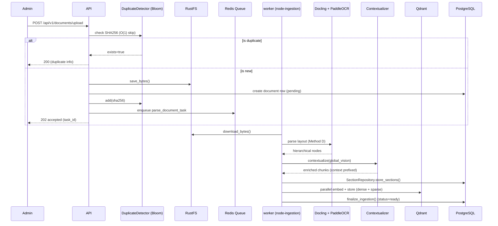

# 2.1 — Document Ingestion Workflow (Admin Only)

The 13-step pipeline for turning raw files into searchable vectors. Runs in `node-ingestion` (solo pool).

## Ingestion Invariants

| Rule | Requirement |
|------|-------------|
| **Duplicate Detection** | **Redis Bloom Filter (DuplicateDetector)** for O(1) checks before DB query |
| Async processing | Upload returns 202 immediately after storage save |
| Solo pool | Ingestion tasks run sequentially on `node-ingestion` to manage VRAM |
| **Global Vision** | **Contextualizer** prepends document-level summary to every chunk for higher RAG accuracy |
| Hierarchical | Docling structure preserved in `document_sections` |
| DB-less RAG | Qdrant payload contains `section_content` to minimize DB lookups during chat |
| Hybrid indexing | Both dense (1024-dim) and sparse (BM25) vectors stored |
| Timeout | SoftTimeLimitExceeded at 25 min → status=failed |

## 13-Step Pipeline (Reference)

| Step | Name | Detail |
|------|------|--------|
| 1 | Upload | Client uploads file → API saves to RustFS → insert documents row (status=pending) |
| 2 | Enqueue | API enqueues parse_document_task to Redis queue "ingestion" |
| 3 | Download | Worker downloads file bytes from RustFS |
| 4 | PaddleOCR | force_full_page_ocr=True — Engine: PaddleOCR via RapidOCR ONNX |
| 5 | Heading fix | Post-processor corrects flat levels from Docling using PDF bookmarks và numbering patterns |
| 6 | Method D extraction | Direct from Docling iterate_items() — preserves page spans, heading levels, table structures |
| 7 | Contextual Enrichment | Contextualizer prepends document-level summary to every chunk |
| 8 | Section extraction | Items → sections with exact page spans → breadcrumbs |
| 9 | Chunk splitting | Sections → ~400 token chunks with ~75 token overlap, linked via section_id |
| 10 | HierarchyValidator | Checks parent-child consistency and structure depth |
| 11 | RuleBasedRefiner | Fixes OCR errors and detects noise (0GB VRAM) |
| 12 | Embed | Parallel embedding via AI-Engine (AITeamVN/Vietnamese_Embedding_v2, 1024-dim, batch size 32) |
| 13 | Index & Store | Upsert to Qdrant (dense + BM25 sparse) → Set status=ready → async BM25 vocab rebuild |

See also: `5_INGESTION_RETRIEVAL.md` for detailed ingestion pipeline documentation.

---

## OCR Backend

| Strategy | When | Config |
|----------|------|--------|
| PaddleOCR (`force_full_page_ocr=True`) | All PDFs + images | `converter` + RapidOcrOptions vi+en |
| Classic parser | DOCX, XLSX, TXT, Markdown | No OCR — native text extraction |

### Embedding Model

| Parameter | Value |
|-----------|-------|
| Model | AITeamVN/Vietnamese_Embedding_v2 |
| Dimensions | 1024 |
| Batch size | 32 (`INGESTION_EMBEDDING_CHUNK_SIZE`) |

---

## Retrieval Pipeline (5-Stage + LLM Response Cache)

| Stage | Name | Detail |
|-------|------|--------|
| 1 | Rate limit | Atomic Lua script — 30 req/min per user |
| 2 | LLM Response Cache | Exact match via `hash(normalized_query)`. HIT → return immediately (bypasses LLM API) |
| 3 | Semantic Cache | Redis Vector Search matching similarity threshold 0.08 (≈0.92 similarity) |
| 4 | Hybrid search | Parallel Dense + Sparse (BM25) + Recommendation (Feedback) |
| 5 | Section grouping | Merge queries → dedupe → top 3 sections (score ≥ 0.30) |
| 6 | Neighbor Expansion (Soi sáng) | Fetch +/- N chunks by `order` to ensure narrative flow |

### Cache Layers (2026 Optimization for 200+ CCU)

| Layer | Key | TTL | Status |
|-------|-----|-----|--------|
| LLM Response Cache | `hash(normalized_query)` | 4h | ✅ IMPLEMENTED (exact match only) |
| Semantic Cache (RAG Context) | `vector(query_embedding)` | 24h | ✅ IMPLEMENTED |
| Query Embedding Cache | `hash(normalized_query)` | 4h | ✅ IMPLEMENTED |
| RAG Context Cache | `hash(query + doc_ids)` | 4h | ✅ IMPLEMENTED |
| Active Doc IDs | `rag:active_doc_ids` | 60s | ✅ IMPLEMENTED |

### Query Normalization

All cache layers use normalized queries:
- Lowercase
- Strip whitespace
- Collapse multiple spaces
- Remove stopwords (Vietnamese/ERP boilerplate)

Example: "Xin chào, cho tôi biết SEO là gì?" → "seo là gì"

### Hybrid Search: Dense + BM25

| Component | Details |
|-----------|---------|
| Dense model | AITeamVN/Vietnamese_Embedding_v2 (1024-dim, cosine) |
| Sparse model | Custom VietnameseBM25Encoder (Underthesea tokenization) |
| BM25 storage | **Redis + RAM Singleton** (BM25Manager) |

### Implementation Mapping

| Responsibility | Module |
|----------------|--------|
| PaddleOCR (mandatory) | `app/modules/documents/ingestion/ingestion_service.py` |
| Hierarchy checks | `app/modules/documents/validators/hierarchy_validator.py` |
| Section storage | `app/modules/documents/repositories/section_repository.py` |
| Vector store adapter | `app/adapters/vector_stores/qdrant.py` |
| BM25 index management | `app/modules/documents/utils/bm25_index.py` |
| 5-stage retrieval | `app/modules/chat/retrieval/retrieval_service.py` |
| Multi-query expansion | `app/modules/chat/retrieval/expansion_service.py` |
| User memory service | `app/modules/chat/services/user_memory_service.py` |
| AI provider (Google) | `app/adapters/ai/google.py` |
| Chat store | `app/modules/chat/utils/chat_store.py:ChatStore` |
| LLM Response Cache | `app/utils/cache/llm_response_cache.py` |
| Query Normalizer | `app/modules/chat/utils/query_normalizer.py` |
| Doc ID cache | `app/modules/documents/utils/document_registry.py` |