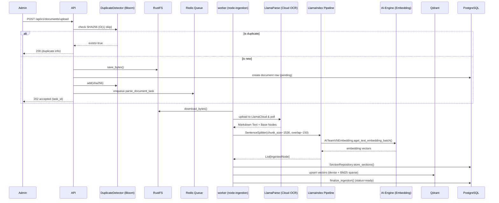

# 2.1 — Document Ingestion Workflow (Admin Only)

The 13-step pipeline for turning raw files into searchable vectors. Runs in `node-ingestion` (solo pool).

## Ingestion Invariants

| Rule | Requirement |
|------|-------------|
| **Duplicate Detection** | **Redis Bloom Filter (DuplicateDetector)** for O(1) checks before DB query |
| Async processing | Upload returns 202 immediately after storage save |
| Solo pool | Ingestion tasks run sequentially on `node-ingestion` to manage VRAM |
| **Chunking** | **LlamaIndex SentenceSplitter** (~1536 token chunks, ~150 token overlap) via LlamaIndex IngestionPipeline |
| **Embedding** | **AITeamVNEmbedding** (remote AI-Engine) wrapped as LlamaIndex `BaseEmbedding` — integrated into IngestionPipeline |
| Hierarchical | LlamaParse markdown structure (#, ##) preserved in `document_sections` |
| DB-less RAG | Qdrant payload contains `section_content` to minimize DB lookups during chat |
| Hybrid indexing | Both dense (1024-dim) and sparse (BM25) vectors stored |
| Timeout | SoftTimeLimitExceeded at 25 min → status=failed |

## 13-Step Pipeline (Reference)

| Step | Name | Detail |
|------|------|--------|
| 1 | Upload | Client uploads file → API saves to RustFS → insert documents row (status=pending) |
| 2 | Enqueue | API enqueues parse_document_task to Redis queue "ingestion" |
| 3 | Download | Worker downloads file bytes from RustFS |
| 4 | LlamaParse Cloud | Upload file to LlamaCloud API with strict markdown formatting instructions |
| 5 | Wait & Fetch | Poll API for completion, retrieve full markdown output |
| 6 | Node Parsing | Parse markdown into hierarchy using LlamaIndex MarkdownNodeParser |
| 7 | Header Cleanup | Filter empty strings from node header paths to prevent UI display issues |
| 8 | Chunk splitting | LlamaIndex SentenceSplitter (~1536 token chunks, ~150 token overlap), linked via document_id + order |
| 9 | Embed | LlamaIndex IngestionPipeline calls AITeamVNEmbedding (remote AI-Engine, 1024-dim, batch size 32) |
| 10 | HierarchyValidator | Checks parent-child consistency and structure depth |
| 11 | Node conversion | LlamaIndex nodes → IngestedNode dicts → SectionRepository + Qdrant upsert format |
| 12 | Index & Store | Upsert to Qdrant (dense + BM25 sparse) → Set status=ready → async BM25 vocab rebuild |

See also: `1_ARCHITECTURE.md` and `architecture.drawio` for system integration.

---

## OCR Backend

| Strategy | When | Config |
|----------|------|--------|
| LlamaParse (Cloud OCR) | All PDF and complex files | Strict markdown instructions, force list-to-header conversion |
| Classic parser | TXT, Markdown | Native text extraction |

### Embedding Model

| Parameter | Value |
|-----------|-------|
| Model | AITeamVN/Vietnamese_Embedding_v2 |
| Dimensions | 1024 |
| Batch size | 32 (`INGESTION_EMBEDDING_CHUNK_SIZE`) |

---

## Retrieval Pipeline (5-Stage + LLM Response Cache)

| Stage | Name | Detail |
|-------|------|--------|
| 1 | Rate limit | Atomic Lua script — 30 req/min per user |
| 2 | LLM Response Cache | Exact match via `hash(normalized_query)`. HIT → return immediately (bypasses LLM API) |
| 3 | Semantic Cache | Redis Vector Search matching similarity threshold 0.08 (≈0.92 similarity) |
| 4 | Hybrid search | Parallel Dense + Sparse (BM25) + Recommendation (Feedback) |
| 5 | Section grouping | Merge queries → dedupe → top 3 sections (score ≥ 0.30) |
| 6 | Neighbor Expansion (Soi sáng) | Fetch +/- N chunks by `order` to ensure narrative flow |

### Cache Layers (2026 Optimization for 200+ CCU)

| Layer | Key | TTL | Status |
|-------|-----|-----|--------|
| LLM Response Cache | `hash(normalized_query)` | 4h | ✅ IMPLEMENTED (exact match only) |
| Semantic Cache (RAG Context) | `vector(query_embedding)` | 24h | ✅ IMPLEMENTED |
| Query Embedding Cache | `hash(normalized_query)` | 4h | ✅ IMPLEMENTED |
| RAG Context Cache | `hash(query + doc_ids)` | 4h | ✅ IMPLEMENTED |
| Active Doc IDs | `rag:active_doc_ids` | 60s | ✅ IMPLEMENTED |

### Query Normalization

All cache layers use normalized queries:
- Lowercase
- Strip whitespace
- Collapse multiple spaces
- Remove stopwords (Vietnamese/ERP boilerplate)

Example: "Xin chào, cho tôi biết SEO là gì?" → "seo là gì"

### Hybrid Search: Dense + BM25

| Component | Details |
|-----------|---------|
| Dense model | AITeamVN/Vietnamese_Embedding_v2 (1024-dim, cosine) |
| Sparse model | Custom VietnameseBM25Encoder (Underthesea tokenization) |
| BM25 storage | **Redis + RAM Singleton** (BM25Manager) |

### Implementation Mapping

| Responsibility | Module |
|----------------|--------|
| LlamaParse Integration | `app/adapters/parsers/llamaparse_adapter.py` |
| Hierarchy checks | `app/modules/documents/validators/hierarchy_validator.py` |
| Section storage | `app/modules/documents/repositories/section_repository.py` |
| Vector store adapter | `app/adapters/vector_stores/qdrant.py` |
| BM25 index management | `app/modules/documents/utils/bm25_index.py` |
| 5-stage retrieval | `app/modules/chat/retrieval/retrieval_service.py` |
| Multi-query expansion | `app/modules/chat/retrieval/expansion_service.py` |
| User memory service | `app/modules/chat/services/user_memory_service.py` |
| AI provider (CLIProxyAPI) | `app/adapters/ai/cliproxy_bridge.py` |
| LlamaIndex pipeline | `app/modules/documents/ingestion/llama_pipeline.py` |
| Embedding adapter (LlamaIndex) | `app/adapters/embeddings/llama_bridge.py` |
| Reranker adapter (LlamaIndex) | `app/adapters/reranker/llama_bridge.py` |
| Chat store | `app/modules/chat/utils/chat_store.py:ChatStore` |
| LLM Response Cache | `app/utils/cache/llm_response_cache.py` |
| Query Normalizer | `app/modules/chat/utils/query_normalizer.py` |
| Doc ID cache | `app/modules/documents/utils/document_registry.py` |