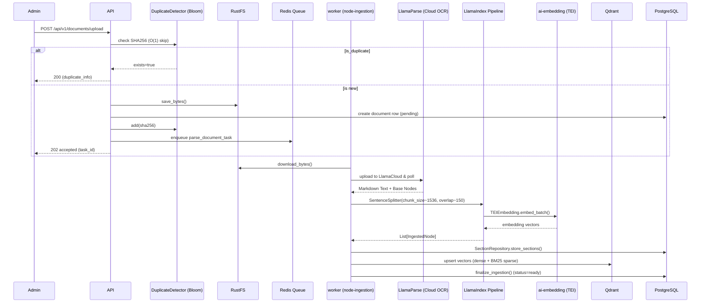
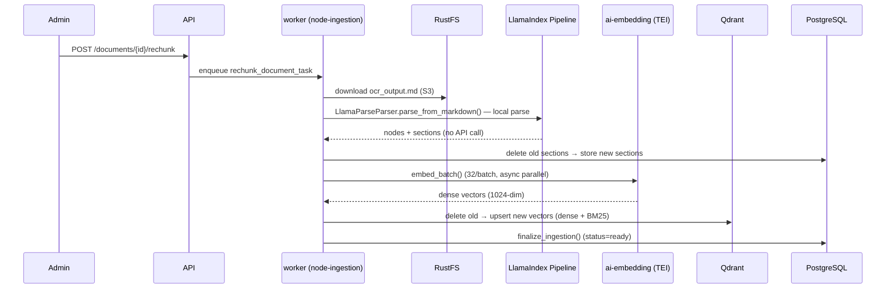

# 2.1 — Document Ingestion Workflow (Admin Only)

The 13-step pipeline for turning raw files into searchable vectors. Runs in `node-ingestion` (solo pool).

## Re-chunk from Saved OCR (Không tốn API)

Khi document đã OCR thành công, file `ocr_output.md` được lưu sẵn trong S3 (RustFS). Người dùng có thể bấm **"Chia lại node"** (ready) hoặc **"Thử lại từ OCR"** (failed) để chạy lại bước chunk + embedding mà **không gọi lại LlamaParse API**.

**Luồng này không tốn LlamaParse API — chỉ đọc file md có sẵn + parse local.**

## Ingestion Invariants

| Rule | Requirement |
|------|-------------|
| **Duplicate Detection** | **Redis Bloom Filter (DuplicateDetector)** for O(1) checks before DB query |
| Async processing | Upload returns 202 immediately after storage save |
| Solo pool | Ingestion tasks run sequentially on `node-ingestion` to manage VRAM |
| **Chunking** | **Single pass**: `MarkdownNodeParser` splits by headings → `SentenceSplitter` (`chunk_size=1200` chars, `overlap=300`) via LlamaIndex IngestionPipeline. No double-splitting. |
| **Preprocessing** | `MarkdownCleaner` strips page numbers, TOC dot-leaders, header/footer patterns before chunking |
| **Text/Markdown files** | Skip LlamaParse API entirely — parse content bytes directly via `parse_from_markdown()` |
| **Embedding** | **TEIEmbedding** (remote TEI ai-embedding) — 1024-dim vectors via HTTP |
| Hierarchical | LlamaParse markdown structure (#, ##) preserved in `document_sections` |
| DB-less RAG | Qdrant payload contains `section_content` to minimize DB lookups during chat |
| Hybrid indexing | Both dense (1024-dim) and sparse (BM25) vectors stored |
| Timeout | SoftTimeLimitExceeded at 25 min → status=failed |

## Ingestion Pipeline (Reference)

| Step | Name | Detail |
|------|------|--------|
| 1 | Upload | Client uploads file → API saves to RustFS → insert documents row (status=pending) |
| 2 | Enqueue | API enqueues parse_document_task to Redis queue "ingestion" |
| 3 | Download | Worker downloads file bytes from RustFS |
| 4 | Parse / OCR | **PDF/DOCX/XLSX**: Upload to LlamaCloud API with strict markdown formatting → poll → retrieve markdown. **.md/.txt**: decode bytes → `MarkdownCleaner` → `parse_from_markdown()` directly (no API call) |
| 5 | Wait & Fetch | Poll API for completion, retrieve full markdown output (only PDF/complex files) |
| 6 | MarkdownCleaner | Strip page numbers, TOC dot-leaders, header/footer artifacts before heading parsing |
| 7 | Node Parsing | `MarkdownNodeParser` splits by `#` headings → merge consecutive same-title sections |
| 8 | Chunk splitting | **Single pass**: `SentenceSplitter` (`chunk_size=1200` chars, `overlap=300`, `include_metadata=True`) via `LlamaIngestionPipeline`. No double-splitting. |
| 9 | Embed | TEIEmbedding (remote TEI ai-embedding, 1024-dim, batch size 32) |
| 10 | HierarchyValidator | Checks parent-child consistency and structure depth |
| 11 | Node conversion | LlamaIndex nodes → IngestedNode dicts → SectionRepository + Qdrant upsert format |
| 12 | Index & Store | Upsert to Qdrant (dense + BM25 sparse) → Set status=ready → async BM25 vocab rebuild |

See also: `1_ARCHITECTURE.md` for system integration, `2.2_WORKFLOWS_CHAT.md` for retrieval pipeline.

---

## OCR Backend

| Strategy | When | Config |
|----------|------|--------|
| LlamaParse (Cloud OCR) | PDF, DOCX, XLSX and complex files | Strict markdown instructions, force list-to-header conversion |
| Local text parser | **Markdown (.md), Text (.txt)** — skip LlamaParse API entirely | `MarkdownCleaner` preprocesses noise, `MarkdownNodeParser` for headings |

### Embedding Model

| Parameter | Value |
|-----------|-------|
| Model | Qwen/Qwen3-Embedding-0.6B (TEI) |
| Dimensions | 1024 |
| Batch size | 32 (`INGESTION_EMBEDDING_CHUNK_SIZE`) |
| Context | 32,768 tokens |

### Hybrid Search: Dense + BM25

| Component | Details |
|-----------|---------|
| Dense model | Qwen/Qwen3-Embedding-0.6B (1024-dim, cosine) |
| Sparse model | Custom VietnameseBM25Encoder (Underthesea tokenization) |
| BM25 storage | **Redis + RAM Singleton** (BM25Manager) |

**Note:** `DoclingParser` (`app/adapters/parsers/docling.py`) is retained as a legacy fallback but **not imported or used** by any active pipeline. The active parser is `LlamaParseParser`.

### Implementation Mapping

| Responsibility | Module |
|----------------|--------|
| LlamaParse Integration | `app/adapters/parsers/llamaparse_adapter.py` |
| Hierarchy checks | `app/modules/documents/validators/hierarchy_validator.py` |
| Section storage | `app/modules/documents/repositories/section_repository.py` |
| Vector store adapter | `app/adapters/vector_stores/qdrant.py` |
| BM25 index management | `app/modules/documents/utils/bm25_index.py` |
| 5-stage retrieval | `app/modules/chat/retrieval/retrieval_service.py` |
| Multi-query expansion | `app/modules/chat/retrieval/expansion_service.py` |
| User memory service | `app/modules/chat/services/user_memory_service.py` |
| AI provider (9Router) | `app/adapters/ai/proxy_bridge.py` |
| LlamaIndex pipeline | `app/modules/documents/ingestion/llama_pipeline.py` |
| Embedding adapter | `app/adapters/embeddings/tei_embedding.py` |
| Reranker adapter | `app/adapters/reranker/reranker.py` |
| Chat store | `app/modules/chat/utils/chat_store.py:ChatStore` |
| LLM Response Cache | `app/utils/cache/llm_response_cache.py` |
| Query Normalizer | `app/modules/chat/utils/query_normalizer.py` |
| Doc ID cache | `app/modules/documents/utils/document_registry.py` |
