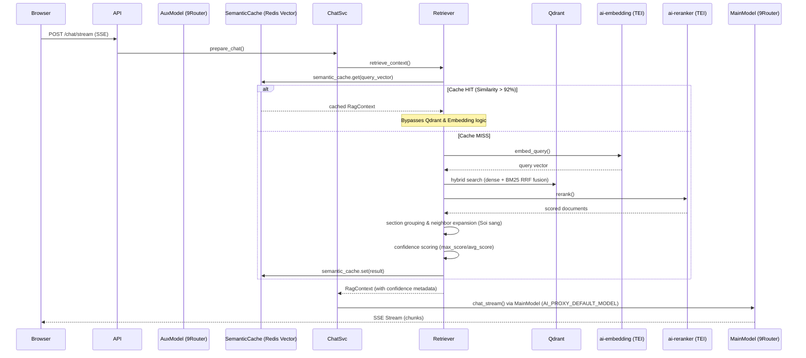

# 2.2 — Chat → Retrieve → Generate → Response

## Overview

## Multi-Model Routing

| Task | Model | Purpose |
|------|-------|---------|
| Main QA | `AI_PROXY_DEFAULT_MODEL` | High-quality answer generation |
| Query expansion | `AI_AUXILIARY_MODEL` | Query rewrite variants |
| Query refinement | `AI_AUXILIARY_MODEL` | Context-aware query optimization |
| Failure detection | `AI_AUXILIARY_MODEL` | LLM-as-judge (future) |

Set `AI_AUXILIARY_MODEL` to a 9Router combo name for lightweight/cheap model. If empty, falls back to `AI_PROXY_DEFAULT_MODEL`.

## Confidence Scoring

After retrieval, the system evaluates retrieval quality based on score distribution:

| Confidence | Condition | Action |
|-----------|-----------|--------|
| high | max_score ≥ 0.7 AND avg_score ≥ 0.5 | Proceed normally |
| medium | max_score ≥ 0.4 | Logged, may broaden search |
| low | max_score < 0.4 | Logged, LLM handles "no info" case via system prompt |
| no_results | No results found | LLM instructed to say "chưa có thông tin" |

## Chat Invariants

| Rule | Requirement |
|------|-------------|
| **SemanticCache** | Redis Vector Search checks for similarity > 92% (COSINE distance < 0.08) |
| **Exact Cache** | Redis exact match check on raw query text for sub-millisecond response |
| **Binary Serialization** | Chat history stored using **MessagePack** for extreme speed and low RAM |
| Doc ID cache | TTL-cached 60s, invalidated on upload/delete |
| 5-stage retrieval | Hybrid search (dense + BM25 RRF) → section grouping (≥0.25) → dedup → rerank → Neighbor Expansion (Soi sáng) → full section context to LLM |
| Rate limiting | **Sliding Window (Redis Lua)** — 30 req/min per user |

## 3-Layer Cache Architecture

| Layer | Key | TTL | Hit → |
|-------|-----|-----|-------|
| LLM Response Cache | `hash(normalized_query)` | 4h | Return immediately (bypasses LLM) |
| Semantic Cache | `vector(query_embedding)` | 24h | Return RAG context |
| Query Embedding Cache | `hash(normalized_query)` | 4h | Skip embedding |

## Retrieval: Soi sáng (Neighbor Expansion)

To ensure the LLM receives a coherent narrative, the system performs a "Neighbor Lookup":

1. For each top hit, the system identifies its `document_id` and `order`.
2. It fetches N nodes immediately preceding and following that chunk (configurable via `RETRIEVAL_CONTEXT_EXPANSION_WINDOW`).
3. Nodes are merged, deduped, and sorted linearly by `order`.

## Query Normalization

All cache layers use normalized queries:
- Lowercase
- Strip whitespace
- Collapse multiple spaces
- Remove stopwords (Vietnamese/ERP boilerplate)

Example: "Xin chào, cho tôi biết SEO là gì?" → "seo là gì"

## History Limiting

Conversation history sent to LLM is limited to `AI_MAX_HISTORY_MESSAGES` (default 10) messages. This replaces the previous context compaction approach — simpler, faster, no extra API calls needed.
