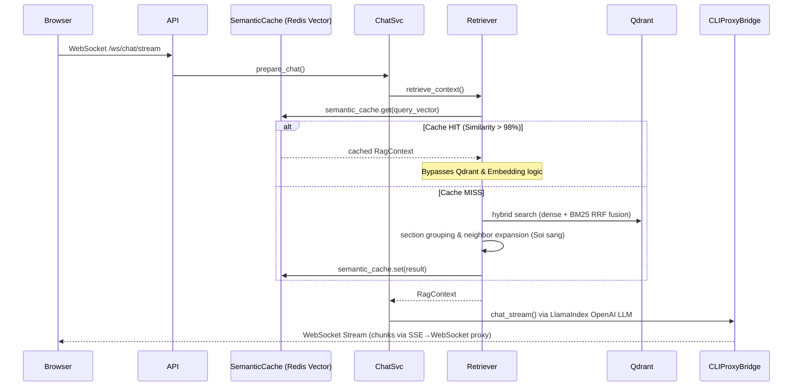

# 2.2 — Chat → Retrieve → Generate → Response

## Overview

## Chat Invariants

| Rule | Requirement |
|------|-------------|
| **Speed Layer** | **SemanticCache** (Redis Vector Search) checks for similarity > 98% (dist < 0.02) |
| **Exact Cache** | Redis exact match check on raw query text for sub-millisecond response |
| **Binary Serialization** | Chat history stored using **MessagePack** for extreme speed and low RAM |
| Doc ID cache | TTL-cached 60s, invalidated on upload/delete |
| 5-stage retrieval | Hybrid search → section grouping (≥0.30) → Neighbor Expansion → context assembly → citations |
| Rate limiting | **Sliding Window (Redis Lua)** — 30 req/min per user |

## 3-Layer Cache Architecture (Updated 2026-05-15)

| Layer | Key | TTL | Hit → |
|-------|-----|-----|-------|
| LLM Response Cache | `hash(normalized_query)` | 4h | Return immediately (bypasses LLM) |
| Semantic Cache | `vector(query_embedding)` | 24h | Return RAG context |
| Query Embedding Cache | `hash(normalized_query)` | 4h | Skip embedding |

See also: `2.1_WORKFLOWS_INGESTION.md` for detailed ingestion pipeline and retrieval architecture.

---

## Retrieval: Soi sáng (Neighbor Expansion)

To ensure the LLM receives a coherent narrative, the system performs a "Neighbor Lookup":

1. For each top hit, the system identifies its `document_id` and `order`.
2. It fetches N nodes immediately preceding and following that chunk (configurable via `RETRIEVAL_CONTEXT_EXPANSION_WINDOW`).
3. Nodes are merged, deduped, and sorted linearly by `order`.

## Query Normalization

All cache layers use normalized queries:
- Lowercase
- Strip whitespace
- Collapse multiple spaces
- Remove stopwords (Vietnamese/ERP boilerplate)

Example: "Xin chào, cho tôi biết SEO là gì?" → "seo là gì"

## Key Fixes Applied (2026-05-07)

| Fix | Before | After |
|-----|--------|-------|
| Semantic threshold | 0.02 | 0.08 |
| QueryEmbeddingCache TTL | 1h | 4h |
| RagResultCache TTL | 30min | 4h |
| Semantic cache TTL refresh | No | Yes (keeps hot data alive) |