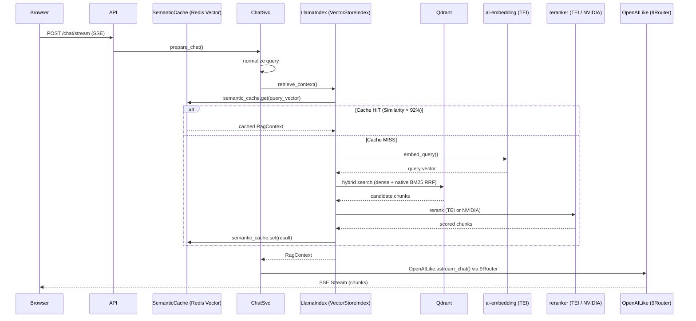

# 2.2 — Chat → Retrieve → Generate → Response

## Overview

## Retrieval Flow

The retrieval pipeline (`app/modules/chat/retrieval/pipeline.py`) keeps LlamaIndex for embedding and postprocessing, but executes hybrid retrieval directly via qdrant-client fusion query:

1. **Embed query** → `TextEmbeddingsInference` (TEI ai-embedding, 768-dim)
2. **Hybrid search** -> direct `qdrant-client` `query_points(prefetch=[dense,sparse], query=Fusion.RRF)`
3. **Rerank** → `TEIRerankerPostprocessor` or `NvidiaRerankerPostprocessor` (switchable via `RERANKER_BACKEND`)
4. **Long-context reorder** → `LongContextReorder` to mitigate “lost in the middle” before synthesis
5. **Deduplicate** → by node_id
6. **Assemble context** → full section text + metadata → `RagContext`

## Cache Architecture (3 layers)

| Layer | Key | TTL | Hit → |
|-------|-----|-----|-------|
| LLM Response Cache | `hash(normalized_query)` | 4h | Return immediately (bypasses LLM) |
| Semantic Cache | `vector(query_embedding)` | 24h | Return RAG context |
| Query Embedding Cache | `hash(normalized_query)` | 4h | Skip embedding |

## Reranking (Switchable Backend)

After hybrid search, the system reranks candidate chunks via `get_reranker()` and reads active provider from SQLite (`RuntimeProviderManager`):

| Backend | When | Details |
|---------|------|---------|
| `TEI` (default) | Active TEI provider in SQLite | Local TEI container, `POST /rerank`, gte-multilingual-reranker-base |
| `NVIDIA` | Active NVIDIA provider in SQLite | NVIDIA NIM API, `nvidia/llama-nemotron-rerank-1b-v2` |

## Query Handling

### Normalization

All cache layers use normalized queries:
- Lowercase
- Strip whitespace
- Collapse multiple spaces
- Remove stopwords (Vietnamese/ERP boilerplate)

Example: "Xin chào, cho tôi biết SEO là gì?" → "seo là gì"

## Chat Invariants

| Rule | Requirement |
|------|-------------|
| **SemanticCache** | Redis Vector Search checks for similarity > 92% (COSINE distance < 0.08) |
| **Exact Cache** | Redis exact match check on raw query text for sub-millisecond response |
| **Binary Serialization** | Chat history stored using **MessagePack** for extreme speed and low RAM |
| 2-stage retrieval | Hybrid search (dense + BM25 RRF) → rerank |
| Rate limiting | **Sliding Window (Redis Lua)** — 30 req/min per user |
| History limit | `AI_MAX_HISTORY_MESSAGES=6` — last N messages sent to LLM |

## History Limiting

Conversation history sent to LLM is limited to `AI_MAX_HISTORY_MESSAGES` (default 6) messages. No context compaction — simpler, faster, no extra API calls needed.

