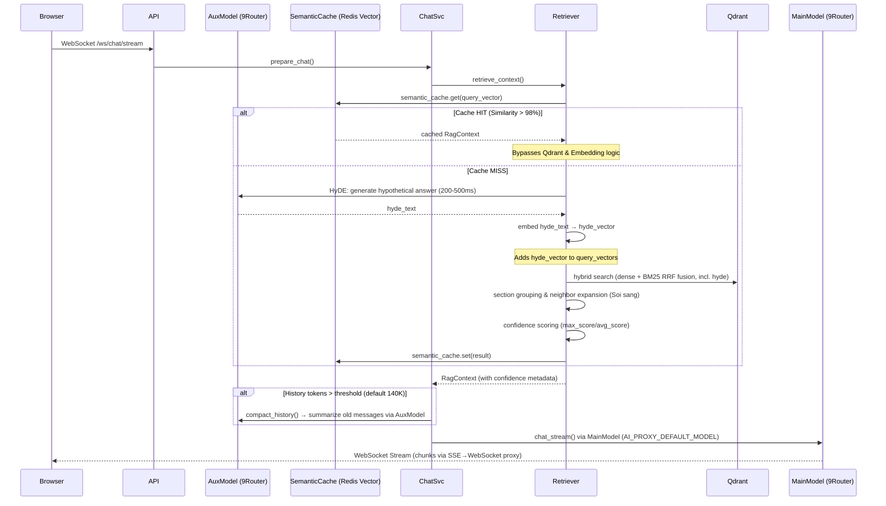

# 2.2 — Chat → Retrieve → Generate → Response

## Overview

## Multi-Model Routing

| Task | Model | Purpose |
|------|-------|---------|
| Main QA | `AI_PROXY_DEFAULT_MODEL` | High-quality answer generation |
| HyDE | `AI_AUXILIARY_MODEL` | Lightweight hypothetical doc generation |
| Query expansion | `AI_AUXILIARY_MODEL` | Query rewrite variants |
| Query refinement | `AI_AUXILIARY_MODEL` | Context-aware query optimization |
| Context compaction | `AI_AUXILIARY_MODEL` | Conversation summarization |
| Failure detection | `AI_AUXILIARY_MODEL` | LLM-as-judge (future) |

Set `AI_AUXILIARY_MODEL` to a 9Router combo name for lightweight/cheap model. If empty, falls back to `AI_PROXY_DEFAULT_MODEL`.

## HyDE (Hypothetical Document Embeddings)

For short queries (<100 chars), the system generates a hypothetical answer document using the auxiliary model, embeds it, and adds the resulting vector to the query ensemble.

**When**: Only for short queries (the ones that benefit most from HyDE). Skipped for multi-query expansions with >2 variants. Timeout: 1.5s.

**Benefit**: +20-40% precision for short/ambiguous queries per recent RAG benchmarks.

## Confidence Scoring

After retrieval, the system evaluates retrieval quality based on score distribution:

| Confidence | Condition | Action |
|-----------|-----------|--------|
| high | max_score ≥ 0.7 AND avg_score ≥ 0.5 | Proceed normally |
| medium | max_score ≥ 0.4 | Logged, may broaden search |
| low | max_score < 0.4 | Logged, LLM handles "no info" case via system prompt |
| no_results | No results found | LLM instructed to say "chưa có thông tin" |

## Chat Invariants

| Rule | Requirement |
|------|-------------|
| **Speed Layer** | **SemanticCache** (Redis Vector Search) checks for similarity > 98% (dist < 0.02) |
| **Exact Cache** | Redis exact match check on raw query text for sub-millisecond response |
| **Binary Serialization** | Chat history stored using **MessagePack** for extreme speed and low RAM |
| Doc ID cache | TTL-cached 60s, invalidated on upload/delete |
| 5-stage retrieval | HyDE → Hybrid search (dense + BM25 RRF) → section grouping (≥0.25) + Rerank → Neighbor Expansion → confidence scoring → context assembly |
| Rate limiting | **Sliding Window (Redis Lua)** — 30 req/min per user |

## 3-Layer Cache Architecture (Updated 2026-05-15)

| Layer | Key | TTL | Hit → |
|-------|-----|-----|-------|
| LLM Response Cache | `hash(normalized_query)` | 4h | Return immediately (bypasses LLM) |
| Semantic Cache | `vector(query_embedding)` | 24h | Return RAG context |
| Query Embedding Cache | `hash(normalized_query)` | 4h | Skip embedding |

See also: `2.1_WORKFLOWS_INGESTION.md` for detailed ingestion pipeline and retrieval architecture.

---

## Retrieval: Soi sáng (Neighbor Expansion)

To ensure the LLM receives a coherent narrative, the system performs a "Neighbor Lookup":

1. For each top hit, the system identifies its `document_id` and `order`.
2. It fetches N nodes immediately preceding and following that chunk (configurable via `RETRIEVAL_CONTEXT_EXPANSION_WINDOW`).
3. Nodes are merged, deduped, and sorted linearly by `order`.

## Query Normalization

All cache layers use normalized queries:
- Lowercase
- Strip whitespace
- Collapse multiple spaces
- Remove stopwords (Vietnamese/ERP boilerplate)

Example: "Xin chào, cho tôi biết SEO là gì?" → "seo là gì"

## Context Compaction (Auto-Compact)

Long conversations are automatically compacted to stay within the model's context window.

**Trigger**: Estimated history tokens > `ai_context_window * ai_compact_threshold_ratio` (default 200K × 0.70 = 140K tokens).

**Process**:
1. Split history: old messages (to summarize) + recent N turns (keep verbatim, default 5)
2. Call 9Router with a summarization prompt to condense old messages
3. Replace old messages with a single summary system message
4. Recent messages stay intact for natural conversation flow

**Fallback**: If summarization fails (API error), oldest messages are dropped instead.

**Config**:
| Variable | Default | Description |
|----------|---------|-------------|
| `AI_CONTEXT_WINDOW` | 200,000 | Model's total context window (tokens) |
| `AI_COMPACT_THRESHOLD_RATIO` | 0.70 | Trigger at % of window |
| `AI_COMPACT_RESERVE_TOKENS` | 20,000 | Reserve for response |
| `AI_COMPACT_KEEP_RECENT` | 5 | Recent turns kept verbatim |

## Key Fixes Applied (2026-05-07)

| Fix | Before | After |
|-----|--------|-------|
| Semantic threshold | 0.02 | 0.08 |
| QueryEmbeddingCache TTL | 1h | 4h |
| RagResultCache TTL | 30min | 4h |
| Semantic cache TTL refresh | No | Yes (keeps hot data alive) |