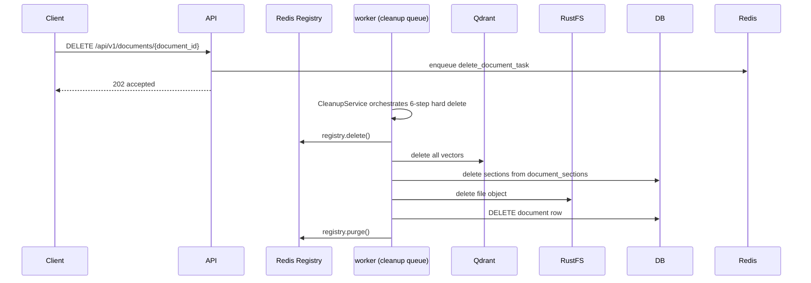

# 2.3 — Hard Delete Workflow

## Overview

## Hard-Delete Order (STRICT)

| Step | Action | Detail |
|------|--------|--------|
| 1 | `registry.delete()` | Marks deleted in Redis → `/status` returns 'deleted' immediately |
| 2 | `vector_store.delete()` | Removes all Qdrant vectors → retrieval stops |
| 3 | `SectionRepository.delete()` | Removes document_sections rows |
| 4 | `storage.delete_object()` | Removes file from RustFS |
| 5 | `DocumentRepository.hard_delete()` | Removes documents row from PostgreSQL |
| 6 | `registry.purge()` | Removes all Redis registry keys |

**Sections deleted BEFORE DB row** — referential integrity.

## Why Hard Delete?

- User consent / privacy requirements
- GDPR-like compliance
- Storage cost optimization
- Remove outdated document versions

See also: `1_ARCHITECTURE.md` for delete policy details.