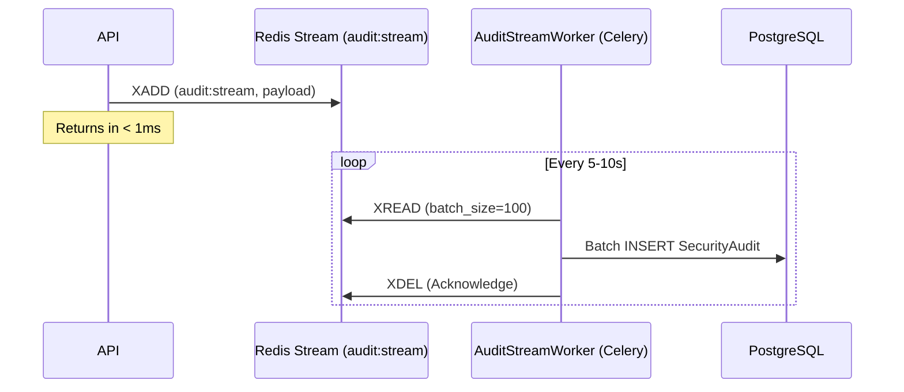

# 2.4 — Decoupled Audit Logging

## Overview

High-concurrency logging that never blocks the user.

## Audit Invariants

| Rule | Detail |
|------|--------|
| **Zero Blocking** | API never writes to SecurityAudit table directly |
| **Batch Write** | AuditStreamWorker groups events to minimize DB transaction overhead |
| **Persistence** | Redis Stream acts as a reliable buffer until DB is ready |

## Why Decoupled?

- Audit writes are fire-and-forget from API perspective
- API response latency never affected by DB write speed
- Redis Stream provides durability until worker processes batch
- Supports high-concurrency scenarios without data loss